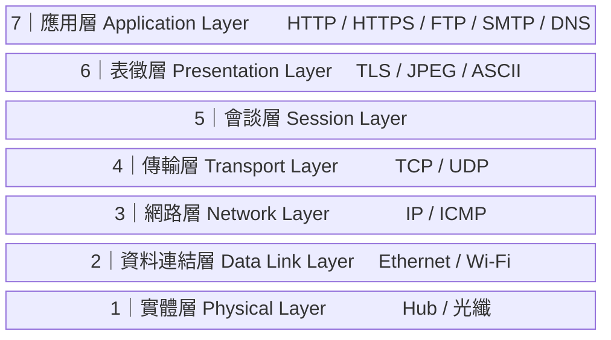
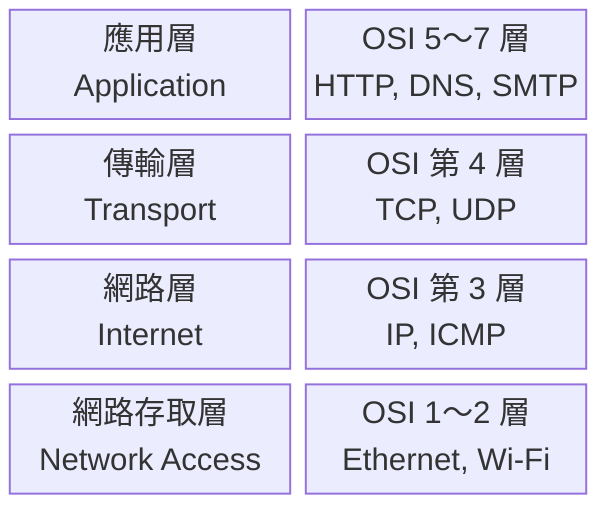

# Mermaid Diagram Support Implementation Plan

> **For agentic workers:** REQUIRED SUB-SKILL: Use superpowers:subagent-driven-development (recommended) or superpowers:executing-plans to implement this plan task-by-task. Steps use checkbox (`- [ ]`) syntax for tracking.

**Goal:** Add site-wide Mermaid diagram rendering to the VitePress blog and insert two diagrams into the network protocol layers article.

**Architecture:** Install `vitepress-plugin-mermaid` + `mermaid`, wrap the VitePress config with `withMermaid()`, then add two `block-beta` diagrams to the existing article. No per-article setup needed — the plugin makes ```` ```mermaid ```` fenced blocks work globally.

**Tech Stack:** VitePress 1.6.4, vitepress-plugin-mermaid, mermaid (latest)

---

## File Map

| File | Action |
|---|---|
| `package.json` | Modified by `npm install` — adds devDependencies entries |
| `docs/.vitepress/config.js` | Modify — add import + `withMermaid()` wrapper |
| `docs/tech/posts/2026-06-06-network-protocol-layers.md` | Modify — insert two Mermaid diagram blocks |

---

### Task 1: Install packages

**Files:**
- Modify: `package.json` (via npm)

- [ ] **Step 1: Install the two required packages**

```bash
npm install --save-dev vitepress-plugin-mermaid mermaid
```

Expected output: packages added, `package-lock.json` updated.

- [ ] **Step 2: Verify entries in package.json**

Open `package.json` and confirm both appear under `devDependencies`:
```json
"mermaid": "^...",
"vitepress-plugin-mermaid": "^..."
```

- [ ] **Step 3: Commit**

```bash
git add package.json package-lock.json
git commit -m "chore: add vitepress-plugin-mermaid and mermaid packages"
```

---

### Task 2: Update VitePress config to enable Mermaid

**Files:**
- Modify: `docs/.vitepress/config.js`

- [ ] **Step 1: Add the `withMermaid` import**

In `docs/.vitepress/config.js`, add the import on line 2 (after the existing `vitepress` import):

```js
import { defineConfig } from 'vitepress'
import { withMermaid } from 'vitepress-plugin-mermaid'  // add this line
import tailwindcss from 'tailwindcss'
import autoprefixer from 'autoprefixer'
import {
  getMetaData,
  getTitle,
  getDescription,
  getTechPosts,
} from './loadData'
```

- [ ] **Step 2: Wrap `defineConfig` with `withMermaid` and add `mermaid` option**

Change the export line from:
```js
export default defineConfig({
```
to:
```js
export default withMermaid(defineConfig({
```

And close the extra parenthesis at the end of the file. Also add `mermaid: {}` as the last property before `appearance: false`:

```js
export default withMermaid(defineConfig({
  ignoreDeadLinks: [
    /^http:\/\/localhost/,
  ],
  title: getTitle(),
  description: getDescription(),
  locales: {
    '/': { lang: 'zh-TW' }
  },
  head: getMetaData(),
  sitemap: {
    hostname: siteUrl
  },
  transformPageData(pageData) {
    // ... existing code unchanged ...
  },
  themeConfig: {
    title: "Yuki Ota's profile",
    techPosts: getTechPosts(),
    nav: [
      { text: 'Resume', link: '/resume'  },
      { text: 'Blog', link: '/tech/'  },
    ]
  },
  vite: {
    // ... existing vite config unchanged ...
  },
  mermaid: {},
  appearance: false,
}))
```

- [ ] **Step 3: Start dev server and verify no errors**

```bash
npm run docs:dev
```

Expected: server starts on `http://localhost:5173` with no import or plugin errors in the terminal.

- [ ] **Step 4: Stop the dev server (Ctrl+C) and commit**

```bash
git add docs/.vitepress/config.js
git commit -m "feat: enable site-wide Mermaid diagram support via vitepress-plugin-mermaid"
```

---

### Task 3: Add OSI 七層架構圖 to the network protocol layers article

**Files:**
- Modify: `docs/tech/posts/2026-06-06-network-protocol-layers.md`

The diagram goes **after line 50** (after `以下從使用者最直接接觸的應用層（第 7 層）開始，往下介紹到實體層（第 1 層）。`) and **before line 52** (`### 第 7 層：應用層`).

- [ ] **Step 1: Insert the OSI layer diagram**

After line 50, insert a blank line then the following Mermaid block:

```markdown



```

Then a blank line before the `### 第 7 層` heading.

- [ ] **Step 2: Verify diagram renders in the browser**

Start the dev server:
```bash
npm run docs:dev
```

Open `http://localhost:5173/tech/posts/2026-06-06-network-protocol-layers.html` and scroll to the OSI section. The diagram should render as a vertical stack of 7 labeled blocks.

- [ ] **Step 3: Stop server and commit**

```bash
git add docs/tech/posts/2026-06-06-network-protocol-layers.md
git commit -m "docs: add OSI 七層架構圖 Mermaid diagram to network protocol layers article"
```

---

### Task 4: Add TCP/IP ↔ OSI 對應圖 to the article

**Files:**
- Modify: `docs/tech/posts/2026-06-06-network-protocol-layers.md`

The diagram goes **after line 96** (after `TCP/IP 採用較精簡的四層架構，把 OSI 的七層合併為四層：`) and **before the existing `|` table**.

- [ ] **Step 1: Insert the TCP/IP mapping diagram**

After the `TCP/IP 採用較精簡的四層架構，把 OSI 的七層合併為四層：` line, insert a blank line then:

```markdown



```

Then a blank line before the existing `| TCP/IP 四層 |...` table.

- [ ] **Step 2: Verify diagram renders in the browser**

```bash
npm run docs:dev
```

Open the article and scroll to the TCP/IP section. The diagram should render as a 2-column grid showing TCP/IP layers on the left and their OSI equivalents on the right. The existing markdown table should still appear below it.

- [ ] **Step 3: Stop server and commit**

```bash
git add docs/tech/posts/2026-06-06-network-protocol-layers.md
git commit -m "docs: add TCP/IP 四層 對應 OSI Mermaid diagram to network protocol layers article"
```

---

### Task 5: Final verification

- [ ] **Step 1: Build the site to catch any SSR issues**

```bash
npm run docs:build
```

Expected: build completes without errors. Mermaid renders client-side so SSR warnings about `window` or `document` are handled by the plugin — but there should be no fatal errors.

- [ ] **Step 2: Preview the built site**

```bash
npm run docs:serve
```

Open `http://localhost:8088/tech/posts/2026-06-06-network-protocol-layers.html` and verify both diagrams render correctly in the production build.
