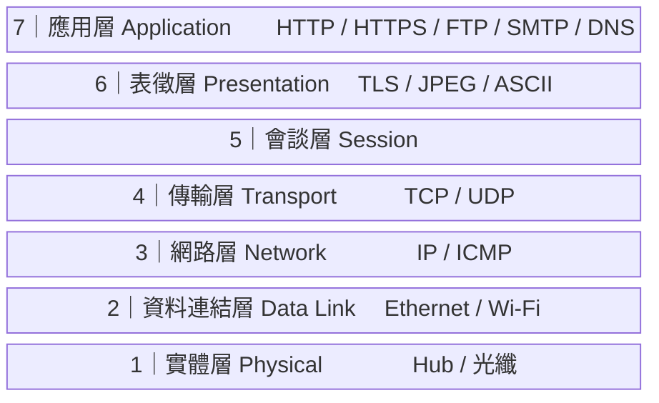
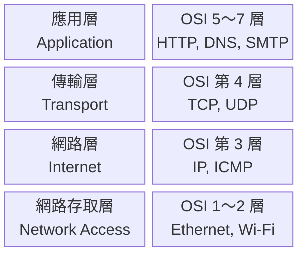

# Mermaid Diagram Support for bibiota-blog

## Overview

Add site-wide Mermaid diagram rendering to the VitePress blog so any article can include architecture diagrams, sequence diagrams, UML class/component diagrams, and other Mermaid-supported visuals using standard fenced code block syntax.

## Goals

- Enable ```` ```mermaid ```` code blocks globally across all `.md` articles
- Add two diagrams to the existing network protocol layers article as the first use case
- Minimal change to existing config and zero change to article authoring conventions

## Out of Scope

- Dark mode theming (dark mode is disabled site-wide)
- Custom Mermaid theme overrides
- Any other article modifications beyond `2026-06-06-network-protocol-layers.md`

## Approach

**`vitepress-plugin-mermaid` + `mermaid` npm packages** (see rejected alternatives below).

This approach wraps `defineConfig` with `withMermaid()` — one config change, zero per-article setup. The plugin handles SSR safety (Mermaid is browser-only; the plugin defers rendering to the client automatically).

Rejected alternatives:
- Custom Vue component: more verbose authoring, manual SSR handling required
- Static SVG images: cannot be maintained as code

## Implementation

### 1. Install packages

```bash
npm install vitepress-plugin-mermaid mermaid
```

### 2. Update `docs/.vitepress/config.js`

Add one import and wrap `defineConfig` with `withMermaid`:

```js
import { withMermaid } from 'vitepress-plugin-mermaid'

export default withMermaid(defineConfig({
  // all existing config unchanged
  mermaid: {},
}))
```

### 3. Add diagrams to `docs/tech/posts/2026-06-06-network-protocol-layers.md`

**Diagram 1 — OSI 七層架構圖**

Place after the OSI section intro paragraph, before the per-layer breakdown:

````markdown

````

**Diagram 2 — TCP/IP 四層 對應 OSI**

Place after the TCP/IP section intro paragraph, before the existing comparison table:

````markdown

````

## Affected Files

| File | Change |
|---|---|
| `package.json` | Add `vitepress-plugin-mermaid`, `mermaid` to devDependencies |
| `docs/.vitepress/config.js` | Add import + `withMermaid()` wrapper |
| `docs/tech/posts/2026-06-06-network-protocol-layers.md` | Insert two Mermaid blocks |

## Testing

1. Run `npm run docs:dev` and open the network protocol layers article
2. Verify both diagrams render correctly in the browser
3. Verify no SSR errors in the terminal
