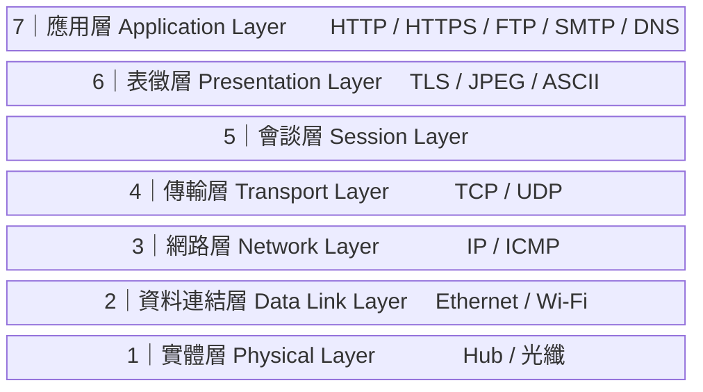
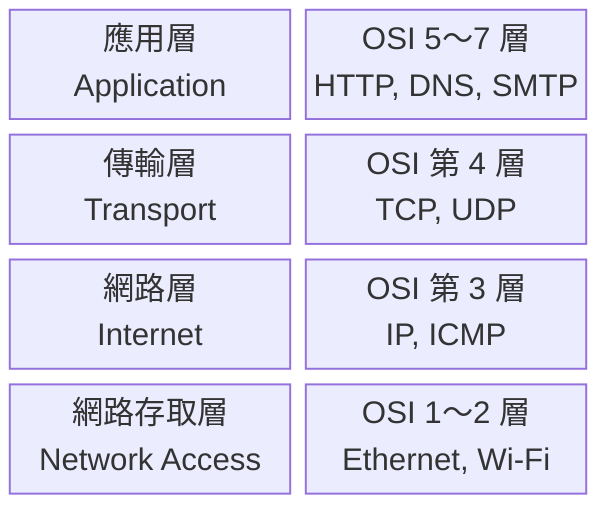

<ArticleTitle />

<ScrollToTopBtn />

兩台電腦要透過網路交換資料，背後涉及的工作遠比想像中複雜：資料要怎麼編碼？走哪條路？萬一途中遺失怎麼辦？最終又如何讓應用程式讀懂？

如果把這些問題全部塞進一個龐大的協定，任何一個環節出問題，整套系統都要重新設計。因此，現代網路通訊協定採用了**分層設計**的概念：

> 將龐大的通訊任務拆分成數個獨立的子任務，每一層只專注處理特定工作，向上層提供服務、向下層發出請求，層與層之間保持高度獨立。

這樣的設計帶來三個好處：

- **模組化開發**：工程師可以專注開發單一層級，不需要了解其他層的所有細節。
- **高相容性**：只要符合層級規範，底層硬體或線材的更換不會影響上層應用軟體。
- **易於除錯**：網路出問題時，可以快速鎖定特定層級排查，而不是大海撈針。

## OSI（Open Systems Interconnection）

OSI 是由 ISO（國際標準化組織）於 1984 年制定的標準參考模型，目的是讓不同廠商的設備與作業系統能夠互通。它將網路通訊拆分成七層，是學習網路概念最常見的理論框架。

以下從使用者最直接接觸的應用層（第 7 層）開始，往下介紹到實體層（第 1 層）。

### 第 7 層：應用層（Application Layer）

核心功能：為應用程式提供網路服務與溝通介面，定義資料的格式與請求規則。

常見協定：HTTP / HTTPS（網頁）、FTP（檔案傳輸）、SMTP（電子郵件）、DNS（網域名稱解析）。

### 第 6 層：表徵層（Presentation Layer）

核心功能：處理資料的轉譯、編碼、加密與解密，確保傳送的資料能被對方正確解讀。例如將圖片壓縮成 JPEG、將資料以 TLS 加密後傳送。

### 第 5 層：會談層（Session Layer）

核心功能：負責建立、管理與終止兩台電腦應用程式之間的通訊連線（對話），確保長時間的資料交換能夠正常維持與恢復。

### 第 4 層：傳輸層（Transport Layer）

核心功能：負責「端點到端點（End-to-End）」的資料傳輸，確保資料完整性，並在需要時進行錯誤檢查與重傳。

常見協定：**TCP**（可靠、連線導向）與 **UDP**（快速、無連線導向）。

TCP 與 UDP 的差異是後端面試的常見題目，下一篇文章將會詳細說明。

### 第 3 層：網路層（Network Layer）

核心功能：決定資料封包傳送的路徑（路由），負責跨網路將資料從來源端送到目的端，處理邏輯位址（IP 位址）的定址。

常見協定：IP（Internet Protocol）、ICMP（用於診斷網路的 `ping` 指令背後的協定）。

### 第 2 層：資料連結層（Data Link Layer）

核心功能：負責在同一個網路或鏈結中（如區域網路）將資料正確傳遞，處理硬體定址（MAC Address）及錯誤偵測。

常見協定：乙太網路（Ethernet）、Wi-Fi（802.11）。

### 第 1 層：實體層（Physical Layer）

核心功能：處理實體線材與硬體介面，負責將資料轉換成電子、光學或無線電波訊號進行實際傳輸。

常見設備：集線器（Hub）、網路線、光纖。

## TCP/IP 四層架構

**TCP/IP** 的全名是 Transmission Control Protocol / Internet Protocol，源自 1970 年代美國國防部高等研究計劃署（DARPA）為 ARPANET 所開發的協定組，是現今網際網路實際運行的基礎。

TCP/IP 採用較精簡的四層架構，把 OSI 的七層合併為四層：

| TCP/IP 四層 | 對應 OSI 層級 | 常見協定 |
|---|---|---|
| 應用層（Application） | 第 5～7 層 | HTTP、DNS、SMTP、FTP |
| 傳輸層（Transport） | 第 4 層 | TCP、UDP |
| 網路層（Internet） | 第 3 層 | IP、ICMP |
| 網路存取層（Network Access） | 第 1～2 層 | Ethernet、Wi-Fi |

## 我們應該關注哪個？

兩個模型的定位不同：

- **OSI** 是理論參考標準，適合建立分層概念、理解每一層的職責，也是許多教科書與課程的教學基礎。
- **TCP/IP 四層**是現實世界網際網路實際運作的架構，工程師日常溝通、面試場合通常以 TCP/IP 為主。

簡單來說：**用 OSI 理解概念，用 TCP/IP 解釋實作**。知道兩者的關係，在面試中能回答得更完整。

## 總結

網路通訊協定採用分層設計，是為了將複雜問題拆解成可獨立開發與維護的子任務。OSI 提供了清晰的理論框架，TCP/IP 四層架構則是實際驅動現代網際網路的協定組。

下一篇文章將聚焦在傳輸層的兩個核心協定：[TCP 與 UDP 的差異與適用場景](./2026-06-07-tcp-udp.md)。

## 參考

- [ISO/IEC 7498-1:1994 — Open Systems Interconnection Basic Reference Model](https://www.iso.org/standard/20269.html)
- [RFC 871 — A Perspective on the ARPANET Reference Model](https://www.rfc-editor.org/rfc/rfc871.html)
- [What is the network layer? — Cloudflare](https://www.cloudflare.com/learning/network-layer/what-is-the-network-layer/)
- [What is Layer 7? — Cloudflare](https://www.cloudflare.com/learning/ddos/what-is-layer-7/)
