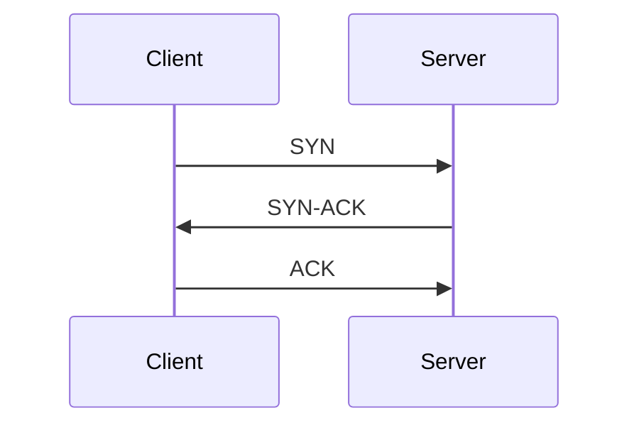

<ArticleTitle />

<ScrollToTopBtn />

在上一篇文章[網際網路通訊協定的分層設計](./2026-06-06-network-protocol-layers.md)提到過：網際網路通訊協定採用分層設計，TCP 與 UDP 都屬於**傳輸層（Transport Layer）**，位於 IP 協定之上。

IP 協定負責把資料送到正確的機器，但不保證資料是否完整送達。傳輸層進一步回答：資料遺失要不要重傳？封包順序對不對？要不要先確認連線？

面對這些問題，傳輸層提供了兩種截然不同的選擇：以可靠為優先的 **TCP**，以及以速度為優先的 **UDP**。

## TCP（Transmission Control Protocol）

TCP 是一種**連線導向（Connection-Oriented）**的協定，在正式傳送資料之前，雙方必須先完成**三次握手（Three-Way Handshake）**建立連線：

其中 **SYN（Synchronize）** 是發起連線請求的訊號，**ACK（Acknowledgment）** 是確認收到的回應。三次握手確保雙方都具備「傳送」與「接收」的能力後，才正式開始傳資料。

連線建立後，TCP 才開始傳送資料。這個過程帶來了以下保證：

- **可靠傳輸（Reliability）**：若封包在傳輸途中遺失，TCP 會自動重傳。
- **順序保證（Ordering）**：封包抵達的順序可能不同，但 TCP 會在接收端重新排列，確保應用層收到的資料順序正確。
- **流量控制（Flow Control）**：TCP 會根據接收端的處理速度動態調整傳送速率，避免接收端被大量封包淹沒。
- **壅塞控制（Congestion Control）**：TCP 會偵測網路壅塞並自動降速，避免加重網路負擔。

這些特性讓 TCP 非常適合需要完整、正確資料的場景，但也代表它的延遲相對較高。

## UDP（User Datagram Protocol）

UDP 是一種**無連線（Connectionless）**的協定，不需要握手，直接將封包（Datagram）送出去。

它的特性如下：

- **不保證送達（Best-Effort Delivery）**：封包可能遺失，UDP 不會重傳。
- **不保證順序**：封包可能亂序抵達，應用層需要自行處理（或忽略）。
- **無流量控制、無壅塞控制**：傳送速度不受協定限制。
- **低延遲**：省去連線建立與確認機制，傳輸速度更快。

UDP 的代價是不可靠性，但在某些場景下，「速度」比「完整性」更重要。

## TCP vs UDP 對比

| 特性 | TCP | UDP |
|---|---|---|
| 連線建立 | 需要（三次握手） | 不需要 |
| 可靠性 | 保證送達，自動重傳 | 不保證，封包可能遺失 |
| 順序保證 | 有 | 無 |
| 流量控制 | 有 | 無 |
| 延遲 | 較高 | 較低 |
| 傳輸單位 | 串流（Stream） | 資料報（Datagram） |

## 適合的使用場景

**TCP 適合：**

- **HTTP / HTTPS**：網頁請求需要完整的回應內容，不能遺漏任何資料。
- **資料庫連線**：SQL 查詢的結果必須完整、正確。
- **電子郵件（SMTP / IMAP）**：信件內容不能缺損。
- **檔案傳輸（FTP / SFTP）**：檔案若有位元遺失就會損毀。

**UDP 適合：**

- **直播與視訊串流**：短暫畫面破格比卡頓更能被接受；重傳來不及趕上播放進度。
- **線上遊戲**：即時位置更新需要低延遲，遺失一幀位置資料影響不大。
- **DNS 查詢**：查詢封包小、回應快，若失敗直接重送即可。
- **WebRTC**：P2P 即時音訊與視訊傳輸使用 UDP 以降低延遲（詳見[淺談 WebRTC](./2026-06-04-webrtc.md)）。

## 總結

TCP 與 UDP 的取捨核心在於：**你能否接受資料遺失？**

- 若資料必須完整送達（網頁、資料庫、檔案），選 **TCP**。
- 若需要低延遲且能容忍少量遺失（直播、遊戲、DNS），選 **UDP**。

兩者沒有優劣之分，而是根據應用場景選擇適合的協定。

## 參考

- [RFC 793 - Transmission Control Protocol](https://tools.ietf.org/html/rfc793)
- [What is UDP? - Cloudflare](https://www.cloudflare.com/learning/ddos/glossary/user-datagram-protocol-udp/)
- [TCP handshake - MDN Web Docs](https://developer.mozilla.org/en-US/docs/Glossary/TCP_handshake)
- [RFC 8095 - Services Provided by IETF Transport Protocols](https://tools.ietf.org/html/rfc8095)
