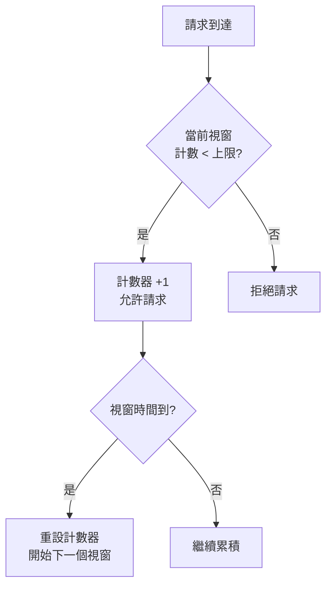
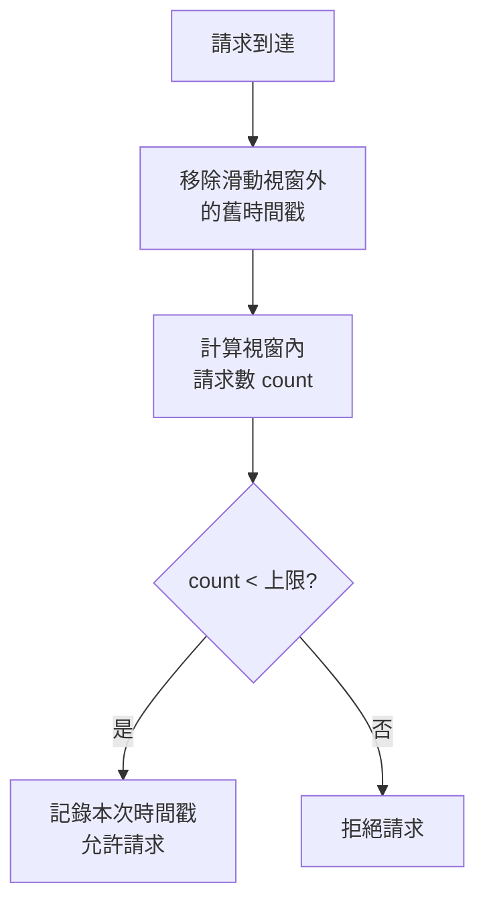
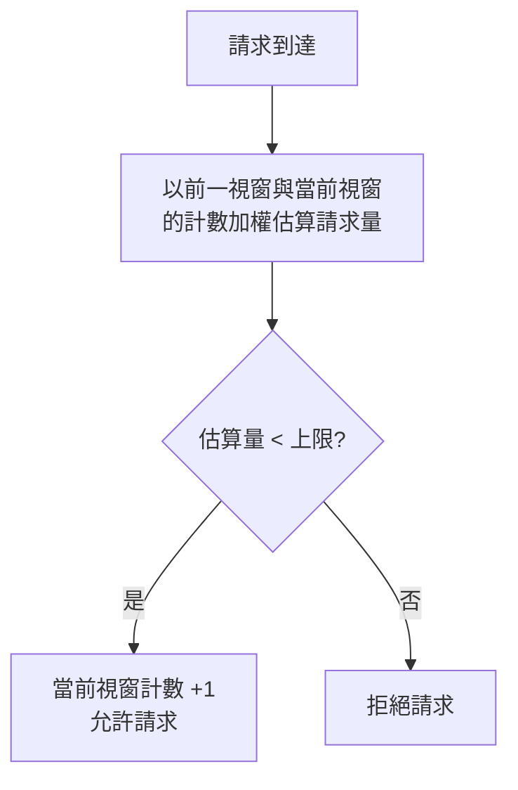
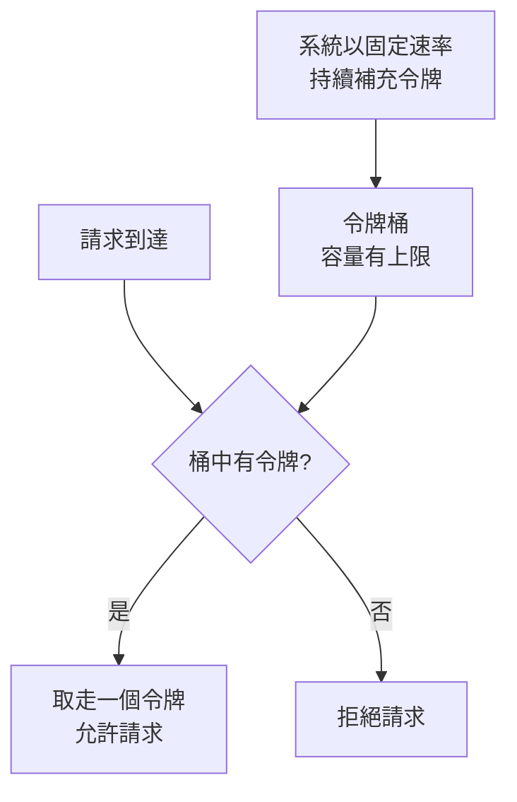
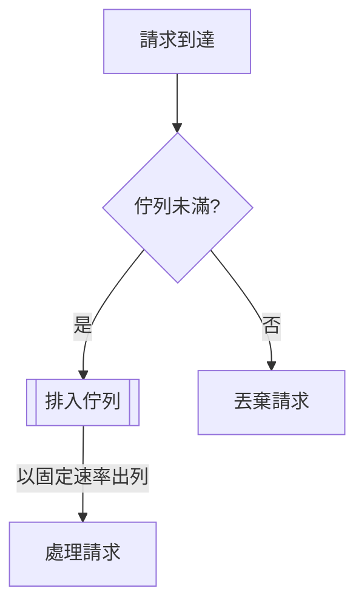

<script setup>
  import ArticleTitle from '@theme/components/ArticleTitle.vue'
  import ScrollToTopBtn from '@theme/components/ScrollToTopBtn.vue'
</script>

<ArticleTitle />

<ScrollToTopBtn />

## 為何需要 Rate Limiting？

Rate Limiting（速率限制）是用來控制某個用戶、IP 或服務在單位時間內可以發出多少請求的機制。設計 API 或後端服務時，若沒有 Rate Limiting，可能面臨以下問題：

- **資源濫用**：惡意用戶大量發送請求，耗盡伺服器資源。
- **下游服務崩潰**：高流量超過資料庫或第三方 API 的承載上限。
- **服務不公平**：少數用戶佔用大量資源，影響其他用戶體驗。

Rate Limiting 常見於 API Gateway、登入介面防爆破（Brute Force）、簡訊發送等場景。

---

## 五種主流演算法

### 1. Fixed Window Counter（固定視窗計數器）

將時間切分為固定大小的視窗（例如每 60 秒一個視窗），每個視窗內維護一個計數器，請求進來就累加，超過上限則拒絕。



**優點**：實作簡單，記憶體佔用低。

**缺點**：視窗邊界放大問題（Boundary Amplification）。假設上限為每分鐘 100 次，用戶在第 0:59 發送 100 次、第 1:01 再發送 100 次，實際上在 2 秒內送出了 200 次請求，卻都合法通過。

---

### 2. Sliding Window Log（滑動視窗日誌）

記錄每筆請求的精確時間戳（Timestamp），每次請求進來時，刪除超出時間視窗的舊記錄，再計算視窗內的總請求數。



**優點**：精確度最高，不會有視窗邊界問題。

**缺點**：每筆請求都需要儲存時間戳，記憶體消耗高，在高流量下成本明顯。

---

### 3. Sliding Window Counter（滑動視窗計數器）

Sliding Window Log 的改良版：不儲存每筆時間戳，而是結合當前視窗與前一個視窗的計數器，以比例估算滑動視窗內的請求數。

**公式**：

```
estimated_count = prev_window_count × (1 - elapsed / window_size) + curr_window_count
```



**優點**：在精確度與記憶體之間取得良好平衡，是分散式系統中最常見的實用選擇。

**缺點**：計算結果為估算值，極少數邊界情況下可能有輕微誤差。

---

### 4. Token Bucket（令牌桶）

想像一個桶子，系統以固定速率（例如每秒 10 個）往桶裡放入令牌（Token），桶有最大容量上限。每個請求進來需消耗一個令牌，桶空則拒絕請求。



**優點**：允許短暫的突發流量（Burst），同時確保長期平均速率符合限制，適合公開 API。

**缺點**：需要記錄上次補充令牌的時間與目前令牌數，狀態稍複雜。

---

### 5. Leaky Bucket（漏桶）

請求進來後先放入佇列（桶），系統以固定速率從佇列取出並處理，超出桶容量則丟棄。



**優點**：輸出速率絕對平穩，適合整形（Shaping）對外或對下游服務的流量。

**缺點**：無法允許任何突發，請求可能因等待而增加延遲。

---

### 演算法比較

| 演算法 | 精確度 | 記憶體 | 允許突發 | 適用場景 |
|---|---|---|---|---|
| Fixed Window Counter | 低（邊界問題） | 低 | 部分 | 內部低風險服務 |
| Sliding Window Log | 最高 | 高 | 否 | 嚴格精確的場景 |
| Sliding Window Counter | 高（估算） | 低 | 否 | 分散式高流量 API |
| Token Bucket | 高 | 低 | 是 | 公開 API |
| Leaky Bucket | 高 | 中 | 否 | 下游流量整形 |

---

## 常見落地場景

- **API Gateway**：在流量入口統一限制每個用戶或 IP 的請求頻率，保護後端所有服務。
- **登入防爆破**：限制同一 IP 在短時間內的登入嘗試次數（例如每 10 分鐘最多 10 次），防止密碼暴力破解。
- **簡訊 / 電子郵件發送**：限制每個用戶每分鐘只能觸發一次驗證碼發送，避免濫用第三方 API 產生費用。

---

## 回應用戶端的方式

當請求被拒絕時，應回傳標準的 HTTP 狀態碼與適當的 Header，讓用戶端知道何時可以重試：

```
HTTP/1.1 429 Too Many Requests
Retry-After: 30
X-RateLimit-Limit: 100
X-RateLimit-Remaining: 0
X-RateLimit-Reset: 1749456000
```

- **`429 Too Many Requests`**：標準狀態碼，表示請求超出速率限制。
- **`Retry-After`**：告知用戶端需等待多少秒後才能重試（秒數或 HTTP 日期格式均可）。
- **`X-RateLimit-*`**：非標準但業界通用的 Header，提供目前限制上限、剩餘次數與重置時間。

---

## 總結

Rate Limiting 的設計沒有萬能解法，需根據場景選擇合適的演算法：

- **需要簡單快速**：Fixed Window Counter。
- **需要公開 API 且允許突發**：Token Bucket。
- **需要高精確度的分散式限制**：Sliding Window Counter。
- **需要平穩整形下游流量**：Leaky Bucket。

在分散式環境下，將狀態集中至 Redis，並以 Lua Script 確保操作原子性，是最常見且可靠的實作模式。

## 參考

- [Rate Limiting Algorithms: Token Bucket vs Sliding Window vs Fixed Window](https://blog.arcjet.com/rate-limiting-algorithms-token-bucket-vs-sliding-window-vs-fixed-window/)
- [Rate Limiting System Design: Algorithms, Trade-offs and Best Practices](https://itnext.io/rate-limiting-system-design-algorithms-trade-offs-and-best-practices-c6019cb2dd85)
- [Build 5 Rate Limiters with Redis: Algorithm Comparison Guide](https://redis.io/tutorials/howtos/ratelimiting/)
- [Redis rate limiter | Docs](https://redis.io/docs/latest/develop/use-cases/rate-limiter/)
- [Sliding Window Rate Limiting - Design and Implementation](https://arpitbhayani.me/blogs/sliding-window-ratelimiter/)
- [RFC 6585 - Additional HTTP Status Codes](https://datatracker.ietf.org/doc/html/rfc6585)
