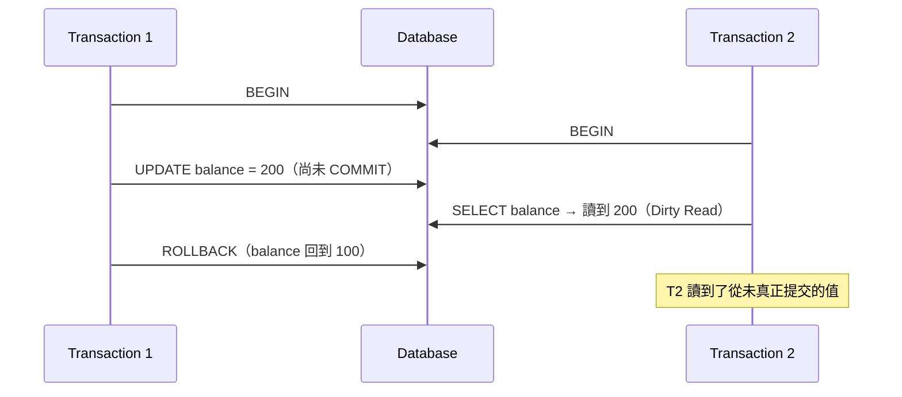
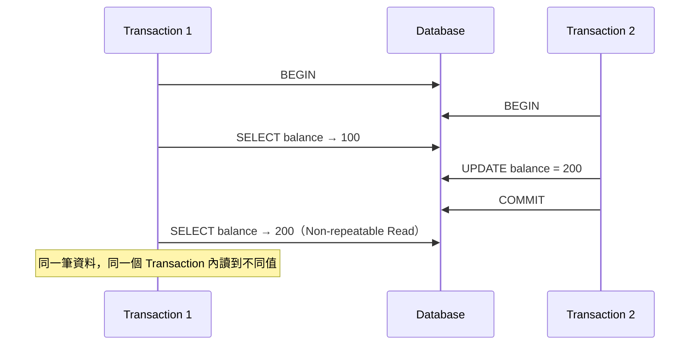
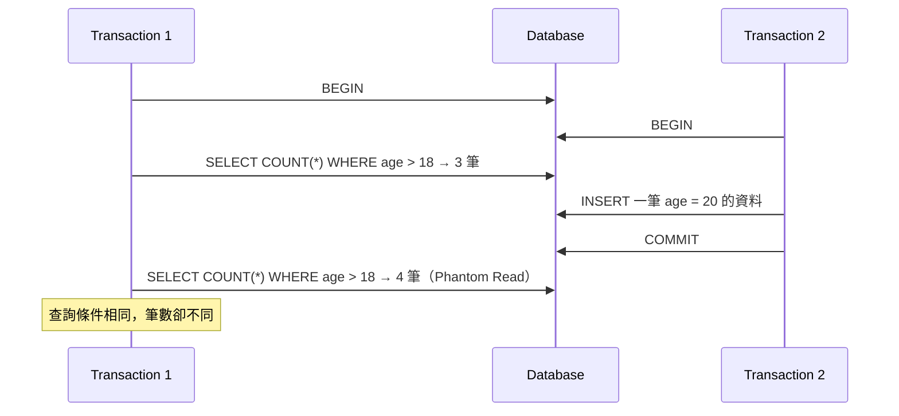
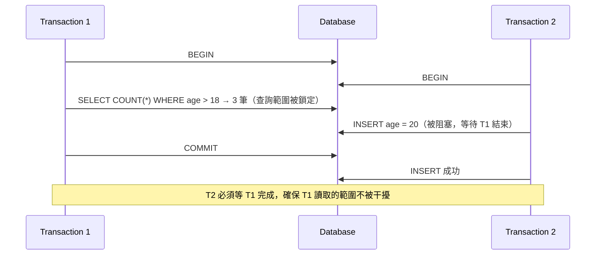

<ArticleTitle />

<ScrollToTopBtn />

## 什麼是 Transaction Isolation

想像帳戶餘額原本是 100。A 正在把它改成 200，還沒 commit；這時 B 讀到 200，拿去做後續計算。結果 A 最後 rollback，餘額回到 100——但 B 已經用了那個從未正式生效的 200。

這類問題在高並發的系統裡很常見。Transaction Isolation Level（交易隔離等級）就是資料庫用來控制「一個 Transaction 的操作，對其他同時進行的 Transaction 可見到什麼程度」的設定。

ANSI SQL 標準定義了三種 Read Anomaly（讀取異常）的類型，以及 Transaction Isolation Level 四個等級。
等級越高，資料越不容易出問題，但資料庫需要做更多的鎖定或版本管理，效能也會受影響。

## 三種 Read Anomaly

### Dirty Read（髒讀）

讀到另一個**尚未提交**的 Transaction 所修改的資料。若那個 Transaction 最終 rollback，你讀到的值其實從未真正存在過。

### Non-repeatable Read（不可重複讀）

在同一個 Transaction 中，對同一筆資料讀取兩次，卻得到不同的值——因為另一個 Transaction 在兩次讀取之間提交了修改。

### Phantom Read（幻影讀）

在同一個 Transaction 中，以相同條件查詢兩次，卻得到不同的**筆數**——因為另一個 Transaction 在兩次查詢之間新增或刪除了符合條件的資料列。

## 四個 Isolation Level

### 1. Read Uncommitted

最低隔離等級，允許讀取其他 Transaction **尚未提交**的資料。三種 Anomaly 都可能發生。

T2 讀到的 200 是 T1 還沒確認要保留的中間狀態，T1 Rollback 後這個值就消失了。

---

### 2. Read Committed

只能讀取已提交的資料，避免 Dirty Read。但同一個 Transaction 內對同一筆資料的兩次讀取，可能因為其他 Transaction 的提交而得到不同結果。

PostgreSQL 與許多雲端資料庫的預設等級是 Read Committed。

---

### 3. Repeatable Read

在同一個 Transaction 中，對同一筆資料重複讀取，保證得到相同的結果。但針對**範圍查詢**，仍可能因為其他 Transaction 插入新資料而讀到不同筆數。

MySQL InnoDB 的預設等級是 Repeatable Read，但實際上也防止了 Phantom Read（比標準要求更強），靠的是兩個機制：

- **MVCC（Multi-Version Concurrency Control）**：資料庫為每筆資料保留多個版本。Transaction 開始後會建立一個快照（Read View），之後的讀取都從這個快照取值，不受其他 Transaction 的新增或修改影響。
- **Gap Lock（間隙鎖）**：鎖住的不只是現有資料列，而是查詢條件所涵蓋的「範圍間隙」，防止其他 Transaction 在這個範圍內插入新資料。

---

### 4. Serializable

最高隔離等級。Transaction 的執行結果與「逐一序列執行」完全一致，三種 Anomaly 全部不會發生。資料庫通常透過範圍鎖（Range Lock）或 Predicate Lock 實現，代價是並發效能顯著下降。

## 各等級防止 Anomaly 的對照表

| Isolation Level   | Dirty Read | Non-repeatable Read | Phantom Read |
|-------------------|:----------:|:-------------------:|:------------:|
| Read Uncommitted  | ❌ 可能    | ❌ 可能             | ❌ 可能      |
| Read Committed    | ✅ 防止    | ❌ 可能             | ❌ 可能      |
| Repeatable Read   | ✅ 防止    | ✅ 防止             | ❌ 可能*     |
| Serializable      | ✅ 防止    | ✅ 防止             | ✅ 防止      |

*MySQL InnoDB 透過 MVCC + Gap Lock，在 Repeatable Read 下也防止了 Phantom Read。

## 實務取捨

隔離等級越高，一致性越強，但需要維護更多鎖或版本資訊，長時間 Transaction 會累積歷史版本，影響記憶體與效能。

常見選擇：

- **Read Committed**：PostgreSQL 預設，適合讀多寫少、對 Non-repeatable Read 容忍的場景
- **Repeatable Read**：MySQL InnoDB 預設，結合 MVCC 可在不完全鎖定的情況下提供強一致性保證
- **Serializable**：金融交易、庫存扣減等對資料正確性要求極嚴格的場景，通常搭配短 Transaction 使用

## 總結

| 等級 | 核心保證 |
|---|---|
| Read Uncommitted | 不加任何保護，效能最高 |
| Read Committed | 只讀已提交資料 |
| Repeatable Read | 同一 Transaction 內讀取結果穩定（MySQL 預設） |
| Serializable | 完整序列化，一致性最強 |

選擇 Isolation Level 的核心取捨在於：你的業務邏輯對**資料一致性**的要求程度，以及對**並發效能**的容忍底線。

## 參考

- [MySQL 8.4 Reference Manual — InnoDB Transaction Isolation Levels](https://dev.mysql.com/doc/refman/8.4/en/innodb-transaction-isolation-levels.html)
- [Isolation (database systems) — Wikipedia](https://en.wikipedia.org/wiki/Isolation_(database_systems))
- [MySQL isolation levels and how they work — PlanetScale](https://planetscale.com/blog/mysql-isolation-levels-and-how-they-work)
- [A Critique of ANSI SQL Isolation Levels — arXiv](https://arxiv.org/pdf/cs/0701157)
