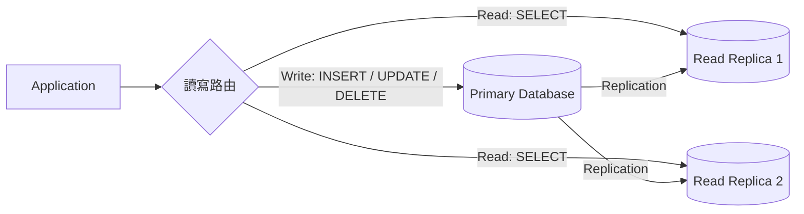
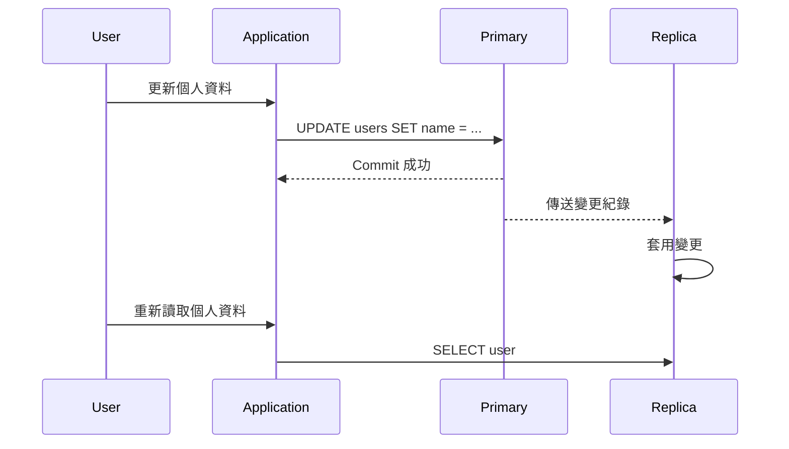
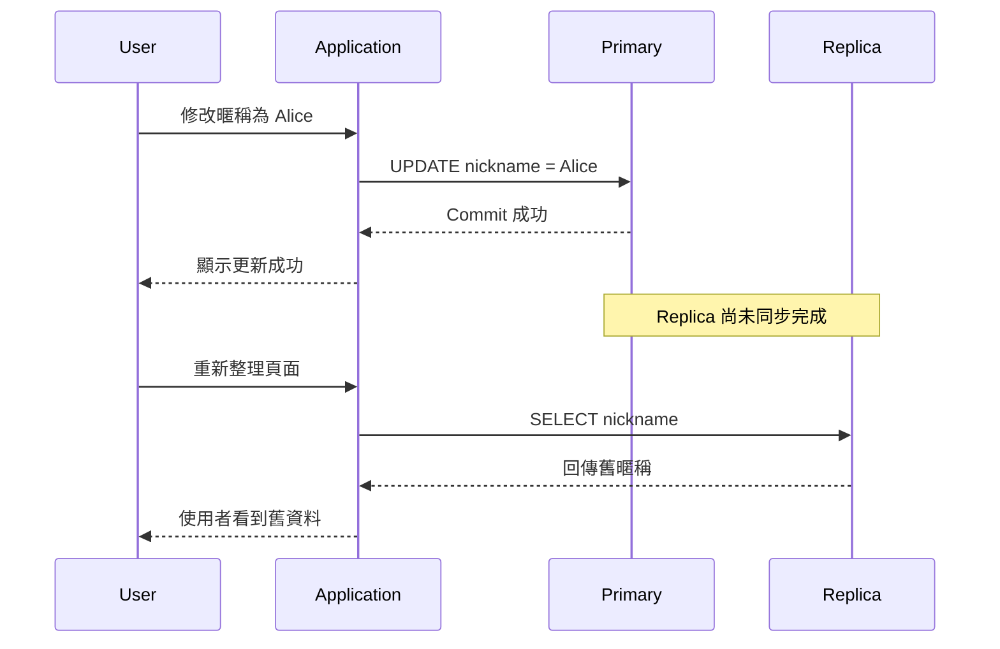

<script setup>
  import ArticleTitle from '@theme/components/ArticleTitle.vue'
  import ScrollToTopBtn from '@theme/components/ScrollToTopBtn.vue'
</script>

<ArticleTitle />

<ScrollToTopBtn />

## 為什麼需要讀寫分離？

多數產品在成長到一定規模後，資料庫壓力通常不是平均分布的。使用者瀏覽商品、查詢文章、刷新訂單狀態、載入個人頁面，這些都是讀取；真正修改資料的寫入，例如下單、付款、更新庫存，比例反而較少。

如果所有讀寫都打到同一台資料庫，資料庫會同時承擔兩種壓力：

- 寫入需要維持資料正確性，例如 transaction、lock、index 更新。
- 讀取可能來自大量使用者或報表查詢，消耗 CPU、I/O 與連線數。

讀寫分離（Read/Write Splitting）的核心想法是：**寫入集中到 Primary，讀取分散到 Replica**。這樣可以讓主資料庫專注處理寫入與一致性，並透過多個讀取副本分散查詢流量。

這不是讓資料庫變成無限快，而是把「讀多寫少」的壓力拆開，讓架構有更清楚的擴展方向。

## 基本架構

典型的讀寫分離架構會有一個 Primary，以及一個或多個 Replica。



在這個架構中：

- **Primary**：負責處理寫入，通常也是資料變更的來源。
- **Replica**：從 Primary 複製資料，主要承接讀取查詢。
- **讀寫路由**：可以寫在應用程式、ORM、資料庫 proxy，或雲端資料庫提供的 reader endpoint。

MySQL 官方文件把這種用途稱為 scale-out：所有寫入與更新都在 source server 上進行，讀取則可以分散到一個或多個 replica。Amazon RDS 的 Read Replica 也採用類似概念，將 primary 的變更非同步複製到 read replica，讓應用程式把讀取流量導向副本。

## Replication 如何運作？

讀寫分離能成立，是因為資料庫有 replication（複製）機制。

以概念來看，流程大致如下：

1. 使用者送出寫入請求。
2. Application 將寫入送到 Primary。
3. Primary 完成寫入並記錄變更。
4. Replica 從 Primary 接收變更紀錄。
5. Replica 重放這些變更，讓自己的資料逐步追上 Primary。



PostgreSQL 的 streaming replication 會讓 standby 透過連線接收 primary 產生的 WAL records；MySQL replication 則是讓 source 的資料複製到一個或多個 replicas，而且預設是非同步複製。

「非同步」是讀寫分離最重要的關鍵字。它讓寫入不用等所有 Replica 都同步完成才回應，因此寫入延遲較低；但代價是 Replica 可能短暫落後 Primary。

## Replication Lag：讀到舊資料的風險

Replication Lag 指的是 Primary 已經完成寫入，但 Replica 還沒套用到該筆變更的時間差。

在延遲很低時，使用者通常感覺不到。但在高寫入量、Replica 負載過高、網路延遲、長查詢卡住 replay 的情況下，lag 可能變明顯。

最常見的問題是：使用者剛更新完資料，下一秒重新整理頁面，卻看到舊資料。



這類問題不是 transaction isolation level 能直接解決的，因為它不是同一台資料庫內部的併發隔離問題，而是多個資料庫節點之間的同步延遲問題。

PostgreSQL 官方文件也明確提醒，standby 上的資料抵達需要時間，所以幾乎同時在 primary 與 standby 執行相同查詢，可能得到不同結果。換句話說，Replica 會逐步追上 Primary，但在追上以前，應用程式必須知道自己可能讀到較舊的狀態。

## Read-after-write Consistency

Read-after-write consistency 指的是：同一個使用者完成寫入後，後續讀取應該看得到自己剛剛寫入的結果。

這個保證對使用者體驗很重要。例如：

- 使用者改完暱稱，重新整理後應該看到新暱稱。
- 使用者建立文章後，應該立刻在自己的文章列表看到它。
- 使用者完成付款後，訂單頁不應該還顯示未付款。

讀寫分離後，如果所有 `SELECT` 都一律導到 Replica，就可能破壞這個保證。因此實務上通常會針對「剛寫完後的讀取」做額外路由。

常見做法如下。

### 1. 寫入後短時間讀 Primary

當某個使用者剛完成寫入，可以在接下來幾秒內把他的讀取導向 Primary。

例如：

- 更新個人資料後，5 秒內讀個人資料走 Primary。
- 建立訂單後，訂單詳情頁先讀 Primary。
- 修改文章後，作者自己的預覽頁讀 Primary。

這種做法簡單有效，但要注意 Primary 的負載。如果時間設太長，或所有使用者都被導回 Primary，就會削弱讀寫分離的效果。

### 2. 重要查詢指定讀 Primary

不是所有讀取都能接受舊資料。像付款狀態、庫存扣減、權限檢查、剛建立的訂單，通常應該讀 Primary。

相對地，文章列表、商品瀏覽、排行榜、統計報表，通常比較能接受短暫延遲。

可以把查詢分成兩類：

| 查詢類型 | 建議路由 |
|---|---|
| 必須看到最新結果 | Primary |
| 可接受短暫延遲 | Replica |
| 報表、分析、後台查詢 | Replica 或獨立分析庫 |

這也是讀寫分離設計裡最容易被忽略的地方：不是所有 `SELECT` 都應該走 Replica。

### 3. 依 Session 做一致性路由

另一種做法是記錄使用者最近一次寫入時間，或記錄某個資料版本位置，讓路由層判斷目前 Replica 是否已經追上。

概念上可以是：

```text
if user_just_wrote_data:
    read_from_primary()
else if replica_lag_is_safe:
    read_from_replica()
else:
    read_from_primary()
```

更精細的系統會比較 Primary 與 Replica 的 replication position，例如 PostgreSQL 的 WAL LSN，確認 Replica 已套用到某個位置後再讓該使用者讀 Replica。

這種方式比固定等待幾秒更精準，但實作複雜度也更高。

### 4. 監控 Replication Lag

讀寫分離上線後，replication lag 必須被監控。

如果 lag 超過門檻，系統可以做幾件事：

- 暫時把敏感讀取導回 Primary。
- 停止把報表查詢送到延遲嚴重的 Replica。
- 對使用者顯示「資料同步中」而不是顯示錯誤狀態。
- 擴充 Replica 資源或檢查是否有長查詢拖慢同步。

PostgreSQL 文件提到可以透過 primary 目前 WAL 位置與 standby 最後收到的 WAL 位置來估算 lag。Amazon Aurora 文件也提醒，Replica lag 通常很低，但在大量寫入期間仍可能上升。

## 適合與不適合的場景

讀寫分離適合用在讀取明顯多於寫入，而且讀取流量已經讓單一資料庫吃緊的系統。

常見例子：

- 電商商品頁、商品列表、庫存展示。
- 內容網站文章頁與列表頁。
- 後台報表或資料分析查詢。
- 社群平台的公開頁面瀏覽。
- 內部系統中大量查詢、少量更新的模組。

不適合的場景：

- 寫入壓力才是主要瓶頸。
- 所有讀取都必須立刻看到最新資料。
- 系統規模還小，單一資料庫加上索引與查詢優化已足夠。
- 團隊沒有監控與處理 replication lag 的能力。

讀寫分離會增加系統複雜度。當問題只是某個 SQL 太慢、缺索引、N+1 query、或資料表設計不良時，直接上 Replica 可能只是把原本的問題複製到更多地方。

## 與 Sharding、Cache、CQRS 的差異

讀寫分離常和其他架構名詞混在一起，但它們解決的問題不同。

| 技術 | 主要解決問題 | 核心概念 |
|---|---|---|
| 讀寫分離 | 讀取流量擴展 | 寫 Primary，讀 Replica |
| Sharding | 單一資料集太大或寫入壓力太高 | 依規則把資料切到不同節點 |
| Cache | 降低重複查詢成本 | 把常用結果放到 Redis、CDN 或記憶體 |
| CQRS | 讀模型與寫模型職責不同 | Command 與 Query 使用不同模型 |

讀寫分離不等於 sharding。Replica 通常保存同一份資料的副本；sharding 則是把不同資料分散到不同節點。

讀寫分離也不等於 cache。Replica 仍是資料庫，會透過 replication 追上 Primary；cache 則通常需要設計失效策略、TTL 或主動更新。

至於 CQRS（Command Query Responsibility Segregation），它比讀寫分離更偏應用架構。簡單說，CQRS 會把「修改資料的 Command」與「查詢資料的 Query」拆成不同模型：寫入端專注處理業務規則與資料變更，讀取端則可以為查詢效率設計成另一種資料模型。

例如訂單系統的寫入模型可能需要處理付款、庫存、狀態轉移等規則；但後台報表只需要快速查詢訂單摘要，就可以使用另一個整理好的讀取模型。

讀寫分離可以支援讀寫負載拆分，但不一定代表你已經採用 CQRS；多數 CRUD 系統只需要讀寫路由，不需要把整個 domain model（領域模型）拆成 command model（命令模型）與 query model（查詢模型）。

## 實務設計重點

導入讀寫分離時，可以用以下問題檢查設計是否合理：

1. 哪些查詢可以接受舊資料？
2. 哪些查詢必須讀到最新資料？
3. 寫入後的下一次讀取要走哪裡？
4. Replica lag 超過門檻時要怎麼降級？
5. 報表查詢是否會拖慢 Replica 同步？
6. Primary 故障時，Replica 是否只是讀取擴展，還是也要承擔 failover？

尤其是最後一點要分清楚：讀寫分離主要是讀取擴展；高可用（High Availability）與災難復原（Disaster Recovery）雖然也可能用到 Replica，但那是另一層設計。

## 總結

資料庫讀寫分離的核心是把寫入送到 Primary，把可接受短暫延遲的讀取分散到 Replica。

它適合讀多寫少、讀取流量已經壓垮單一資料庫的系統，可以提升讀取吞吐量，也能把報表或分析查詢從 Primary 移開。

但它不是免費的擴展。因為多數 replication 都是非同步或近似非同步，Replica 可能短暫落後 Primary，造成 read-after-write consistency 問題。

因此讀寫分離真正的設計重點不是「所有 SELECT 都丟給 Replica」，而是清楚分類：

- 可以接受延遲的讀取，走 Replica。
- 必須看到最新狀態的讀取，走 Primary。
- 寫入後立即讀取的流程，要有一致性路由策略。
- Replication lag 要被監控，並能在延遲過高時降級。

如果能把這些取捨說清楚，讀寫分離就不只是「加幾台從庫」，而是一個圍繞資料一致性、效能與可維運性的架構決策。

## 參考

- [MySQL 8.4 Reference Manual — Replication](https://dev.mysql.com/doc/refman/8.4/en/replication.html)
- [PostgreSQL Documentation — Log-Shipping Standby Servers](https://www.postgresql.org/docs/current/warm-standby.html)
- [PostgreSQL Documentation — Hot Standby](https://www.postgresql.org/docs/current/hot-standby.html)
- [Amazon RDS Documentation — Working with DB instance read replicas](https://docs.aws.amazon.com/AmazonRDS/latest/UserGuide/USER_ReadRepl.html)
- [Amazon Aurora Documentation — Replication with Amazon Aurora](https://docs.aws.amazon.com/AmazonRDS/latest/AuroraUserGuide/Aurora.Replication.html)
- [Martin Fowler — CQRS](https://martinfowler.com/bliki/CQRS.html)
