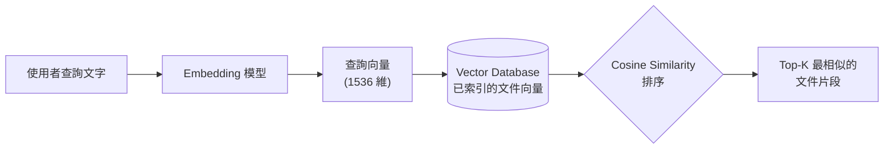

<script setup>
  import ArticleTitle from '@theme/components/ArticleTitle.vue'
  import ScrollToTopBtn from '@theme/components/ScrollToTopBtn.vue'
</script>

<ArticleTitle />

<ScrollToTopBtn />

## 前言

[上一篇](/tech/posts/2026-06-16-llm-api-best-practices)討論了串接 LLM API 時必須處理的錯誤、Streaming 與費用控管。當這些基本功能都到位之後，下一個常見問題會是：「我想讓 LLM 回答公司內部文件、最新產品手冊或私有資料，但這些內容不在模型的訓練資料裡，該怎麼辦？」

答案就是 **RAG（Retrieval-Augmented Generation，檢索增強生成）**——LLM 應用最常見的架構模式之一，由 Meta 研究團隊在 2020 年的論文中首次提出。

## 為什麼需要 RAG

直接呼叫 LLM API 有三個本質上的限制：

| 限制 | 說明 |
|---|---|
| **知識截止（Knowledge Cutoff）** | LLM 的訓練資料有截止日期，無法回答之後發生的事件 |
| **幻覺（Hallucination）** | LLM 不知道時，傾向「編造」聽起來合理但實際錯誤的內容 |
| **私有資料盲區** | 公司內部文件、個人筆記、付費資料庫從未進入模型訓練集，模型無從得知 |

傳統做法是把所有相關資料塞進 Prompt，但這會遇到 Context Window 上限與 Token 費用爆炸的問題；而且當資料量大到需要從上千份文件中挑出相關內容時，根本塞不下。

RAG 的核心思路是：**不要把所有資料都餵給 LLM，而是在每次問答前先「檢索」出最相關的幾段資料，再把它們和使用者的問題一起送進 LLM**。

## RAG 的兩階段架構

RAG 系統由兩條獨立的流水線組成：**Indexing（索引）** 與 **Query（查詢）**。

### Indexing 階段（離線）

把外部資料預處理並存進可搜尋的資料庫，這個階段只需要在資料更新時執行：

```
原始文件 → Chunking 切分 → Embedding 向量化 → 寫入 Vector Database
```

### Query 階段（線上）

每次使用者發問時即時執行：

```
使用者問題 → Embedding 向量化 → 在 Vector DB 做相似度搜尋
            → 取出 Top-K 相關片段 → 連同問題送進 LLM → 生成回答
```

關鍵設計在於：**Indexing 與 Query 必須使用同一個 Embedding 模型**，否則向量空間不一致，相似度搜尋會失準。

## Embedding：把文字變成向量

**Embedding（嵌入）** 是把一段文字轉成固定維度的數字向量。語意相近的文字在向量空間中距離較近，語意不同的文字距離較遠。

舉例來說，OpenAI 的 `text-embedding-3-small` 會把任意文字轉成 1536 維的浮點數向量。「貓在睡覺」和「Cat is sleeping」雖然語言不同，但在向量空間中會非常接近；而「貓在睡覺」與「股票市場分析」則會相距很遠。

Embedding 是 RAG 能進行「語意搜尋」的基礎——傳統的關鍵字搜尋只能找到「字面相同」的文字，Embedding 則能找到「意思相近」的內容，即使用詞完全不同。

## Vector Database 與相似度搜尋

存了大量向量之後，需要一種能快速找出「最相似向量」的資料庫，這就是 **Vector Database（向量資料庫）**。常見選項包括 Pinecone、Weaviate、Chroma、Qdrant、pgvector 等。

整個查詢流程可以這樣理解：



最常用的相似度計算方式是 **Cosine Similarity（餘弦相似度）**：把兩個向量看成空間中的箭頭，計算它們之間夾角的餘弦值。

- 值接近 **1**：兩向量方向幾乎相同，語意非常相似
- 值接近 **0**：兩向量近乎垂直，語意無關
- 值接近 **-1**：方向相反，語意對立

對 1536 維向量逐筆比對的成本很高，因此 Vector DB 內部會使用 **HNSW（Hierarchical Navigable Small World）** 等近似最近鄰演算法（Approximate Nearest Neighbor, ANN），用犧牲少量精確度換取數量級的查詢加速。

## Chunking：把長文件切成適合檢索的片段

如果直接把整份 PDF 或網頁存成一個向量，會遇到兩個問題：

- 一份文件可能涵蓋多個主題，整體向量無法精準表達任一主題
- 即使檢索到了，整份文件可能塞不進 LLM 的 Context Window

**Chunking（分塊）** 就是把長文件切成適合檢索的小片段。常見策略有三種：

| 策略 | 做法 | 適用情境 |
|---|---|---|
| **Fixed-size** | 依固定字數（如 500 字）切分，搭配少量重疊（如 50 字） | 通用，最簡單，無需 NLP 處理 |
| **Structure-based** | 依文件結構（段落、章節、Markdown 標題）切分 | 結構清楚的文件，如技術文件、書籍 |
| **Semantic** | 用 Embedding 偵測語意斷點，相似度驟降時切分 | 長篇文章、敘事性內容 |

實務上有幾個經驗：

- **Chunk 太小**：上下文不足，模型缺乏背景資訊；檢索可能命中片段但語意不完整
- **Chunk 太大**：一個 chunk 含多個主題，向量無法精準表達；浪費 Context Window
- **加入 Overlap**：相鄰 chunk 之間保留少量重疊（如 10%–20% 字數），避免關鍵句被切在邊界

Fixed-size + Overlap 通常是最務實的起點，再根據實際檢索效果調整。

## RAG vs Fine-tuning

當需要讓 LLM「掌握額外資料」時，另一條路是 **Fine-tuning（微調）**——把資料整理成訓練樣本，再去調整模型權重。兩者並非互斥，但取捨上有明顯差異：

| 面向 | RAG | Fine-tuning |
|---|---|---|
| **資料更新** | 即時，重新索引即可 | 必須重新訓練 |
| **建置成本** | 較低，無需 GPU 訓練 | 高，需要訓練資料與算力 |
| **推論延遲** | 略高（多一次檢索） | 較低 |
| **可追溯性** | 可附上來源文件 | 不易追溯內容出處 |
| **適合場景** | 大量、頻繁更新的知識性內容 | 固定的語氣、格式、行為模式 |

實務上的判斷原則：

- **資料會變動 → 用 RAG**：產品文件、新聞、法規等更新頻繁的內容
- **需要特定行為或格式 → 用 Fine-tuning**：語氣、輸出風格、特殊分類任務
- **兩者組合**：用 Fine-tuning 訓練輸出格式與風格，用 RAG 注入最新資料——這在生產環境中很常見

## 總結

RAG 的核心概念可以歸納為四個重點：

- **動機**：解決 LLM 的知識截止、幻覺與私有資料盲區三大限制
- **兩階段架構**：Indexing（離線預處理）+ Query（線上檢索 + 生成），共用同一個 Embedding 模型
- **核心元件**：Embedding 把文字變成向量、Vector DB 提供快速的相似度搜尋、Chunking 決定檢索的粒度與品質
- **與 Fine-tuning 的取捨**：RAG 適合頻繁變動的知識，Fine-tuning 適合固定的行為模式，兩者常組合使用

RAG 解決了「LLM 如何取得外部資料」的問題，但實際的 LLM 應用還有另一個關鍵挑戰：**多輪對話中，如何讓 LLM 記住前面說過的話**。Context Window 是有限的，當對話越來越長，要怎麼決定保留什麼、丟棄什麼？這就是下一篇要討論的 Context 與對話記憶管理。

## 參考

- [Retrieval-Augmented Generation for Knowledge-Intensive NLP Tasks (Lewis et al., 2020)](https://arxiv.org/abs/2005.11401)
- [What is RAG (Retrieval Augmented Generation)? - IBM](https://www.ibm.com/think/topics/retrieval-augmented-generation)
- [RAG Pipeline Deep Dive: Ingestion, Chunking, Embedding, and Vector Search - Medium](https://medium.com/@derrickryangiggs/rag-pipeline-deep-dive-ingestion-chunking-embedding-and-vector-search-abd3c8bfc177)
- [Best Chunking Strategies for RAG (and LLMs) in 2026 - Firecrawl](https://www.firecrawl.dev/blog/best-chunking-strategies-rag)
- [Chunking Strategies to Improve LLM RAG Pipeline Performance - Weaviate](https://weaviate.io/blog/chunking-strategies-for-rag)
- [Retrieval Augmented Generation: Embeddings & Cosine Similarity - TribalScale](https://www.tribalscale.com/insights/vector-search-embedding-cosine-similarity)
- [When to Apply RAG vs Fine-Tuning - Medium](https://medium.com/@bijit211987/when-to-apply-rag-vs-fine-tuning-90a34e7d6d25)
- [RAG vs. Fine-Tuning: What Dev Teams Need to Know - Heavybit](https://www.heavybit.com/library/article/rag-vs-fine-tuning)
