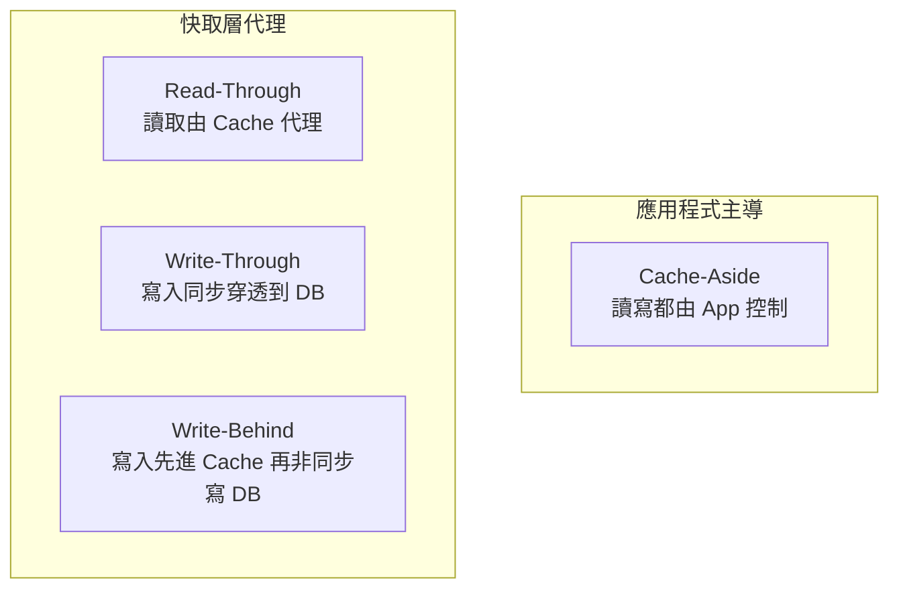
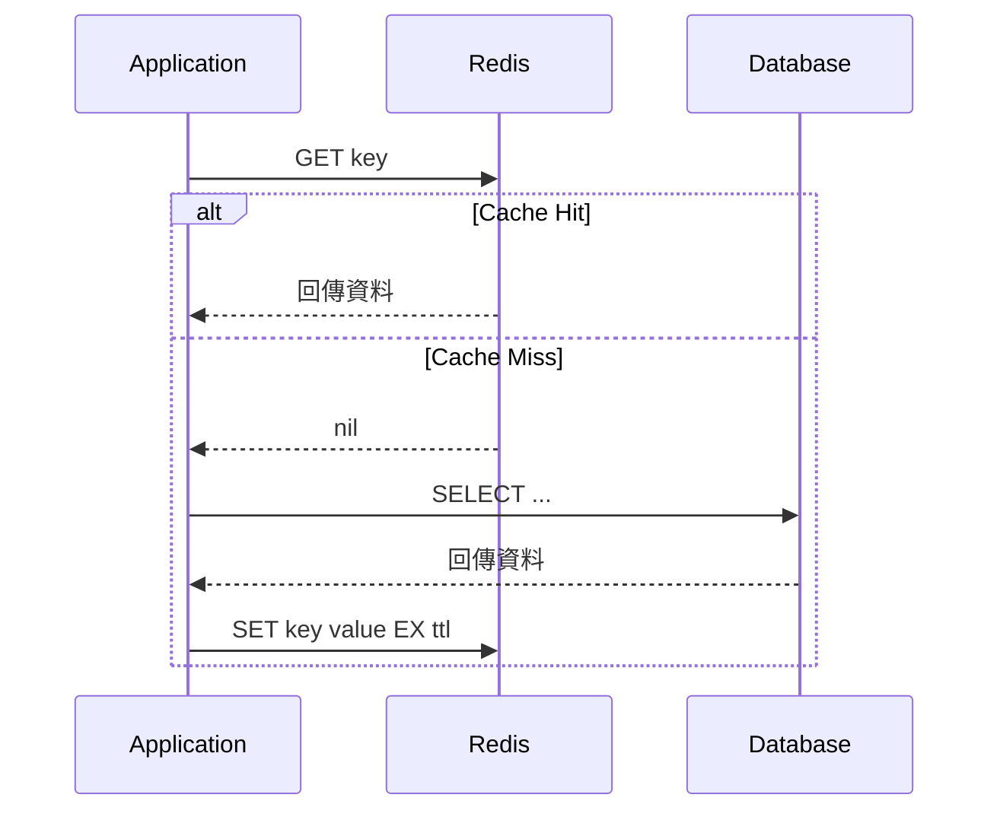
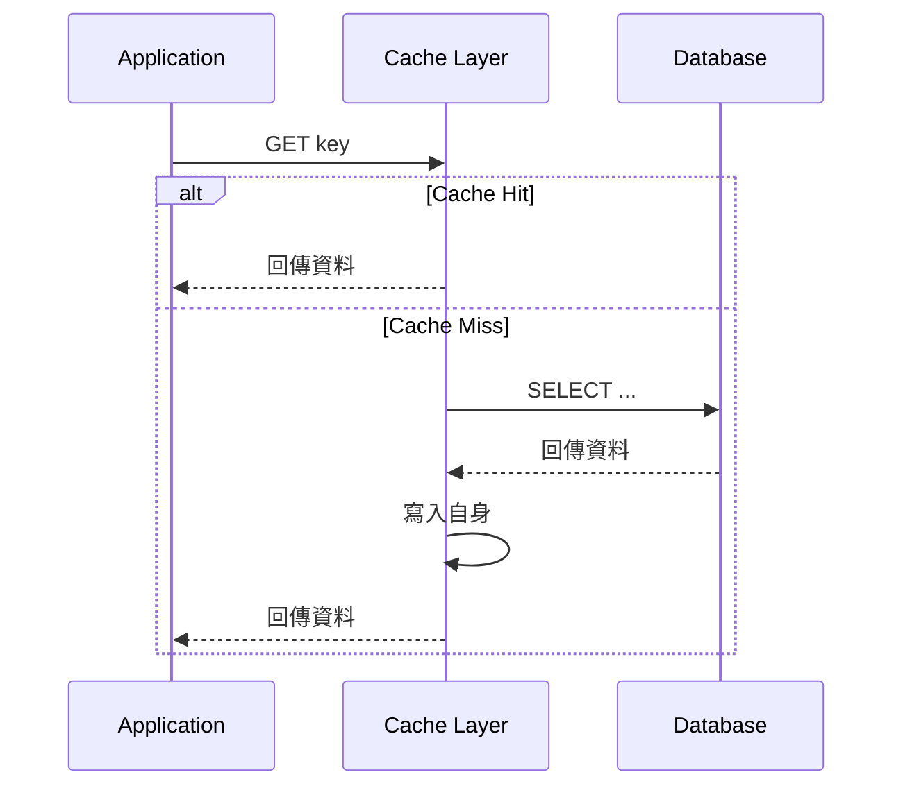
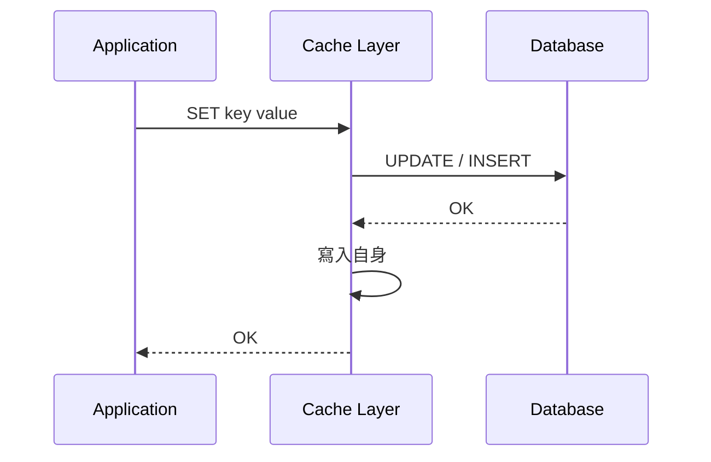
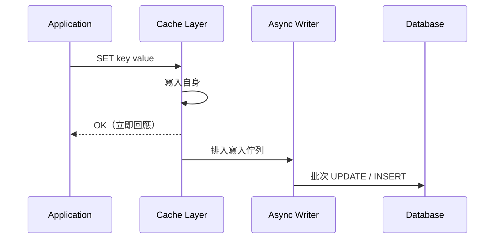
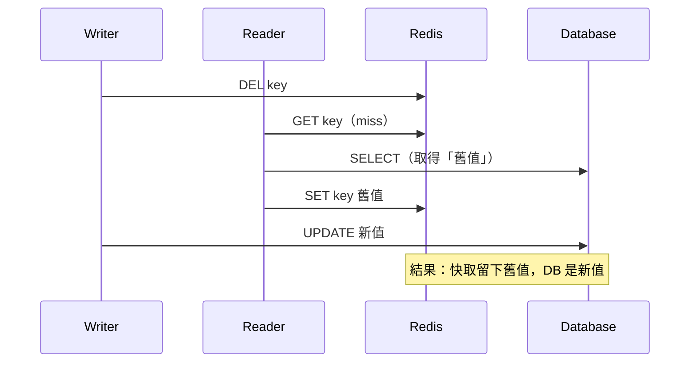
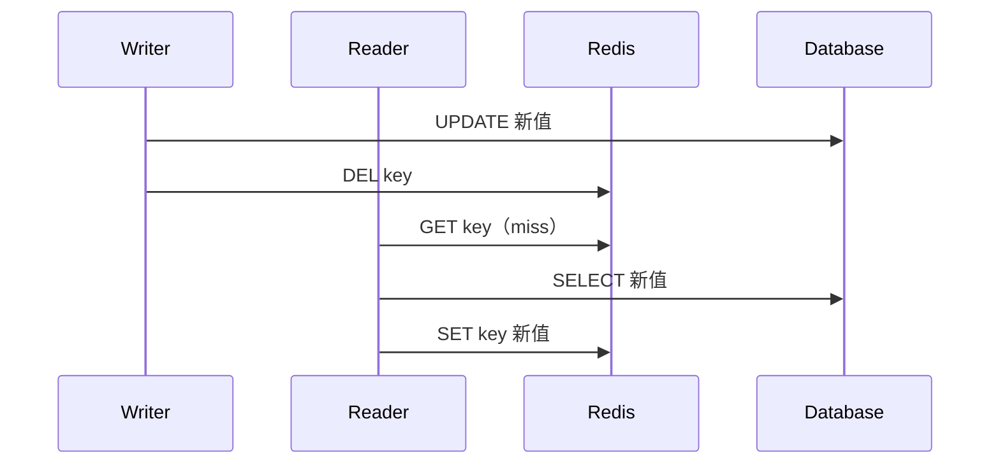
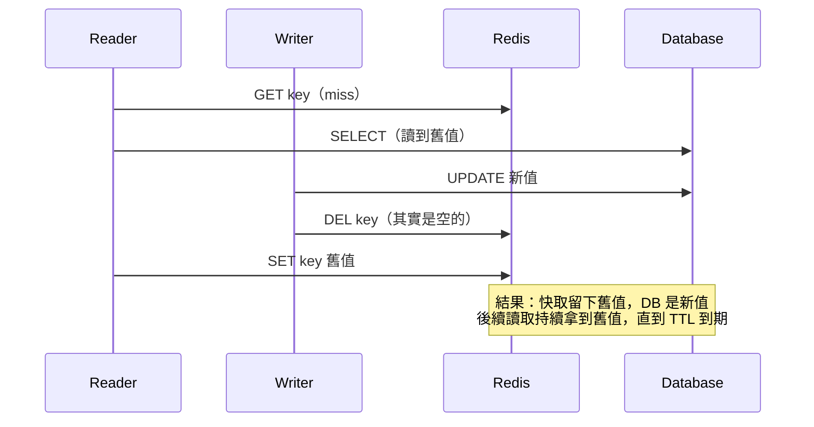

<ArticleTitle />

<ScrollToTopBtn />

## 為什麼後端需要快取？

在前面的[使用 Redis 分布式鎖避免 Race Condition](./2026-06-02-redis-distributed-lock.md)中，我們把 Redis 當成多服務之間的同步原語。不過實務上 Redis 最常見的用途其實是**快取（Cache）**：把熱門資料暫存在記憶體中，讓後續讀取不必每次都打到資料庫。

多數後端系統的讀取量遠大於寫入量。如果每一次讀取都要走資料庫，會發生兩個問題：

- 查詢延遲偏高，尤其是需要 join 或聚合的請求。
- 資料庫負載集中，連線數與 I/O 容易成為瓶頸。

把高頻讀取的資料放到 Redis 之後：

- 讀取從毫秒等級降到次毫秒等級。
- 資料庫只需要處理寫入與快取未命中（Cache Miss）的查詢。
- 同樣的硬體可以承擔更多 QPS。

但問題隨之而來：**這些資料同時存在於資料庫與快取，誰先寫、誰先讀、誰負責更新？資料不一致時要怎麼處理？**

這就是「快取設計」要回答的問題。下面先從四種主流的讀寫模式開始。

## 四種快取讀寫模式

業界常見的快取讀寫模式有四種。它們的差別主要在於：

- **誰負責讀寫快取**：是應用程式（Application），還是快取層自己？
- **寫入時，資料庫與快取的同步是同步還是非同步？**

### 1. Cache-Aside（旁路快取 / Lazy Loading）

Cache-Aside 是最常見的模式。應用程式同時知道快取和資料庫的存在，自行決定何時讀、何時寫。

**讀取流程：**

1. 先查 Redis。
2. 命中（Cache Hit）：直接回傳。
3. 未命中（Cache Miss）：查資料庫，把結果寫回 Redis，再回傳給呼叫端。

**寫入流程：** 應用程式更新資料庫，然後**刪除**（而不是更新）快取中對應的 key。下一次讀取會自然觸發 Cache Miss，重新從資料庫載入最新版本。

**優點：**

- 邏輯直觀，幾乎不需要額外基礎設施。
- 快取只裝「真的被讀過」的資料，記憶體成本低。
- 即使快取掛掉，系統還是能 fallback 回資料庫。

**代價：**

- 首次讀取一定 Cache Miss，延遲較高。
- 應用程式必須自己處理一致性，所有讀寫都要記得「先查快取」「寫完刪快取」。
- 寫多讀少的場景，快取命中率反而會被頻繁失效拖垮。

**適用場景：** 讀多寫少、可以容忍短暫的舊資料、希望邏輯簡單明確。這也是 AWS 與 Microsoft Azure 的官方文件都推薦的預設選擇。

### 2. Read-Through

Read-Through 把「Cache Miss 後去查 DB」這段邏輯**搬到快取層**。應用程式只跟快取對話，不直接接觸資料庫。

**和 Cache-Aside 的差別：**

- Cache-Aside：應用程式發現 miss，自己去查 DB、回寫快取。
- Read-Through：快取層發現 miss，自己去查 DB、回寫，再回傳給應用程式。

**優點：**

- 應用程式邏輯更乾淨，所有資料源都被快取層收斂。
- 適合用在現成的快取產品（例如某些 ORM、CDN、企業級快取），這些工具會內建 Read-Through 行為。

**代價：**

- 純 Redis 本身**不提供** Read-Through，需要靠 client library 或在快取層前再包一個 service。
- 「載入資料」的邏輯被搬到快取層，要支援多種查詢時會變複雜。

**適用場景：** 使用本身就支援 Read-Through 的快取產品；或者想把資料載入邏輯收斂在單一處。

### 3. Write-Through

Write-Through 是「寫入時同時更新快取與資料庫」的模式。寫入操作會在快取層觸發，**同步**穿透到資料庫，兩邊都成功才算寫入完成。

通常會搭配 Read-Through 或 Cache-Aside 的讀取邏輯一起使用。

**優點：**

- 快取永遠是最新的，不會因為 stale data 而回傳舊資料。
- 讀取幾乎全部命中，DB 壓力小。

**代價：**

- 寫入延遲變高，要等兩邊都成功。
- 沒被讀過的資料也會被寫進快取，可能浪費記憶體。
- 任何一邊寫入失敗都需要 rollback 或補償邏輯，否則會留下不一致。

**適用場景：** 寫入頻率不高、但每次寫入後立刻就會被讀（例如使用者個人設定剛改完就要顯示）；或快取產品天然就支援 Write-Through。

AWS 的官方文件特別提到，Write-Through 幾乎總是會搭配 Lazy Loading（即 Cache-Aside）一起用：寫入時主動寫快取，未命中時還是用 Lazy Loading 補資料。

### 4. Write-Behind（Write-Back）

Write-Behind 又叫 Write-Back。寫入時**只**寫快取，DB 由快取層在背景**非同步**批次寫入。

**優點：**

- 寫入延遲非常低，使用者不用等資料庫。
- 多筆寫入可以合併（coalesce），減少資料庫負擔。
- 對寫入密集的場景（例如計數器、瀏覽數、點擊紀錄）很友善。

**代價：**

- **資料遺失風險**：如果快取在批次寫回 DB 之前掛掉，那些寫入會消失。
- 需要可靠的非同步寫入機制（佇列、retry、死信處理）。
- 讀取端必須以快取為單一資料來源（Source of Truth），否則會讀到 DB 還沒同步的舊資料。

**適用場景：** 寫入吞吐量是瓶頸、且資料容忍度高（例如即時計數、訪客記錄、Log 緩衝）。對訂單、付款等高一致性需求的資料，這個模式並不適合。

### 四種模式快速比較

| 模式 | 讀取主導 | 寫入主導 | 寫入延遲 | 一致性 | 資料遺失風險 |
|---|---|---|---|---|---|
| Cache-Aside | App | App | 中（DB + 刪快取） | 弱（短暫 stale） | 無 |
| Read-Through | Cache | App | 中 | 弱 | 無 |
| Write-Through | App / Cache | Cache | 高（同步雙寫） | 強 | 無 |
| Write-Behind | App / Cache | Cache（非同步） | 低 | 弱（DB 延遲同步） | **有** |

## 為什麼業界最常用 Cache-Aside + 刪除快取？

雖然四種模式各有適用場景，但實務上多數系統的預設選擇是 **Cache-Aside + 寫入時刪除快取**。原因有三：

1. **基礎設施單純**：純用 Redis 就能實作，不需要 Read-Through / Write-Through 那種帶代理層的快取產品。
2. **邏輯顯式**：寫入流程清楚地分成「先寫 DB、再刪快取」兩步，出錯時容易追蹤。
3. **失敗時容易降級**：Redis 掛掉只會讓讀取變慢、不會讓寫入失敗或資料消失。

下一節討論「為什麼是刪除快取，而不是更新快取」，以及這個寫入順序背後其實還是有競態條件要留意。

## DB 與快取的一致性取捨

只要資料同時存在於 DB 與 Redis，就一定有兩者落差的可能。差別只在於：落差多大、多久、發生機率多高。

### 為什麼選擇「刪除」而不是「更新」快取？

當資料庫被更新後，理論上有兩種方式同步快取：

- **更新快取**：直接把新值寫回 Redis 的同一個 key。
- **刪除快取**：刪掉這個 key，下一次讀取時自然重新從 DB 載入。

業界普遍的選擇是**刪除**。主要原因：

- **冪等性（Idempotency）**：刪除執行幾次結果都一樣（最終都是「沒有這個 key」），更新則可能因為多個併發寫入造成中間狀態錯亂。
- **避免覆寫順序錯亂**：兩個寫入請求 A、B 幾乎同時發生，可能 DB 先寫 B 後寫 A，但快取卻變成「先更新 A、再被 B 覆寫」，最後快取拿到 B 的值、DB 拿到 A 的值，反而完全錯位。
- **省下寫快取的成本**：很多資料寫進去後不一定立刻被讀，更新等於先做一次無效的快取寫入。
- **複雜資料結構更新麻煩**：如果快取存的是 JSON 或 Hash，要做「局部更新」邏輯遠比 `DEL` 一行指令複雜。

Redis 的官方部落格也把這種「寫 DB 後刪快取」的做法稱為 cache invalidation，並強調它最大優勢是「只需要一次昂貴寫入（資料庫本身），不必兩邊同步」。

### 先寫 DB 再刪快取，還是先刪快取再寫 DB？

確定要用「刪除」之後，下一個問題是順序。

**先刪快取，再更新 DB：**

寫入者剛把快取刪掉、還沒寫進 DB，這時讀取者跑進來、發現 miss，從 DB 抓到**還沒被更新的舊值**並寫回快取。等寫入者完成 DB 更新後，快取就卡在舊值，直到 TTL 到期才會修正。

**先更新 DB，再刪快取：**

寫入者先把 DB 改成新值，再刪快取。即使刪除完成前有讀取進來，最多讀到自己快取裡的舊值；只要刪除一完成，下一次讀取就會從 DB 拿到新值。

Microsoft Azure 的 Cache-Aside 文件對這個順序的提醒非常明確：

> 「更新資料儲存區（data store）**之前**就移除快取項目，會有一個時間窗口，讓 client 在資料儲存區更新之前讀到資料。這次讀取會 cache miss，從資料儲存區讀到舊資料，再把它寫回快取。這個順序會導致快取裡留下 stale data。」

所以實務原則是：**先寫 DB，再刪快取（Write DB → Invalidate Cache）**。

### 不是完美：仍可能短暫不一致

即使按「先寫 DB 再刪快取」執行，理論上仍有極小的競態空間：

整段時間軸可以這樣理解：

1. 讀取者 R 先 miss，正在查 DB 的中途，寫入者 W 完成了 DB 更新與快取刪除。
2. R 拿到的 DB 結果其實是「W 寫入前的舊值」，但 R 仍然把它寫回快取。
3. 從 W 的角度看，自己明明已經刪過快取了；但因為 R 寫回的時機更晚，快取最終被 R 蓋回舊值。

這個時間窗很小（R 從讀 DB 到寫回 Cache 的時間），但理論上存在。

實務上有幾種緩解方法：

- **TTL 兜底**：每個快取 key 都設一個合理的過期時間（例如 5～30 分鐘），即使發生上述邊角情況，最壞也只會 stale 一個 TTL 週期。
- **延遲雙刪（Delayed Double Delete）**：寫入完成後刪一次，等幾百毫秒後再刪一次，把上述情境中被誤寫回的舊值再清掉。注意這只是降低機率，不是完全消除。
- **訂閱 DB Binlog 主動失效**：用 Canal、Debezium 之類的工具監聽 DB 變更事件，由獨立 worker 統一發出快取失效命令。這種做法把「失效」從業務邏輯中抽出來，減少各服務各自處理的負擔。

對絕大多數應用來說，**TTL 加上「先寫 DB 再刪快取」已經夠用**。需要延遲雙刪或 Binlog 訂閱的，通常是金流、即時庫存這類對一致性極度敏感的場景。

### TTL：最簡單也最重要的保底機制

不論用哪種模式，**快取 TTL（Time-To-Live）幾乎都該設**。理由：

- 應用程式可能漏刪某些 key。
- 多服務或外部流程可能直接改 DB，繞過了快取失效邏輯。
- 任何 race condition 殘留的 stale data 都會被 TTL 自動清掉。

Microsoft Azure 的 Cache-Aside 文件也提醒：TTL 不能太短（會讓快取一直 miss、失去意義），也不能太長（會讓資料 stale 太久）。實務上要根據資料的更新頻率與容忍度逐個 key 評估。

對「絕對不能 stale」的資料（例如付款狀態、權限）：應該直接讀 DB 或走 Write-Through，不要丟進 Cache-Aside。

## 何時不該用 Redis 快取

快取並非萬靈丹。以下情境直接打 DB 反而更好：

- **資料一致性要求極高**：例如金流交易、庫存扣減、權限檢查。這類情境多花的延遲與基礎設施成本，遠不如資料錯誤的代價。
- **寫多讀少**：每次寫入都要刪快取，結果幾乎沒有讀取能命中。這時快取只是多一層維護成本。
- **資料規模小、查詢便宜**：能用 DB index 解決的問題不要動 Redis。多一層快取就多一個失效路徑、多一處潛在不一致。
- **資料變動極頻繁**：快取的 TTL 還沒到，資料就已經被改了好幾次。命中率低、失效成本高。
- **沒有監控與失效機制**：團隊還沒準備好監控快取命中率、stale ratio、Redis 連線健康度時，貿然導入快取容易讓 debug 變難。

讀寫分離（請參考 [Daily Questions Challenge 17] [資料庫讀寫分離：Primary、Replica 與一致性取捨](./2026-06-11-database-read-write-splitting.md)）也是讀取擴展的手段。差別在於：Replica 仍是資料庫、最終會追上 Primary；快取則是另一份獨立資料，需要應用層主動維護一致性。兩者解決的問題不同，但同樣都要面對「讀到舊資料」這個議題。

## 總結

Redis 快取的設計不是「裝上去就快」，而是一連串關於**讀寫責任**、**失效時機**、**一致性容忍度**的選擇。

四種讀寫模式可以這樣理解：

- **Cache-Aside**：App 主導，最常用，預設選項。
- **Read-Through**：把讀取邏輯下放給快取層，邏輯乾淨但需要支援的快取產品。
- **Write-Through**：寫入同步雙寫，強一致但寫入延遲高。
- **Write-Behind**：寫入只進快取，背景非同步寫 DB，吞吐高但有遺失風險。

一致性取捨的設計原則：

- **預設使用 Cache-Aside + 刪除快取**，幾乎是業界共識。
- **先更新 DB、再刪快取**，避免常見競態。
- **TTL 是保底**，所有 key 都該設合理過期時間。
- **延遲雙刪、Binlog 訂閱**只在一致性敏感場景使用。
- **不該用快取**的情境（強一致、寫多讀少、變動頻繁）就大方放棄。

設計快取時，最有用的問題不是「怎麼讓快取永遠不出錯」，而是「**這份資料 stale 30 秒可以嗎？stale 5 分鐘可以嗎？如果不行，是不是根本不該快取？**」當這個問題能被清楚回答，快取的讀寫模式與一致性策略也就自然浮現。

## 參考

- [AWS — Database Caching Strategies Using Redis: Caching Patterns](https://docs.aws.amazon.com/whitepapers/latest/database-caching-strategies-using-redis/caching-patterns.html)
- [AWS — Caching Best Practices](https://aws.amazon.com/caching/best-practices/)
- [AWS Builders' Library — Caching challenges and strategies](https://aws.amazon.com/builders-library/caching-challenges-and-strategies/)
- [Microsoft Learn — Cache-Aside Pattern](https://learn.microsoft.com/en-us/azure/architecture/patterns/cache-aside)
- [Microsoft Learn — Caching Guidance](https://learn.microsoft.com/en-us/azure/architecture/best-practices/caching)
- [Redis Blog — Three Ways to Maintain Cache Consistency](https://redis.io/blog/three-ways-to-maintain-cache-consistency/)
