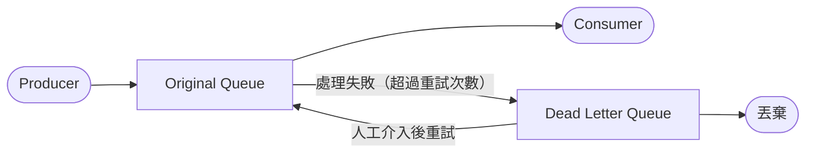

<ArticleTitle />

<ScrollToTopBtn />

在 [#09 Message Queue](./2026-06-03-message-queue.md) 中，我們介紹了如何透過訊息佇列的生產者與消費者模型，解決高併發場景下的效能瓶頸。MQ 確保了訊息能夠被排隊、依序處理，但有一個問題留了下來：**當 Consumer 無法成功處理某則訊息時，系統應該怎麼辦？**

如果讓 Consumer 不斷重試同一則訊息，可能會佔用 Queue 的處理通道，讓其他正常訊息也被卡住。若直接丟棄，又可能造成訂單遺失或資料不一致。**Dead Letter Queue（DLQ，死信佇列）** 正是為了解決這個問題而設計的機制。

---

## 什麼是 Dead Letter Queue？

DLQ 是一個專門收容「處理失敗訊息」的獨立佇列。當一則訊息因為某些原因無法被正常消費時，MQ 系統不會讓它無限期地佔據原始 Queue，而是將它轉移到 DLQ 中，讓工程師可以事後查閱、分析，並決定是否重新投遞。

從架構上來看，DLQ 和原始 Queue 是分開的：

---

## 訊息什麼時候會進入 DLQ？

訊息進入 DLQ 通常有以下幾種觸發條件：

### 1. 超過最大重試次數（Max Delivery Attempts）

這是最常見的情況。Consumer 嘗試處理訊息時失敗（例如資料庫寫入失敗、下游服務不可用），MQ 會讓訊息重新排隊重試。當重試次數超過設定的上限（例如 5 次），訊息就會被送進 DLQ。

### 2. 訊息存活時間到期（TTL, Time To Live）

如果訊息在 Queue 中等待的時間超過設定的 TTL，還沒有被任何 Consumer 消費，就會自動被移入 DLQ，避免過期資料佔用系統資源。

### 3. 訊息格式錯誤或無法解析

Consumer 在嘗試反序列化（Deserialize）訊息時失敗，例如 JSON 格式損毀或欄位不符合預期，這類訊息無論重試幾次都無法成功，應該直接送往 DLQ 而非繼續重試。

### 4. Consumer 明確拒絕（Negative Acknowledgement）

在支援確認機制（ACK/NACK）的 MQ 中，Consumer 可以主動回傳 NACK 拒絕某則訊息，並指定不重新入隊（`requeue: false`），此時訊息也會被路由到 DLQ。

---

## DLQ 的實務用途

### 錯誤排查與日誌分析

DLQ 讓工程師可以在不影響主流程的情況下，事後查閱哪些訊息失敗了、失敗原因是什麼。這在生產環境中非常重要，尤其是訂單、金流等不能輕易丟棄的業務訊息。

### 監控告警

可以針對 DLQ 的訊息數量設定告警閾值。當 DLQ 中的訊息累積超過一定數量，代表系統可能有持續性的錯誤（例如下游服務持續故障），需要立刻通知工程師介入。

### 手動重試或丟棄

工程師修復問題後，可以選擇將 DLQ 中的訊息重新投遞回原始 Queue（Redrive / Replay），讓它們重新被處理；或者在確認訊息已過時、不再有意義時，直接清除。

---

## DLQ 設計考量

### 指數退避重試（Exponential Backoff with Jitter）

在讓訊息進入 DLQ 之前，重試的間隔時間應逐步拉長，而非固定頻率不斷重打。這種策略稱為 **指數退避（Exponential Backoff）**：

| 第幾次重試 | 等待時間（示意） |
|---|---|
| 1 | 1 秒 |
| 2 | 2 秒 |
| 3 | 4 秒 |
| 4 | 8 秒 |
| 5 | 16 秒 → 進入 DLQ |

此外，建議加入 **Jitter（隨機抖動）**，讓每次重試的等待時間在基準值附近略有浮動，避免大量 Consumer 同時在相同時間點重試，對下游服務造成集中衝擊（Thundering Herd）。

### 區分可重試與不可重試的錯誤

- **應重試：** 網路逾時、下游服務暫時不可用（503）、速率限制（429）
- **直接進 DLQ：** 訊息格式錯誤（400）、驗證失敗（422）、業務邏輯上的永久性錯誤

對於不可重試的錯誤，立即送往 DLQ 比耗盡重試次數再進 DLQ 更有效率，也能更快讓工程師知道問題所在。

### 避免 DLQ 訊息的無限循環

從 DLQ 重新投遞訊息時，需要確保修復了根本問題，而不是把同樣會失敗的訊息再次丟回 Queue。建議在重試前先確認：錯誤原因是否已解決？訊息本身是否仍有效？

同時，DLQ 本身也需要設定保留期限（Retention），避免累積大量過期訊息消耗儲存資源。

---

## 各平台的 DLQ 支援

### RabbitMQ：Dead Letter Exchange（DLX）

RabbitMQ 透過 **Dead Letter Exchange（DLX）** 實作 DLQ 功能。設定時，在宣告 Queue 時附加 `x-dead-letter-exchange` 參數，指定死信要路由到哪個 Exchange。當訊息被 NACK 且不重新入隊、TTL 到期，或 Queue 達到長度上限時，訊息就會透過 DLX 轉發到對應的 DLQ。

### Amazon SQS

SQS 原生支援 DLQ，只需在建立 Queue 時設定 `RedrivePolicy`，指定 DLQ 的 ARN 和 `maxReceiveCount`（最大接收次數）。當訊息被接收的次數超過 `maxReceiveCount` 仍未被刪除，SQS 會自動將它移入 DLQ。SQS 也提供 **Redrive to Source** 功能，可以一鍵將 DLQ 中的訊息重新投遞回原始 Queue。

### Apache Kafka

Kafka 本身沒有內建的 DLQ 機制，但業界慣例是為每個需要容錯的 Topic 建立對應的 Dead Letter Topic（通常命名為 `<topic-name>.DLT`）。Consumer 在捕捉到無法處理的錯誤時，由應用程式程式碼主動將訊息寫入 DLT，同時記錄錯誤原因。Spring Kafka 等框架也內建了對應的抽象層，可以自動處理這個路由邏輯。

---

## 總結

Dead Letter Queue 是 Message Queue 架構中不可缺少的容錯機制。它讓系統在面對訊息處理失敗時，不必在「無限重試」與「直接丟棄」之間二選一，而是有了第三條路：**保留失敗訊息、確保可觀測性、待問題修復後再重新投遞**。

在設計 DLQ 時，關鍵的幾個決策是：

- **重試策略**：採用指數退避加 Jitter，避免系統承受重試帶來的額外壓力。
- **錯誤分類**：區分可重試與不可重試的錯誤，減少無效重試。
- **監控告警**：將 DLQ 訊息數量納入監控，讓系統問題能被及時發現。
- **Redrive 流程**：修復問題後有清楚的重新投遞程序，而非盲目將訊息打回 Queue。

---

## 參考

- [Dead letter queue - Wikipedia](https://en.wikipedia.org/wiki/Dead_letter_queue)
- [Apache Kafka Dead Letter Queue: A Comprehensive Guide - Confluent](https://www.confluent.io/learn/kafka-dead-letter-queue/)
- [Dead Letter Queue (DLQ) and Retry Management in Asynchronous Microservices - Medium](https://medium.com/yapi-kredi-teknoloji/dead-letter-queue-dlq-and-retry-management-in-asynchronous-microservices-054bb318b1bb)
- [Integration Patterns IV: Retries and Dead-Letter Queues - LittleHorse](https://littlehorse.io/blog/retries-and-dlq)
- [Retry Patterns That Work: Exponential Backoff, Jitter, and Dead Letter Queues - DEV Community](https://dev.to/young_gao/retry-patterns-that-actually-work-exponential-backoff-jitter-and-dead-letter-queues-75)
