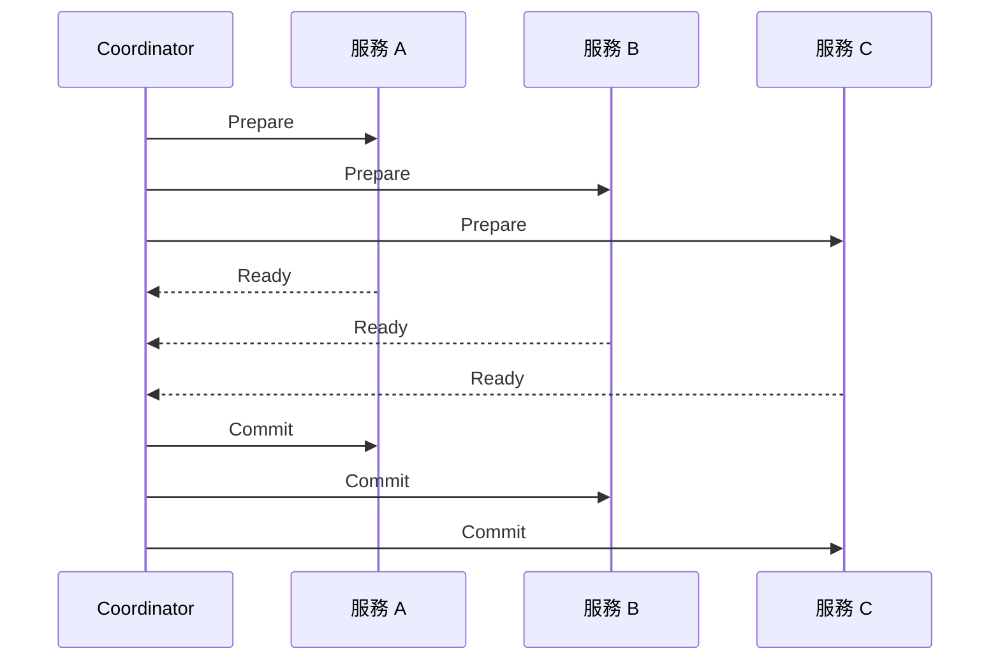
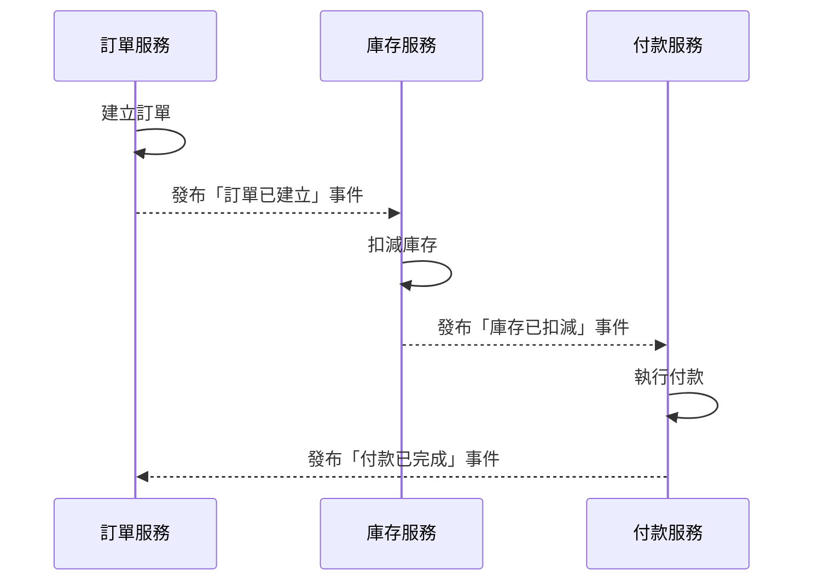
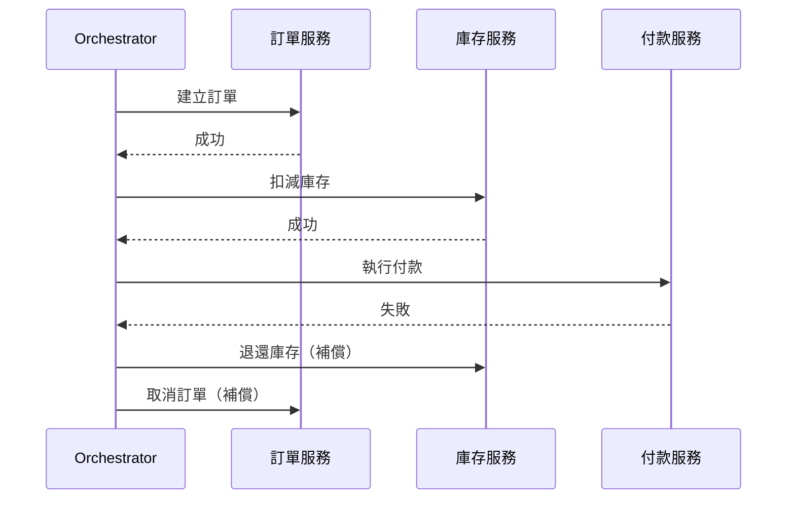
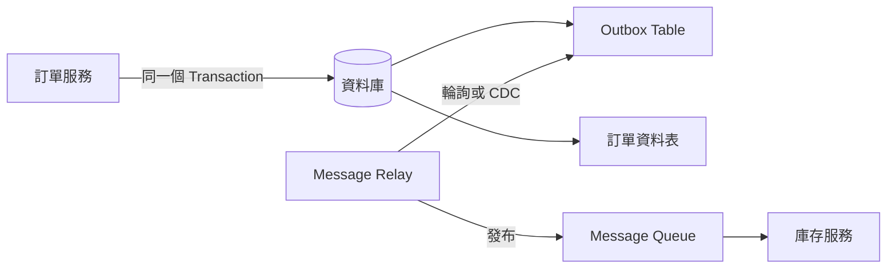

<script setup>
  import ArticleTitle from '@theme/components/ArticleTitle.vue'
  import ScrollToTopBtn from '@theme/components/ScrollToTopBtn.vue'
</script>

<ArticleTitle />

<ScrollToTopBtn />

在單體應用（Monolith）中，一筆跨資料表的操作通常包在同一個資料庫 Transaction 裡，失敗就 Rollback，資料不一致的問題相對容易處理。

但在微服務架構下，不同服務擁有各自獨立的資料庫，一個業務流程可能橫跨三、四個服務。當「訂單建立」、「庫存扣減」、「付款完成」分散在不同服務時，**如果中途有一個步驟失敗，怎麼確保其他服務的資料不會停在半途的不一致狀態？**

---

## 為什麼不能直接用分散式交易（2PC）？

兩階段提交（Two-Phase Commit，2PC）是最直觀的解法，它讓所有服務在一個協調者（Coordinator）的管理下，先「準備提交」再「確認提交」：



聽起來合理，但在微服務環境下有幾個根本問題：

**1. 鎖定時間過長**

2PC 要求各服務在「Prepare」階段鎖住相關資源，等待 Coordinator 的最終指令。微服務之間透過網路溝通，延遲不可預測，鎖定時間拉長就會成為系統瓶頸，高並發下很快變成災難。

**2. Coordinator 是單點故障**

如果 Coordinator 在「Prepare」之後、「Commit」之前崩潰，各服務不知道該 Commit 還是 Rollback，只能一直等待，造成系統無限卡住（blocking）。

**3. 違背微服務的獨立性原則**

2PC 要求服務暴露內部交易狀態給外部 Coordinator，這讓原本應該鬆耦合的服務產生深度依賴，與微服務的設計哲學相悖。

因此，現代微服務架構幾乎不使用 2PC，而是改用以**最終一致性（Eventual Consistency）**為前提的設計模式。

---

## Saga Pattern：分散式流程的核心解法

Saga Pattern 的核心思路是：**不用全域交易，改成一連串的本地交易（Local Transaction），每一步成功後觸發下一步，失敗時執行補償交易（Compensating Transaction）回滾前面的步驟。**

以電商下單流程為例，一個 Saga 可能是：

```
建立訂單 → 扣減庫存 → 執行付款 → 發送通知
```

如果「執行付款」失敗，則依序執行：

```
退還庫存 → 取消訂單
```

Saga 有兩種實作方式，差別在於「誰來協調整個流程」。

### Choreography（編舞式）：事件驅動，去中心化

每個服務處理完自己的本地交易後，發布一個事件（Event）；下一個服務訂閱這個事件，再處理自己的邏輯。沒有中央控制者，服務之間透過事件鏈串起來。



**優點：** 服務完全鬆耦合，沒有中央協調者，擴展性高。

**缺點：** 整個流程分散在各服務的事件監聽邏輯中，當服務數量增加，流程追蹤與除錯變得困難。想知道「一筆訂單的狀態走到哪了」，需要串接多個服務的日誌。

### Orchestration（協調式）：中央編排，有明確流程控制

由一個專門的 Orchestrator 服務負責驅動整個流程，它按順序呼叫各服務，並根據回傳結果決定下一步。



**優點：** 流程集中，容易追蹤狀態與除錯。失敗時的補償邏輯也集中在 Orchestrator 中管理。

**缺點：** Orchestrator 本身需要處理狀態持久化與錯誤重試，實作複雜度較高。Orchestrator 若設計不當，可能成為新的單點故障。

### 如何選擇？

| | Choreography | Orchestration |
|---|---|---|
| 流程可見性 | 低（分散在各服務） | 高（集中在 Orchestrator） |
| 服務耦合度 | 低 | 中（服務需接收 Orchestrator 指令） |
| 適合場景 | 步驟少、邏輯簡單的流程 | 步驟多、需要明確追蹤的長流程 |

---

## Outbox Pattern：確保事件不遺失

Saga Pattern 的 Choreography 模式高度依賴事件能被可靠發布。但在實作中有一個常見的陷阱：

**服務完成本地交易後，如果在發布事件到 Message Queue 之前崩潰，這個事件就永遠消失了。**

例如：

```
訂單服務：INSERT 訂單資料 → DB 成功
訂單服務：發布「訂單已建立」事件 → 崩潰！
庫存服務：沒收到事件，永遠不扣減庫存
```

**Outbox Pattern** 就是為了解決這個問題。作法是：

1. 服務在同一個資料庫 Transaction 中，同時寫入業務資料與一筆「待發送事件」到 Outbox 資料表。
2. 一個獨立的 Message Relay（訊息轉發器）持續監控 Outbox 資料表，將事件轉發到 Message Queue，成功後標記該筆記錄為已發送。



因為業務資料寫入與 Outbox 記錄寫入在同一個 Transaction 內，要麼都成功，要麼都失敗，不會出現「資料寫了、事件沒發出去」的情況。

**注意：** Outbox Pattern 保證「至少發送一次（At-Least-Once Delivery）」，在重試情境下訊息可能被重複發送，因此消費端的業務邏輯必須具備冪等性（Idempotency）。這與 [#25 Dead Letter Queue](./2026-06-19-dead-letter-queue.md) 中提到的重試設計概念一致。

---

## 最終一致性的思維轉換

採用 Saga Pattern 與 Outbox Pattern，代表我們放棄了傳統意義上的「強一致性（Strong Consistency）」——在任何時間點，所有服務的資料狀態不一定立即同步。

這不是退而求其次，而是一個主動的取捨：

- **強一致性**要求所有節點在同一時刻看到相同的資料，代價是需要鎖定資源與同步等待，系統的可用性與延遲都受影響。
- **最終一致性（Eventual Consistency）**允許資料在短暫的時間視窗內存在不一致，但系統承諾只要沒有新的異動，資料最終會收斂到一致的狀態。

對大多數業務場景來說，這個短暫的不一致是可接受的——電商訂單從「建立中」到「庫存確認」之間的幾百毫秒延遲，用戶並不會察覺，也不影響業務正確性。

設計微服務資料一致性的關鍵，不是消除不一致，而是**識別哪些地方必須強一致、哪些地方能接受最終一致**，並在後者使用 Saga + Outbox 這類適合分散式環境的模式。

---

## 總結

| 方案 | 適用場景 | 主要問題 |
|---|---|---|
| 2PC | 需要強一致性的簡單場景 | 鎖定時間長、協調者單點故障、不適合高並發微服務 |
| Saga（Choreography） | 步驟少、服務鬆耦合 | 流程分散、難以追蹤整體狀態 |
| Saga（Orchestration） | 流程複雜、需要可見性 | Orchestrator 實作複雜度高 |
| Outbox Pattern | 搭配 Saga 確保事件可靠發布 | 需要 Message Relay、消費端需實作冪等性 |

微服務資料一致性沒有萬能解法，核心思路是：以**最終一致性**為設計前提，用 Saga 拆解跨服務的業務流程，用 Outbox Pattern 確保事件不遺失，並在消費端設計冪等性防禦重複處理。

---

## 參考

- [Patterns for distributed transactions within a microservices architecture](https://developers.redhat.com/blog/2018/10/01/patterns-for-distributed-transactions-within-a-microservices-architecture) — Red Hat Developer
- [Pattern: Saga](https://microservices.io/patterns/data/saga.html) — microservices.io
- [Saga Design Pattern](https://learn.microsoft.com/en-us/azure/architecture/patterns/saga) — Azure Architecture Center, Microsoft Learn
- [Pattern: Transactional outbox](https://microservices.io/patterns/data/transactional-outbox.html) — microservices.io
- [Transactional outbox pattern](https://docs.aws.amazon.com/prescriptive-guidance/latest/cloud-design-patterns/transactional-outbox.html) — AWS Prescriptive Guidance
- [Saga choreography pattern](https://docs.aws.amazon.com/prescriptive-guidance/latest/cloud-design-patterns/saga-choreography.html) — AWS Prescriptive Guidance
- [Saga Orchestration vs Choreography](https://temporal.io/blog/to-choreograph-or-orchestrate-your-saga-that-is-the-question) — Temporal
