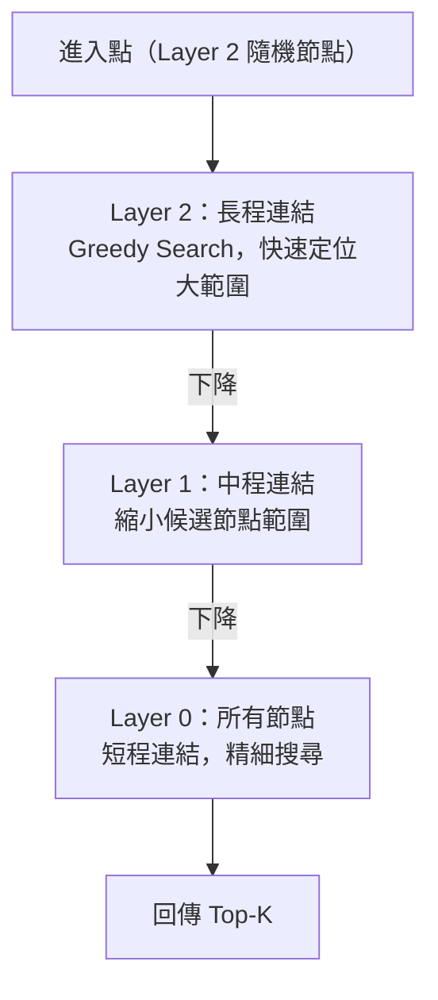

<ArticleTitle />

<ScrollToTopBtn />

## 前言

在 [Challenge #23 的 RAG 架構設計](/tech/posts/2026-06-17-rag-architecture)中，Vector Database 作為核心元件出現：負責儲存 Embedding 向量，並在查詢時找出最相似的片段。文章裡提到了幾個常見選項，也簡介了 Cosine Similarity 與 HNSW 演算法。

但在實際選型時，光知道「有這些工具」還不夠：**哪種索引演算法適合你的資料規模？需要過濾功能嗎？自建還是託管？** 這篇文章從演算法原理切入，再帶出各產品的實際取捨與選型建議。

## 為什麼傳統資料庫不夠？

傳統關聯式資料庫設計在精確匹配與範圍查詢上。當你問「找出所有向量中，和查詢向量距離最近的 Top-10」，資料庫必須：

1. 對每一筆資料計算距離（Cosine Similarity 或 L2 距離）
2. 對所有結果排序
3. 回傳前 10 名

這是 **O(N) 的線性掃描**。百萬筆向量還堪用，千萬、億筆以上延遲就無法接受。

Vector Database 的核心價值，是用**近似最近鄰（Approximate Nearest Neighbor, ANN）演算法**，在不掃描全部資料的前提下找到夠準確的結果。

## 三種索引演算法：速度、精度與記憶體的取捨

選擇 Vector DB 前，先理解三種主流索引演算法的設計邏輯，它們代表不同的取捨點。

### Flat（精確搜尋）

想像你想在全台灣找出離你最近的餐廳。Flat 的做法是：**把全台灣所有餐廳的地址拿出來，一間一間量距離，量完再排序**。結果絕對準確，但如果有一百萬間餐廳，就得量一百萬次——資料量越大，等待時間線性增長。

- **Recall**：100%，結果絕對精確
- **查詢速度**：O(N)，隨資料量線性變慢
- **記憶體**：低（只儲存原始向量）
- **適用場景**：資料量 < 100 萬、精確度要求 100%、作為其他演算法的基準

---

### IVF-PQ（倒排索引 + 乘積量化）

同樣是找最近的餐廳，聰明一點的做法是先把全台灣分成幾百個區域，查詢時只看你附近的幾個區——遠在高雄的餐廳根本不需要量。這就是 IVF 的核心邏輯：**先分區，查詢時只搜尋最近的幾個區**。

PQ 再多做一件事：把每間餐廳的精確座標壓縮成一個「近似代碼」，用更少記憶體儲存，查詢時以近似計算取代精確計算，犧牲一點點精準度換取大幅的速度與空間效益。

IVF-PQ 把兩個策略合在一起：

**IVF（Inverted File Index，倒排索引）**：用 k-means 把向量空間分成 N 個 Cluster。建立索引時，每筆向量被分配到最近的 Cluster；查詢時只搜尋最近的幾個 Cluster（由參數 `nprobe` 控制），跳過不相關的大部分資料。

**PQ（Product Quantization，乘積量化）**：把每個向量切成若干子向量，再用 codebook 壓縮成短碼。儲存空間縮減 4–8 倍，查詢時用近似距離計算取代精確計算。

- **Recall**：90–95%（`nprobe` 越大越高，速度越慢）
- **查詢速度**：快，只掃部分資料
- **記憶體**：很低，壓縮比高
- **適用場景**：資料量 > 1 億筆、記憶體受限、可接受略低於 100% 的 Recall

---

### HNSW（階層式小世界圖）

HNSW（Hierarchical Navigable Small World）是目前最主流的 ANN 演算法，也是大多數 Vector DB 的預設選項。

用導航來比喻：找路時不會從第一個路口開始逐步試，而是先看整張地圖確認大方向，再切到區域地圖縮小範圍，最後才切到街道層找到精確位置。HNSW 的設計邏輯完全相同——**把所有向量組成一張多層地圖，從高層快速定位，逐層下降精細搜尋**。

- **頂層（Layer 2）**：只有少數「代表性節點」，彼此之間有長距離連結，一跳就能跨越大範圍
- **中層（Layer 1）**：更多節點，連結距離縮短，縮小候選範圍
- **底層（Layer 0）**：所有節點，短程連結，做最終精細搜尋

每個節點被隨機分配到幾層（指數衰減機率，越高層的節點越少），自然形成「少數長程快速跳躍 + 大量短程精細搜尋」的小世界結構。查詢時從頂層入口點開始，每層以「貪婪」方式移向最近鄰，逐層下降縮小候選範圍，最終在底層找出 Top-K。

- **Recall**：95–99%，比 IVF-PQ 更高
- **查詢速度**：很快，次毫秒級
- **記憶體**：高（每個節點需儲存鄰居指標）
- **適用場景**：大多數 RAG 應用、1000 萬筆以下的生產環境、高 Recall 需求

---

### 三種演算法比較

| | Flat | IVF-PQ | HNSW |
|---|---|---|---|
| **Recall** | 100% | 90–95% | 95–99% |
| **查詢速度** | 慢（O(N)） | 快 | 很快 |
| **記憶體** | 低 | 很低 | 高 |
| **建索引時間** | 無 | 需 k-means 訓練 | 較慢 |
| **適合資料量** | < 1M | > 100M | < 100M |

## 主流 Vector Database 選項

了解演算法之後，來看各家產品的定位與實際取捨。

### Pinecone

全託管的向量資料庫服務，核心賣點是「零運維負擔」。

- **索引**：HNSW（Serverless）或 IVF（Pod-based）
- **部署**：全託管，無需自建
- **優點**：SDK 完整，Serverless 架構自動擴縮，支援 Metadata 過濾
- **缺點**：大規模使用費用偏高；資料存放在 Pinecone 服務內，無法自建

**適合**：快速上線 MVP、不想管基礎設施、預算充足的團隊。

---

### Qdrant

Rust 寫成的開源向量資料庫，以過濾效能與價效比著稱。

- **索引**：HNSW（預設）
- **部署**：自建（單一 binary）或 Qdrant Cloud（有免費方案）
- **優點**：過濾（Filter）與向量搜尋整合最成熟、Apache 2.0 授權、自建成本低
- **缺點**：生態系成熟度略低於 Pinecone

**適合**：需要按 user_id、category 等欄位精細過濾、追求最佳價效比、樂於自建的團隊。

---

### Weaviate

Go 寫成的開源向量資料庫，強調「向量化 + 搜尋」一體化。

- **索引**：HNSW
- **部署**：自建或 Weaviate Cloud（有免費方案）
- **優點**：支援在 insert 時自動呼叫 Embedding API 的 Vectorizer 模組；Hybrid Search（BM25 + 向量搜尋）開箱即用；多租戶（Multi-tenancy）為一等公民
- **缺點**：設定複雜度高於 Chroma/Qdrant

**適合**：需要 Hybrid Search、多租戶隔離、希望一個系統包含向量化邏輯的場景。

---

### Chroma

輕量、以 Python 為核心的開源向量資料庫，定位是開發者友善。

- **索引**：HNSW（底層使用 hnswlib）
- **部署**：`pip install chromadb` 即可啟動嵌入式模式；或獨立 server
- **優點**：上手成本最低，適合 Prototype 和開發環境
- **缺點**：大規模生產環境（> 1000 萬筆）效能與可觀測性不足

**適合**：快速 Prototype、研究與開發、小型應用。

---

### pgvector

PostgreSQL 的向量搜尋擴充套件，讓現有 Postgres 直接支援向量儲存與搜尋。

- **索引**：HNSW 或 IVFFlat
- **部署**：安裝擴充套件即可，沿用現有 Postgres
- **優點**：不需新增系統；與現有關聯式資料（關聯查詢、事務、備份、複寫）無縫整合
- **缺點**：百萬筆以上需要仔細調整 HNSW 參數（`m`、`ef_construction`）；純向量搜尋效能不如原生 Vector DB

**適合**：已使用 Postgres、資料量在 1000 萬以下、不想引入新系統的團隊。

---

### 五個選項一覽

| | Pinecone | Qdrant | Weaviate | Chroma | pgvector |
|---|---|---|---|---|---|
| **部署** | 全託管 | 自建 / Cloud | 自建 / Cloud | 自建 | 自建（Postgres） |
| **授權** | 商業 | Apache 2.0 | BSD-3 | Apache 2.0 | PostgreSQL |
| **預設索引** | HNSW | HNSW | HNSW | HNSW | HNSW / IVFFlat |
| **Hybrid Search** | 支援 | 支援 | 內建 BM25 | 不支援 | 需額外設定 |
| **適合規模** | 大 | 中–大 | 中–大 | 小 | 小–中 |
| **主要優勢** | 零運維 | 過濾 + 價效比 | 多租戶 + Hybrid | 快速上手 | 沿用 Postgres |

## 選型決策框架

**資料規模**
- < 100 萬筆 → pgvector 或 Chroma 都夠用
- 100 萬 – 5000 萬筆 → Qdrant 或 Weaviate（HNSW 為主）
- > 5000 萬筆 → Pinecone Serverless 或 Qdrant（可考慮切換 IVF-PQ）

**是否需要複雜過濾**
- 需要按 user_id、category、date range 等欄位過濾 → Qdrant 的 Filter API 最成熟
- 基本 metadata 過濾即可 → 各家都支援

**基礎設施偏好**
- 不想管基礎設施 → Pinecone Serverless
- 已有 Postgres → pgvector（先確認資料量在可接受範圍內）
- 可接受自建但要省成本 → Qdrant（自建在小 VPS 上成本極低）

**Hybrid Search 需求**
- 同時需要關鍵字搜尋（BM25）和向量搜尋 → Weaviate 最直接

**開發階段**
- Prototype / 研究 → Chroma
- 生產環境 → Qdrant、Pinecone、Weaviate

## 總結

Vector Database 的核心問題是「如何在大量高維向量中快速找到最相似的結果」，三種主流索引演算法各有定位：

- **Flat**：100% 精確，適合小資料量或基準測試
- **IVF-PQ**：以精度換記憶體和速度，適合億級規模、記憶體受限的場景
- **HNSW**：高 Recall + 快速查詢，是大多數生產環境的預設選擇

選型上，大多數 RAG 應用從 **pgvector（小型、已用 Postgres）** 或 **Qdrant（中大型、需要精細過濾）** 開始是合理的起點，規模成長後再評估是否遷移至全託管方案。

## 參考

- [HNSW vs IVF-PQ: Vector Database Index Performance Guide - DrCodes](https://drcodes.com/posts/hnsw-vs-ivf-pq-vector-database-index-performance-guide)
- [Understanding Modern Vector Search: From HNSW to IVF-PQ - Medium](https://medium.com/@mehrcodeland/understanding-modern-vector-search-from-hnsw-to-ivf-pq-f582b7e9ee89)
- [Approximate Nearest Neighbor Search Explained: IVF vs HNSW vs PQ - TiDB](https://www.pingcap.com/article/approximate-nearest-neighbor-ann-search-explained-ivf-vs-hnsw-vs-pq/)
- [Understand HNSW for Vector Search - Milvus Blog](https://milvus.io/blog/understand-hierarchical-navigable-small-worlds-hnsw-for-vector-search.md)
- [Inverted File Product Quantization (IVF_PQ) - LanceDB Blog](https://blog.lancedb.com/benchmarking-lancedb-92b01032874a-2/)
- [Vector Database Comparison 2025 - sysdebug.com](https://sysdebug.com/posts/vector-database-comparison-guide-2025/)
- [Pinecone vs pgvector vs Chroma vs Weaviate (2026) - groovyweb](https://www.groovyweb.co/blog/vector-database-comparison-2026)
- [Best Vector Database for AI 2026 - MCP.Directory](https://mcp.directory/blog/chroma-vs-pinecone-vs-qdrant-vs-weaviate-vs-pgvector-mcp-2026)
- [Efficient and robust approximate nearest neighbor search using HNSW graphs (Malkov & Yashunin, 2016)](https://arxiv.org/abs/1603.09320)
