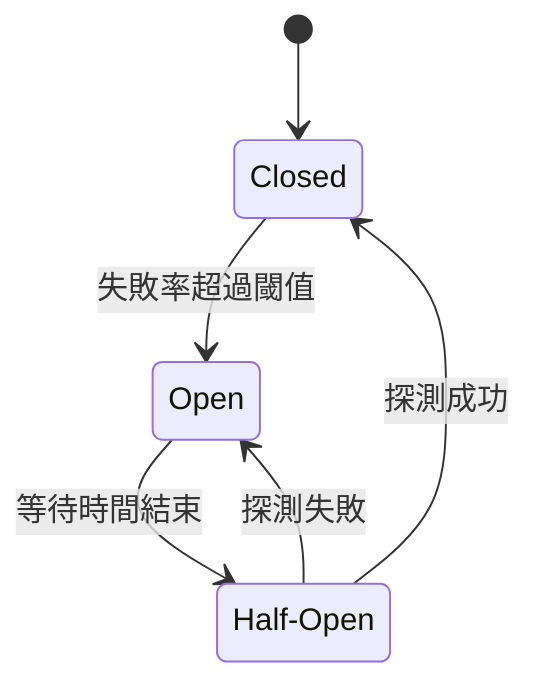

<ArticleTitle />

<ScrollToTopBtn />

## 問題場景：下游故障如何拖垮上游

在微服務架構中，服務之間透過網路互相呼叫，一個業務流程往往需要串起多個服務。當下游服務（如付款服務、庫存服務）出現異常時，問題不會只停留在那個服務上。

假設訂單服務每次呼叫庫存服務都要等到 Timeout（例如 30 秒）才放棄，同時有大量請求湧入，那麼訂單服務的執行緒會全部卡在等待庫存服務回應，最終導致訂單服務的 thread pool 耗盡，連其他正常的請求也無法處理。這就是所謂的**故障擴散（cascading failure）**。

Circuit Breaker Pattern 的核心思路是：與其讓呼叫方一直等到 Timeout，不如在偵測到下游持續失敗後，主動切斷請求，讓上游服務快速失敗並執行備援邏輯，等待下游恢復後再重新開放流量。

## Circuit Breaker Pattern 是什麼

Circuit Breaker（斷路器）這個名字來自電路中的保護元件。當電路異常、電流過大時，斷路器會自動跳脫，切斷電路，避免設備損毀；等情況恢復正常後，才手動或自動復歸。

軟體中的 Circuit Breaker 概念由 Michael Nygard 在《Release It!》中提出，後來由 Martin Fowler 整理成設計模式。其做法是將對下游服務的呼叫包裝在一個 Circuit Breaker 物件中，由它統一監控失敗率，並在必要時切斷請求。

## 三種狀態機

Circuit Breaker 有三種狀態，狀態之間會根據失敗率與時間自動轉換。

### Closed（關閉）

正常運作狀態。所有請求都正常通過，Circuit Breaker 在背景監控失敗率。當失敗次數或失敗比例超過設定的閾值（failure threshold）時，轉換為 Open 狀態。

### Open（開路）

斷路狀態。所有請求立即被拒絕，不再實際呼叫下游服務，直接執行 Fallback 邏輯。這個狀態會持續一段預設的等待時間（reset timeout），讓下游服務有時間恢復。

### Half-Open（半開）

探測狀態。等待時間結束後，Circuit Breaker 進入 Half-Open，允許少量探測請求（probe request）通過：

- 若探測請求成功 → 回到 Closed 狀態，恢復正常流量
- 若探測請求失敗 → 重新進入 Open 狀態，繼續等待

## Fallback 策略

當 Circuit Breaker 處於 Open 狀態，請求被拒絕後，系統需要有備援回應。常見的 Fallback 策略有：

- **回傳快取資料**：若庫存資訊有快取，先返回快取中的舊資料
- **回傳預設值**：例如推薦服務掛掉時，回傳一組固定的熱門商品
- **降級回應**：回傳一個簡化的結果，告知使用者目前服務暫時不可用
- **排隊延後處理**：將操作放入佇列，待服務恢復後再執行（適合非即時場景）

Fallback 的設計原則是：盡量讓使用者感知到的影響最小，而不是直接回傳錯誤。

## 與 Retry、Timeout、Bulkhead 的關係

Circuit Breaker 通常不單獨使用，而是與其他韌性模式（resilience pattern）搭配：

| 模式 | 作用 | 與 Circuit Breaker 的關係 |
|------|------|--------------------------|
| Timeout | 設定最長等待時間，避免無限期阻塞 | Circuit Breaker 的基礎，Timeout 觸發失敗才能被統計 |
| Retry | 短暫失敗時自動重試 | 適用於偶發性錯誤；若下游持續失敗，Circuit Breaker 應先開路，避免 Retry 反而加重下游壓力 |
| Bulkhead | 限制每個服務的資源配額（執行緒、連線數） | 隔離資源，讓某個服務的故障不影響其他服務的資源池 |
| Rate Limiting | 主動限制請求速率 | 主動限流（預防性）；Circuit Breaker 是被動熔斷（反應性） |

一個典型的組合是：設定 Timeout → 若失敗則 Retry 一次 → 若仍失敗由 Circuit Breaker 統計 → 達到閾值後開路並執行 Fallback。

## 總結

Circuit Breaker Pattern 的核心價值在於**快速失敗、主動保護上游**。當下游服務出現持續性故障時，與其讓所有請求都等到 Timeout 卡死資源，不如由 Circuit Breaker 統一攔截，立即回傳 Fallback，讓系統在部分降級的情況下仍能繼續運作。

面試中被問到這個題目，可以掌握幾個核心點：三種狀態的轉換邏輯、Fallback 策略的設計原則，以及 Circuit Breaker 與 Retry 的使用時機差異。

## 參考

- [Circuit Breaker - Martin Fowler](https://martinfowler.com/bliki/CircuitBreaker.html)
- [Circuit Breaker Pattern - Azure Architecture Center | Microsoft Learn](https://learn.microsoft.com/en-us/azure/architecture/patterns/circuit-breaker)
- [Circuit Breaker Pattern in Microservices - Baeldung](https://www.baeldung.com/cs/microservices-circuit-breaker-pattern)
- [Circuit breaker design pattern - Wikipedia](https://en.wikipedia.org/wiki/Circuit_breaker_design_pattern)
- [Resilience4j Documentation](https://resilience4j.readme.io/docs/circuitbreaker)
