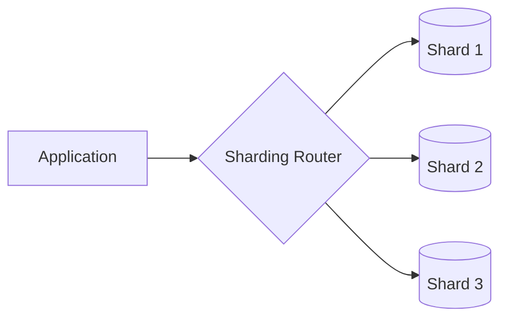
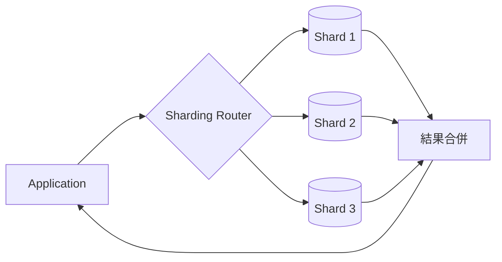

<script setup>
  import ArticleTitle from '@theme/components/ArticleTitle.vue'
  import ScrollToTopBtn from '@theme/components/ScrollToTopBtn.vue'
</script>

<ArticleTitle />

<ScrollToTopBtn />

## 為什麼需要切分資料？

當一個系統成長到一定規模，單一資料庫節點通常會先遇到兩種壓力：

- **資料量太大**：資料表有幾億筆記錄，查詢變慢、備份時間拉長、索引佔用大量記憶體。
- **寫入壓力太高**：大量並發寫入打到同一個節點，磁碟 I/O 或 CPU 成為瓶頸。

[Daily Questions Challenge #17 — 資料庫讀寫分離：Primary、Replica 與一致性取捨](./2026-06-11-database-read-write-splitting.md) 介紹了讀寫分離：把寫入集中到 Primary，把讀取分散到 Replica。這個方案可以分散讀取流量，但無法解決「單一節點裝不下所有資料」或「寫入壓力過高」的問題，因為所有 Replica 仍然儲存完整的資料集，寫入仍然集中在 Primary。

這時候需要的是把資料本身拆開，這就是 Partitioning 和 Sharding 要解決的問題。

## Partitioning：在單一資料庫內拆分資料

Partitioning（分區）是把一張邏輯上的大資料表，拆成多個較小的物理片段，但這些片段仍然在同一個資料庫節點內。對應用程式來說，它還是查同一張資料表，資料庫引擎內部會自動路由到對應的分區。

### 水平切割（Horizontal Partitioning）

水平切割是依照列（Row）來拆分：每個分區儲存完整的欄位結構，但只包含部分資料列。

常見的拆法：

- **Range（範圍）**：依日期、ID 範圍分區。例如 2024 年的訂單放一個分區，2025 年的放另一個。
- **List（清單）**：依特定值分區。例如台灣的資料放一區、日本的放另一區。
- **Hash（雜湊）**：用分區鍵的雜湊值對分區數取餘數，決定資料放哪個分區。

PostgreSQL 官方支援這三種分區方式。以 Range 分區為例，概念如下：

```
orders（邏輯資料表）
├── orders_2024（分區：2024 年）
├── orders_2025（分區：2025 年）
└── orders_2026（分區：2026 年）
```

查詢時，如果 `WHERE` 條件包含 date 欄位，PostgreSQL 可以只掃描對應分區，跳過其他分區，這稱為 **Partition Pruning**（分區裁剪）。

### 垂直切割（Vertical Partitioning）

垂直切割是依照欄（Column）來拆分：把一張寬資料表的欄位拆到不同的表或分區。

例如使用者資料表可能拆成：

- `users`：id、name、email、created_at（核心欄位，頻繁存取）
- `user_profiles`：user_id、bio、avatar_url、social_links（輔助欄位，不常讀取）

這樣頻繁查詢核心欄位時，不需要把大型欄位（如 bio）也載入記憶體，可以減少 I/O。

### Partitioning 的限制

Partitioning 在單一節點內拆分資料，能解決查詢效能和維護效率的問題，但不能解決節點本身的容量或寫入瓶頸：所有分區仍然共用同一台機器的 CPU、記憶體和磁碟。

當資料量或寫入壓力超過單一節點的極限，就需要把資料分散到多個節點，這就是 Sharding。

## Sharding：跨節點分散資料

Sharding（分片）是把資料分散到多個獨立的資料庫節點（Shard），每個 Shard 只儲存整體資料的一個子集。



Sharding 本質上是水平切割（Horizontal Partitioning）的延伸，差別在於：Partitioning 在同一個節點內切分，Sharding 則跨多個節點切分。

每個 Shard 可以是獨立的資料庫伺服器，各自有自己的 CPU、記憶體和磁碟，因此 Sharding 能真正解決單一節點的容量與寫入壓力。

### Sharding Key

Sharding Key（分片鍵）是決定一筆資料要放到哪個 Shard 的欄位或欄位組合。它是 Sharding 設計中最關鍵的決定，直接影響資料分布是否均勻、查詢是否需要跨 Shard、以及未來 Rebalancing 的難度。

## 三種常見的 Sharding 策略

### 1. Hash Sharding（雜湊分片）

對 Sharding Key 套用雜湊函數，再對 Shard 數量取餘數，決定資料放哪個 Shard。

```
shard_id = hash(user_id) % shard_count
```

**優點：**
- 資料分布均勻，能有效避免 Hotspot。
- 不需要額外的路由表，計算簡單。

**缺點：**
- 範圍查詢（Range Query）很難有效率：例如查 `user_id BETWEEN 1000 AND 2000`，結果可能散落在所有 Shard，必須 Fan-out 查詢。
- 當 Shard 數量改變，大量資料需要重新計算雜湊並搬移（Rebalancing 代價高）。

**改善方式**：使用 Consistent Hashing（一致性雜湊），當新增或移除節點時，只需移動部分資料，而非全部重算。

### 2. Range Sharding（範圍分片）

依 Sharding Key 的數值範圍，把資料分配到不同 Shard。

```
User ID 1–1,000,000    → Shard 1
User ID 1,000,001–2,000,000 → Shard 2
User ID 2,000,001–3,000,000 → Shard 3
```

**優點：**
- 範圍查詢效率高：查詢 `user_id BETWEEN 500,000 AND 800,000` 只需打到 Shard 1。
- 路由邏輯簡單直觀。

**缺點：**
- 容易產生 Hotspot：如果新使用者的 ID 是遞增的，新資料會集中寫入最後一個 Shard，造成寫入不均。
- Rebalancing 困難：當某個範圍的 Shard 過熱，切分它需要搬移大量連續資料。

### 3. Directory-based Sharding（目錄式分片）

維護一張查找表（Lookup Table），明確記錄每個 Key 或 Key 範圍對應到哪個 Shard。

```
Lookup Table:
user_id 1–500,000       → Shard A
user_id 500,001–900,000 → Shard B
user_id 900,001–1,200,000 → Shard C  ← 可以任意調整
```

**優點：**
- 最靈活：不受固定雜湊函數或靜態範圍限制，可以依實際需求任意調整分配。
- Rebalancing 比較容易：只要更新 Lookup Table，不需要重算所有 Key。

**缺點：**
- Lookup Table 本身可能成為效能瓶頸或單點故障（Single Point of Failure）。
- 系統複雜度較高，需要維護額外的查找服務。

### 策略比較

| 策略 | 資料分布 | 範圍查詢 | Rebalancing | 複雜度 |
|---|---|---|---|---|
| Hash Sharding | 均勻 | 困難（Fan-out） | 代價高 | 低 |
| Range Sharding | 可能不均 | 有效率 | 困難 | 低 |
| Directory-based | 可控制 | 視設計而定 | 較彈性 | 高 |

## Sharding Key 的選擇

Sharding Key 的選擇直接決定 Sharding 的成效，沒有適合所有情境的答案，但有幾個原則可以參考：

**選擇高 Cardinality 的欄位**：欄位值的種類要夠多，才能讓資料分散到不同 Shard。用「地區（5 個值）」當 Sharding Key，永遠只會有 5 個 Shard，擴展性很有限。

**選擇查詢頻率高的欄位**：如果大多數查詢都帶著 `user_id`，以 `user_id` 當 Sharding Key，大多數查詢只需打到單一 Shard，效率最高。

**避免單調遞增的欄位配合 Range Sharding**：自動遞增的 ID 或時間戳記搭配 Range Sharding，會讓所有新資料集中寫入最後一個 Shard，形成寫入 Hotspot。

**考慮業務存取模式**：某些業務天然有「同一個使用者的資料通常一起存取」的特性。這時以 `user_id` 切分，讓同一使用者的所有資料在同一個 Shard，可以避免跨 Shard 查詢。

## Hotspot 問題

Hotspot（熱點）是指某一個 Shard 承受了遠超比例的讀寫流量。

常見原因：

- Sharding Key 選擇不當，例如以「國家」切分，但使用者 90% 都在台灣，台灣那個 Shard 永遠過熱。
- 業務特性導致某些資料天然熱門，例如明星用戶的資料被大量存取。
- Range Sharding 搭配遞增 ID，寫入永遠打到最後一個 Shard。

處理 Hotspot 的做法：

- 重新評估 Sharding Key。
- 把熱門的 Key 加上隨機前綴分散寫入（寫入分散但查詢需要合併）。
- 把過熱的 Shard 再切分（Reshard），但這代價很高。

## 跨 Shard 查詢的挑戰

設計 Sharding 最難處理的部分，往往不是拆開資料，而是「需要跨多個 Shard 查詢時怎麼辦」。

**Fan-out 查詢**：當查詢條件不包含 Sharding Key，系統必須對所有 Shard 發出查詢，再把結果合併。查詢 `SELECT * FROM orders WHERE status = 'pending'` 如果按 `user_id` 分片，status 查詢必須打到所有 Shard。



**跨 Shard JOIN**：跨越多個 Shard 的 JOIN 很困難。資料庫引擎必須從多個節點取出資料，在應用層或協調層做合併，效能很差。

**跨 Shard 分散式交易**：當一筆業務操作需要同時更新多個 Shard 上的資料，就需要分散式交易（Distributed Transaction）。這通常需要兩階段提交（2PC）或 Saga Pattern，複雜度和延遲都會大幅提升。

**跨 Shard 聚合與排序**：`COUNT`、`SUM`、`ORDER BY`、`LIMIT` 這類操作在 Sharding 環境下都需要特別處理。例如「取全域前 10 筆」必須先從每個 Shard 取前 10 筆，再在合併層取最終前 10 筆。

這些挑戰說明一件事：**Sharding 最好讓大多數查詢只打到單一 Shard**。如果業務邏輯需要大量跨 Shard 操作，Sharding 的收益可能不及它帶來的複雜度。

## Partitioning 與 Sharding 的差異

Partitioning 和 Sharding 都是拆分資料，但解決的問題不同，適用的時機也不同。

| 面向 | Partitioning | Sharding |
|---|---|---|
| 節點數量 | 單一節點 | 多個獨立節點 |
| 解決的問題 | 大資料表查詢效能、維護效率 | 容量超出單節點、寫入壓力過高 |
| 擴展方向 | 垂直擴展（升級單一節點） | 水平擴展（增加節點） |
| 跨分區查詢 | 資料庫引擎自動處理 | 需要應用層或協調層介入 |
| 實作複雜度 | 低（資料庫原生支援） | 高（需要路由層、處理分散式問題） |

**什麼時候用 Partitioning？**

當資料表很大，查詢或維護開始變慢，但單一節點的 CPU、記憶體、磁碟還夠用，優先考慮 Partitioning。例如訂單資料表有幾億筆，依年份分區後，查詢特定年份的訂單只需掃描對應分區；清除舊資料也可以直接 DROP 分區，速度遠快於 `DELETE`。

**什麼時候用 Sharding？**

當問題是單一節點的容量或寫入吞吐量已達極限，Partitioning 沒辦法解決，才需要 Sharding。Sharding 帶來的跨 Shard 查詢複雜度和分散式交易代價很高，應該是能力不足時的最後手段，而不是提前優化的選項。

兩者也可以組合使用：先 Sharding 把資料分散到多個節點，每個節點內再對大資料表做 Partitioning，兼顧水平擴展與查詢效能。

## 適合與不適合的場景

**適合 Sharding 的情境：**

- 單一節點的儲存容量已不夠放下全部資料。
- 寫入吞吐量已超過單一節點的處理極限，讀寫分離無法解決。
- 資料有天然的切分鍵，大多數查詢都帶著這個鍵（如 `user_id`、`tenant_id`）。
- 業務邏輯允許跨 Shard 查詢少見或可以接受延遲。

**不適合 Sharding 的情境：**

- 資料量還小，單一資料庫加上索引優化已足夠。
- 業務需要大量跨 Shard 的 JOIN、聚合或交易。
- 團隊沒有足夠能力維護分散式系統的複雜度。
- 讀取壓力才是瓶頸，讀寫分離或 Cache 就能解決。

Sharding 是一個不可逆的架構決定，一旦上線，Resharding 的代價極高。應該先確認問題真的是單一節點的容量或寫入瓶頸，而不是索引缺失、N+1 Query、或讀取壓力，再考慮是否需要 Sharding。

## 總結

遇到資料庫壓力時，先判斷問題出在哪裡，再選擇對應的工具：

- 查詢效能變慢、大資料表維護困難，但單一節點還夠用 → 考慮 **Partitioning**。
- 單一節點容量或寫入吞吐量已達極限 → 才需要 **Sharding**。

選擇 Sharding 後，核心決策是 Sharding Key：目標是讓大多數查詢只打到單一 Shard，避免 Hotspot，同時考慮未來 Rebalancing 的難度。三種策略各有取捨：Hash Sharding 分布均勻但 Rebalancing 代價高、Range Sharding 範圍查詢有效率但容易 Hotspot、Directory-based Sharding 最彈性但最複雜。

跨 Shard 查詢（Fan-out、跨 Shard JOIN、分散式交易）是 Sharding 最主要的複雜度來源。如果業務邏輯大量需要跨 Shard 操作，Sharding 帶來的代價可能遠超過它解決的問題。

## 參考

- [PostgreSQL Documentation — Table Partitioning](https://www.postgresql.org/docs/current/ddl-partitioning.html)
- [PlanetScale — Sharding strategies: directory-based, range-based, and hash-based](https://planetscale.com/blog/types-of-sharding)
- [Microsoft Azure Architecture Center — Sharding Pattern](https://learn.microsoft.com/en-us/azure/architecture/patterns/sharding)
- [Aerospike — What Is Sharding and How It Works for Database Scale](https://aerospike.com/blog/what-is-sharding/)
- [DataCamp — Sharding vs Partitioning: Understanding Database Distribution Methods](https://www.datacamp.com/blog/sharding-vs-partitioning)
