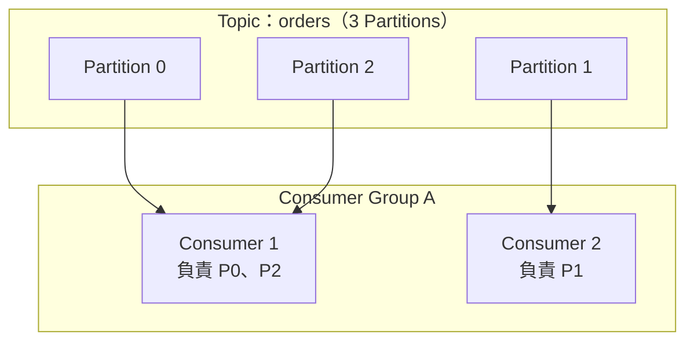
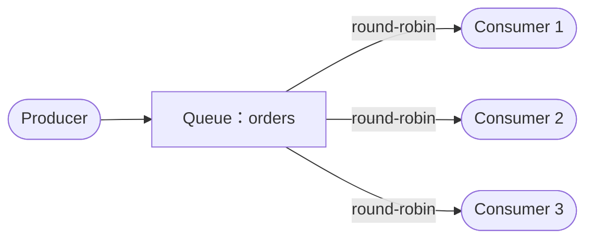
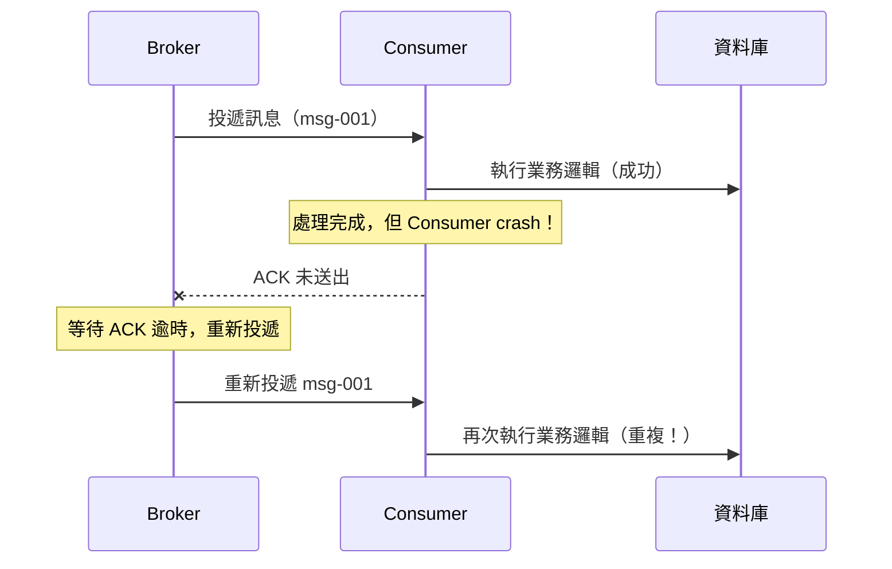
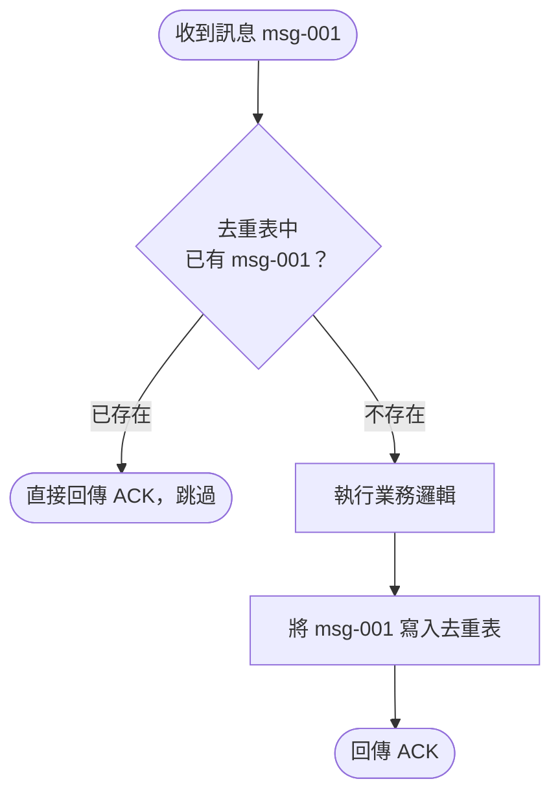

<script setup>
  import ArticleTitle from '@theme/components/ArticleTitle.vue'
  import ScrollToTopBtn from '@theme/components/ScrollToTopBtn.vue'
</script>

<ArticleTitle />

<ScrollToTopBtn />

在 [#09 使用 Message Queue 處理高併發下的排隊機制](./2026-06-03-message-queue.md) 中，我們介紹了 MQ 如何透過 Producer/Consumer 模型解決高併發下的排隊機制。然而，當系統流量成長、單一 Consumer 處理速度成為瓶頸時，自然的做法是增加更多 Consumer 實例來水平擴展——這時兩個問題就會浮現：**多個 Consumer 同時運作時，訊息要怎麼分配？又如何確保每則訊息只被處理一次？**

---

## 水平擴展機制

### Kafka：Consumer Group 與 Partition 分配

Kafka 的核心設計是 **Topic 下有多個 Partition（分區）**，水平擴展透過 **Consumer Group（消費者群組）** 實現。

Consumer Group 的核心規則只有一條：**同一個 Consumer Group 內，每個 Partition 至多只能被一個 Consumer 消費。**

以 3 個 Partition 搭配 2 個 Consumer 為例：



Consumer 1 負責 Partition 0 與 Partition 2，Consumer 2 負責 Partition 1，兩者可以**平行消費**，互不干擾。

這個規則有一個重要推論：**Partition 數量決定了 Consumer Group 的最大並行度。** 如果 Consumer 數量超過 Partition 數量，多出來的 Consumer 將會閒置，不會分配到任何 Partition。想要更高的並行度，必須先增加 Partition 數量。

#### Rebalance（重新分配）

當 Consumer Group 的成員發生變化時，Kafka 會觸發 **Rebalance**，重新計算 Partition 的歸屬：

- 新 Consumer 加入 Group
- Consumer 離開或崩潰（heartbeat 超時）
- Topic 的 Partition 數量變動

Rebalance 期間，受影響的 Consumer 會暫停消費，直到新的分配完成。Kafka 2.4 引入了 **Incremental Cooperative Rebalance**，讓未受影響的 Consumer 可以繼續消費，減少停頓的影響範圍。

---

### RabbitMQ：Competing Consumers Pattern

RabbitMQ 的設計與 Kafka 不同：**訊息儲存在 Queue 中，而非 Partition 裡**。水平擴展的方式是讓多個 Consumer 同時訂閱同一個 Queue，彼此競爭取得下一則訊息，這個模式稱為 **Competing Consumers（競爭消費者）**。



預設情況下，RabbitMQ 以 **round-robin** 方式輪流派發訊息給各個 Consumer。但如果各 Consumer 的處理速度不一致，純 round-robin 可能導致快速 Consumer 閒置、慢速 Consumer 積壓。

解決方法是透過 **`basicQos(prefetchCount)`** 設定每個 Consumer 最多能持有多少未確認的訊息。當 `prefetchCount = 1` 時，RabbitMQ 只有在 Consumer 確認上一則訊息後，才會派發下一則，讓處理快的 Consumer 自然接收更多訊息，實現公平分發（Fair Dispatch）。

---

### Kafka vs RabbitMQ 設計差異

| 比較項目 | Kafka | RabbitMQ |
|---------|-------|---------|
| 訊息儲存單位 | Partition | Queue |
| 並行度上限 | Partition 數量 | Consumer 數量（無上限） |
| 訊息保留 | 按設定時間保留（可重播） | 確認後刪除 |
| 擴展方式 | 增加 Partition + Consumer | 直接增加 Consumer |
| Partition/Queue 內的順序 | Partition 內保證順序 | Queue 內 FIFO（單 Consumer 時） |

---

## At-least-once：重複消費的根源

MQ 的訊息投遞有三種語意：

- **At-most-once（至多一次）**：訊息可能遺失，但不會重複
- **At-least-once（至少一次）**：訊息不會遺失，但可能重複
- **Exactly-once（恰好一次）**：不遺失、不重複（實作複雜，有效能代價）

大多數 MQ 系統預設提供 **At-least-once**，因為在大多數業務場景中，資料遺失的代價遠高於重複處理的代價。

重複消費最常見的場景如下：



Consumer 完成業務邏輯後、送出確認之前崩潰，Broker 無法得知訊息已被成功處理，因此重新投遞，造成重複消費。

---

## 平台層的確認機制

### Kafka：Offset Commit 策略

Kafka 用 **Offset（偏移量）** 記錄 Consumer 讀取到的位置。Consumer 將目前讀到的 Offset commit 到 Broker（儲存在 `__consumer_offsets` Topic 中），重啟後從最後一次 commit 的位置繼續消費。

#### 自動 Commit（enable.auto.commit=true，預設值）

Kafka 每隔 `auto.commit.interval.ms`（預設 5000ms）自動 commit 一次當前 Offset。

風險在於 commit 時間點無法與業務邏輯對齊：Consumer 在處理完訊息但自動 commit 尚未觸發前崩潰，重啟後會重新消費已處理過的訊息。

#### 手動 Commit（enable.auto.commit=false）

關閉自動 commit，由應用程式在處理完訊息後明確 commit：

- **`commitSync()`**：同步 commit，等待 Broker 確認後才繼續。可靠性高，但會阻塞執行緒，吞吐量較低。
- **`commitAsync()`**：非同步 commit，不等待 Broker 回應，吞吐量高，但失敗時不會自動重試。

標準做法是 `enable.auto.commit=false`，處理完每批訊息後呼叫 `commitSync()`：

```
poll() → 處理訊息 → commitSync() → poll() → ...
```

即使如此，手動 commit 仍是 At-least-once 語意：Consumer 在業務邏輯完成但 commit 前崩潰，重啟後仍會重新消費同一批訊息。

---

### RabbitMQ：Consumer ACK 機制

RabbitMQ 透過 **Consumer Acknowledgement（確認機制）** 判斷訊息是否已成功處理。

#### autoAck=true（不建議用於生產環境）

訊息一旦**送達 Consumer**，Broker 就立即從 Queue 中刪除訊息。Consumer 在處理過程中崩潰，訊息將永久遺失。

#### autoAck=false + 手動 ACK（建議做法）

Consumer 接收訊息後，由應用程式明確送出確認：

- **`basicAck(deliveryTag)`**：告知 Broker「此訊息已成功處理，可以刪除」
- **`basicNack(deliveryTag, requeue=true)`**：告知 Broker「處理失敗，請重新入隊」
- **`basicNack(deliveryTag, requeue=false)`**：告知 Broker「處理失敗，不重試」（通常路由至 DLQ，參見 [#25 Dead Letter Queue](./2026-06-19-dead-letter-queue.md)）

如果 Consumer 在送出 `basicAck` 之前崩潰，RabbitMQ 偵測到連線中斷後，會將所有未確認的訊息重新投遞給其他可用的 Consumer。

Kafka Offset Commit 與 RabbitMQ ACK 的對等關係：

| 行為 | Kafka | RabbitMQ |
|------|-------|---------|
| 告知 Broker「已成功處理」 | commitOffset | basicAck |
| 告知 Broker「處理失敗，重試」 | 不 commit，等 Rebalance 或重啟 | basicNack(requeue=true) |
| Consumer 崩潰時的行為 | 從上次 commit Offset 重新消費 | 重新投遞所有未 ACK 的訊息 |

---

## 應用層的冪等性設計

無論使用 Kafka 還是 RabbitMQ，平台層的確認機制只能縮小重複消費的時間窗口，無法完全消除——Consumer 在業務邏輯完成後、發送確認前的那個瞬間崩潰，重複消費就會發生。

根本解法是在**應用層**實現 **冪等性（Idempotency）**：相同的訊息被處理多次，業務結果與處理一次相同。



### 資料庫唯一索引

在去重表中對 `message_id` 欄位建立 UNIQUE 索引。處理訊息前先嘗試插入 `message_id`：

- 插入成功 → 繼續執行業務邏輯
- 拋出唯一鍵衝突（Duplicate Key Error）→ 此訊息已被處理過，直接跳過並回傳 ACK

資料庫唯一索引的插入是原子操作，不需要額外的「先查再插」邏輯，不存在 Race Condition 的風險。

### Redis 分布式去重（SET NX + TTL）

使用 Redis 的 `SET key value NX EX ttl` 指令（NX = Not Exists）：

- 設定成功 → 此訊息是第一次消費，繼續處理
- 設定失敗（Key 已存在）→ 重複訊息，跳過

TTL 讓去重記錄自動過期，避免資料無限累積。TTL 應設定為大於訊息可能被重新投遞的最大時間窗口。

相較於資料庫方案，Redis 的讀寫速度更快，適合高吞吐量場景；但需要考慮 Redis 不可用時的降級策略。

### 去重 ID 的選擇

去重 ID 應優先使用**業務 ID**（如 `order_id`、`payment_id`），而非 MQ 框架生成的 Message ID。原因是：訊息在不同平台重新投遞時，Message ID 可能改變，但業務 ID 保持穩定，去重邏輯才能真正生效。

---

## 總結

MQ 水平擴展與重複消費防護是兩個密切相關的系統設計問題：

- **Kafka** 透過 Consumer Group + Partition 實現並行消費，並行度上限等於 Partition 數量；**RabbitMQ** 透過 Competing Consumers Pattern，多 Consumer 競爭同一 Queue，擴展更靈活但訊息不可重播。
- 兩個平台的預設投遞語意都是 **At-least-once**，Consumer 在確認前崩潰必然導致重複消費。
- 平台層的 **Kafka Manual Offset Commit** 與 **RabbitMQ 手動 ACK** 可縮小重複消費的時間窗口，但無法完全消除。
- 根本解法是在應用層實現 **冪等性**：透過資料庫唯一索引或 Redis SET NX 去重，確保相同訊息無論消費幾次，業務結果都一致。

---

## 參考

- [Apache Kafka® Internal Architecture - Consumer Group Protocol - Confluent](https://developer.confluent.io/courses/architecture/consumer-group-protocol/)
- [Kafka Rebalancing Explained: How It Works & Why It Matters - Confluent](https://www.confluent.io/learn/kafka-rebalancing/)
- [Commit Offsets in Kafka - Baeldung](https://www.baeldung.com/kafka-commit-offsets)
- [Consumer Acknowledgements and Publisher Confirms - RabbitMQ Official Docs](https://www.rabbitmq.com/docs/confirms)
- [RabbitMQ: Competing Consumers Pattern - Medium](https://medium.com/@sankar.muduli/rabbitmq-competing-consumers-pattern-60982f6c7572)
- [Build Idempotent Kafka Consumers: Patterns That Actually Work - Conduktor](https://www.conduktor.io/blog/building-idempotent-consumers)
- [Data deduplication with Redis using SET NX - Redis Official Docs](https://redis.io/tutorials/data-deduplication-with-redis/)
