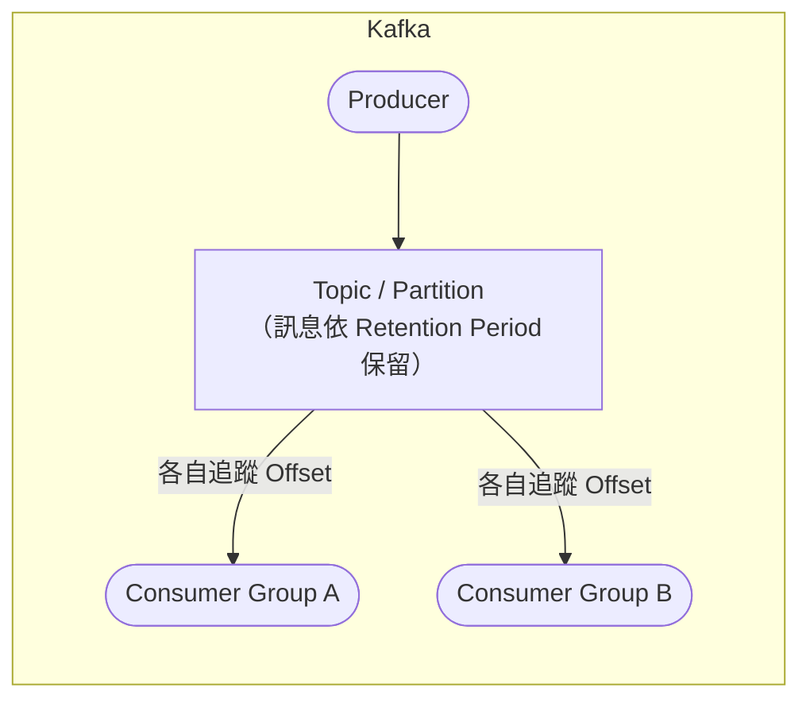
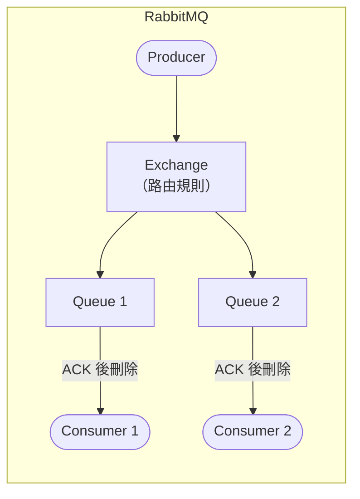

<script setup>
  import ArticleTitle from '@theme/components/ArticleTitle.vue'
  import ScrollToTopBtn from '@theme/components/ScrollToTopBtn.vue'
</script>

<ArticleTitle />

<ScrollToTopBtn />

在面試過程中，「你們為什麼選 Kafka 不選 RabbitMQ？」是一個讓很多工程師答不出來的問題——不是因為不了解這兩個工具，而是因為很多人只是「跟著 Team 在用」，從來沒有主動思考過選型背後的理由。

在 [#09 使用 Message Queue 處理高併發下的排隊機制](./2026-06-03-message-queue.md) 中，我們介紹了 MQ 的基本概念；在 [#33 MQ 水平擴展機制與避免重複消費的設計](./2026-06-27-mq-horizontal-scaling-idempotency.md) 中，也對比了兩者的擴展設計差異。這篇文章聚焦在選型本身——從設計哲學、功能比較到使用場景，建立一個可以套用到實際情境的決策框架。

---

## 設計哲學的根本差異

Kafka 和 RabbitMQ 在誕生之初，解決的是不同的問題。

**Kafka** 最初由 LinkedIn 開發，用來處理內部龐大的事件日誌（User Activity、系統 Metrics）。它的核心概念是**分散式 Commit Log（提交日誌）**：Producer 將訊息寫入 Topic 的 Partition，訊息依序追加在 Log 末端；Consumer 自己追蹤「讀到哪了」（Offset）。訊息不會因為被消費而消失，而是依照設定的保留期限（Retention Period）留在 Broker 上。

> Kafka 的哲學是 **"Dumb Broker, Smart Consumer"**：Broker 只負責儲存與排序，Consumer 自己負責記住位置。

**RabbitMQ** 基於 **AMQP（Advanced Message Queuing Protocol）** 協定設計，AMQP 最初由 JPMorgan Chase 為金融服務業的訊息交換需求而開發，設計重點在於靈活路由與可靠投遞。它的核心概念是**訊息路由中介軟體（Message Broker）**：Producer 將訊息送到 Exchange，Exchange 依照路由規則分發到對應的 Queue，Consumer 從 Queue 取出訊息並回傳 ACK 確認後，訊息即從 Queue 中刪除。

> RabbitMQ 的哲學是 **"Smart Broker, Dumb Consumer"**：Broker 負責複雜的路由判斷，Consumer 只需要收訊息並確認。





---

## 功能比較

| 比較維度 | Kafka | RabbitMQ |
|---------|-------|---------|
| **設計定位** | 事件串流平台（Event Streaming Platform） | 訊息路由中介軟體（Message Broker） |
| **訊息保留** | 依 Retention Period 保留，消費後仍在 | 消費並 ACK 後立即刪除 |
| **訊息重播** | ✅ 支援（調整 Offset 可重讀歷史） | ❌ 不支援 |
| **消費模式** | Pull（Consumer 主動拉取） | Push（Broker 主動推送） |
| **路由能力** | 只能以 Topic 為單位訂閱 | 支援 Direct、Topic、Fanout、Headers 四種 Exchange |
| **吞吐量** | 極高（百萬 msg/sec 量級） | 中高（數萬至十萬 msg/sec） |
| **延遲** | 較高（批次設計，適合高吞吐量） | 較低（即時 Push，適合低延遲任務） |
| **訊息順序** | Partition 內保證順序 | Queue 內 FIFO（單 Consumer 時） |
| **協定** | Kafka 原生協定 | AMQP 0-9-1 |
| **水平擴展** | 增加 Partition + Consumer | 直接增加 Consumer |
| **內建 DLQ 支援** | ❌（需應用層自行實作） | ✅ 內建 Dead Letter Exchange（DLX） |

---

## RabbitMQ 的路由能力

RabbitMQ 最大的優勢之一是靈活的 Exchange 路由。四種 Exchange 類型可以組合出多樣化的訊息分發邏輯：

| Exchange 類型 | 路由規則 | 適用場景 |
|-------------|---------|---------|
| **Direct** | Routing Key 完全匹配 | 點對點任務派發 |
| **Topic** | Routing Key 支援萬用字元（`*`、`#`） | 多層次事件訂閱（如 `order.*.tw`） |
| **Fanout** | 廣播至所有綁定的 Queue，忽略 Routing Key | 通知、廣播訊息 |
| **Headers** | 依 Message Header 欄位匹配 | 複雜條件路由 |

如果系統的訊息需要依據不同條件分發給不同 Consumer，RabbitMQ 的 Exchange 設計比 Kafka 的 Topic 方案更直觀。

---

## 典型使用場景

### 適合選 Kafka 的情境

- **高吞吐量事件流**：User 行為追蹤、點擊流（Clickstream）、IoT Sensor 數據，訊息量級達每秒數百萬。
- **多個獨立服務訂閱同一事件流**：訂單成立事件同時被庫存服務、通知服務、報表服務各自消費，彼此的進度（Offset）互不影響。
- **事件溯源（Event Sourcing）**：系統狀態由歷史事件重建，需要能重播（Replay）過去的事件。
- **日誌聚合（Log Aggregation）**：多個服務的 Log 彙整至 Kafka，再由下游分析系統消費。

### 適合選 RabbitMQ 的情境

- **任務佇列（Task Queue）**：發送 Email、影像縮圖、PDF 產生等非同步背景任務，任務執行完即不再需要訊息。
- **複雜路由需求**：根據訂單來源、訂單類型等條件，將訊息路由到不同的 Consumer。
- **低延遲即時確認**：需要盡快投遞任務並處理，Push 模式比 Pull 模式延遲更低。
- **協定相容需求**：既有系統或第三方服務使用 AMQP 協定，RabbitMQ 可直接相容。
- **內建 DLQ 需求**：需要開箱即用的重試與死信佇列機制（詳見 [#25 Dead Letter Queue](./2026-06-19-dead-letter-queue.md)）。

---

## 選型決策框架

與其背比較表格，不如用幾個問題快速定位：

```
1. 需要訊息重播，或需要多個獨立 Consumer 訂閱同一事件流？
   → 是：Kafka

2. 吞吐量需求超過每秒數十萬 msg？
   → 是：Kafka

3. 訊息需要依複雜條件路由到不同 Consumer？
   → 是：RabbitMQ

4. 既有系統使用 AMQP 協定？
   → 是：RabbitMQ

5. 任務處理完即可丟棄，不需要保留或重播？
   → 是：RabbitMQ，否則考慮 Kafka
```

實務上，兩者也常見並用：Kafka 承接高流量的事件流（訂單成立、用戶行為），RabbitMQ 負責分配內部任務（發通知、觸發工作流程）。兩者並用時，各自發揮擅長的角色，而不是非此即彼的取捨。

---

## 總結

RabbitMQ 和 Kafka 不是誰優於誰的關係，而是解決不同問題的工具：

- **Kafka** 的強項在於持久化日誌、高吞吐量、以及支援多個獨立消費者重播同一事件流，適合事件溯源、流處理、Log 聚合等場景。
- **RabbitMQ** 的強項在於靈活路由、低延遲 Push 投遞、以及內建的 AMQP 協定與 DLQ 支援，適合任務佇列、複雜路由分發等場景。

---

## 參考

- [RabbitMQ vs. Apache Kafka | Confluent](https://www.confluent.io/compare/rabbitmq-vs-apache-kafka/)
- [Kafka vs RabbitMQ? Difference between Kafka and RabbitMQ | AWS](https://aws.amazon.com/compare/the-difference-between-rabbitmq-and-kafka/)
- [Exchanges | RabbitMQ](https://www.rabbitmq.com/docs/exchanges)
- [AMQP 0-9-1 Model Explained | RabbitMQ](https://www.rabbitmq.com/tutorials/amqp-concepts)
- [Apache Kafka 4.0.0 Release Announcement | Apache Kafka](https://kafka.apache.org/blog/2025/03/18/apache-kafka-4.0.0-release-announcement/)
- [Kafka vs RabbitMQ: Streams vs Queues | Conduktor](https://www.conduktor.io/glossary/kafka-vs-rabbitmq)
