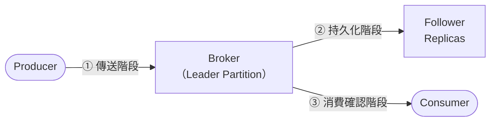
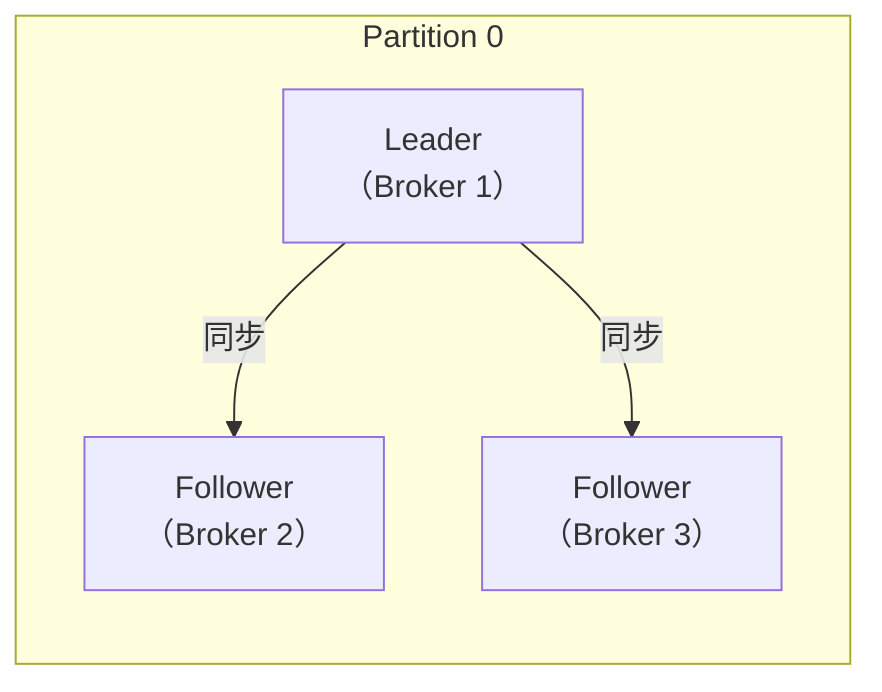
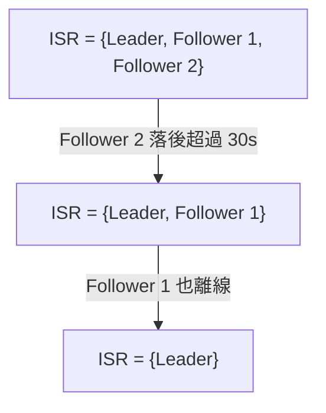

<script setup>
  import ArticleTitle from '@theme/components/ArticleTitle.vue'
  import ScrollToTopBtn from '@theme/components/ScrollToTopBtn.vue'
</script>

<ArticleTitle />

<ScrollToTopBtn />

在 [#09 使用 Message Queue 處理高併發下的排隊機制](./2026-06-03-message-queue.md) 中，我們提到 MQ 需要設定「持久化機制」來防止訊息遺失，但沒有深入說明怎麼做。訊息在從 Producer 送出到 Consumer 消費完成的過程中，有三個不同的階段都可能遺失，每個階段有各自對應的機制。

---

## 訊息在哪三個階段可能遺失？



| 階段 | 遺失情境 | 對應機制 |
|------|---------|---------|
| ① Producer → Broker | 網路問題、Broker 尚未寫入就 crash | `acks` 設定、`retries`、`enable.idempotence` |
| ② Broker 持久化 | Leader crash 且 Follower 尚未同步 | Replication Factor、ISR、`min.insync.replicas` |
| ③ Consumer 消費確認 | Consumer 處理完但 Offset 未 commit 就 crash | Offset Commit 策略（詳見 [#33](./2026-06-27-mq-horizontal-scaling-idempotency.md)） |

本篇聚焦在 ① 與 ② 兩個階段，③ 已在 [#33 MQ 水平擴展機制與避免重複消費的設計](./2026-06-27-mq-horizontal-scaling-idempotency.md) 中完整介紹。

---

## ① Producer 端：acks 設定

`acks` 是 Producer 最重要的可靠性設定，它決定了 **Producer 要收到多少個確認，才認為這則訊息「已成功送出」**。

### acks=0：完全不等待

```
Producer ──傳送──▶ Broker
         ◀── 不等回應，直接繼續
```

Producer 把訊息丟進 socket buffer 後就繼續執行，不等 Broker 任何回應。這意味著：

- 如果網路封包遺失，Producer 不知道
- 如果 Broker 在寫入前 crash，訊息永遠消失
- `retries` 設定完全不生效（Producer 不知道失敗了）

**適用場景**：可以接受少量遺失的情境，例如監控 Metrics、用戶行為日誌。極限吞吐量，零可靠保證。

### acks=1：等待 Leader 確認

```
Producer ──傳送──▶ Leader（寫入本地 Log）
         ◀── ACK（不等 Follower 同步）
```

Leader 將訊息寫入自己的本地 Log 後立即回傳 ACK，不等任何 Follower 確認。這代表：

- Producer 收到 ACK = 訊息已在 Leader 上
- 如果 Leader 在 Follower 同步之前 crash，訊息仍然遺失

這是 Kafka 3.0 之前的預設值；Kafka 3.0 起因 `enable.idempotence` 預設啟用，`acks` 的有效預設已變為 `all`。對大多數非關鍵業務而言是合理的折衷，但對於不能遺失的資料（訂單、金流）則不夠安全。

### acks=all（或 acks=-1）：等待所有 ISR 確認

```
Producer ──傳送──▶ Leader ──同步──▶ Follower 1
                         ──同步──▶ Follower 2
         ◀── ACK（等全部 ISR 都寫入後才回）
```

Leader 等到所有 In-Sync Replicas（ISR，後面會詳細說明）都確認寫入後，才回傳 ACK 給 Producer。這是 **Kafka 提供的最強可靠性保證**。

> 光設 `acks=all` 還不夠——ISR 可能在某個時間點只剩下 Leader 自己。`acks=all` 的真正強度，取決於 ISR 的成員數，這就是 `min.insync.replicas` 的用途。

---

## Producer 的冪等性：防止重試產生重複

當 Producer 設定 `retries`（重試次數）時，如果 Broker 成功寫入但 ACK 在回傳途中遺失，Producer 會誤以為失敗而重試，導致訊息被寫入兩次。

**`enable.idempotence=true`** 解決了這個問題：

- Broker 為每個 Producer 分配唯一的 Producer ID（PID）
- Producer 為每則訊息附上遞增的 Sequence Number
- Broker 用 `(PID, Sequence Number)` 去重，重複投遞的訊息會被丟棄

啟用 `enable.idempotence` 需要同時滿足：`acks=all`、`retries > 0`、`max.in.flight.requests.per.connection ≤ 5`。Kafka 3.0 之後，`enable.idempotence` 已預設為 `true`。

---

## ② Broker 端：Replication 與 ISR

### Replication Factor（副本數）

Kafka 的每個 Partition 都可以設定副本數（Replication Factor）。以 Replication Factor = 3 為例，每個 Partition 會有 1 個 Leader 和 2 個 Follower，分布在不同的 Broker 上。



**Follower 會持續從 Leader 拉取（pull）最新訊息，保持同步。** 當 Leader crash 時，Kafka 從 Follower 中選出新的 Leader，服務不中斷。

副本數為 N 時，最多可以容忍 N-1 個 Broker 故障而不遺失資料。生產環境通常設定為 3（可容忍 1 個 Broker 故障）。

### ISR（In-Sync Replicas，同步副本集合）

ISR 是指「目前與 Leader 保持同步的副本集合」。同步的定義是：Follower 的 Log 落後 Leader 的程度，在 `replica.lag.time.max.ms`（預設 30 秒）以內。

如果某個 Follower 因為網路問題或 Broker 負載過高，長時間跟不上 Leader，它會被移出 ISR，成為 Out-of-Sync Replica。



**只有在 ISR 中的副本，才有資格被選為新 Leader。** 這確保了新 Leader 一定擁有所有已 commit 的訊息，不會有資料倒退的情況。

### min.insync.replicas：設定寫入門檻

`min.insync.replicas` 指定了「當 `acks=all` 時，至少需要多少個 ISR 成員確認，寫入才算成功」。

以 Replication Factor = 3、min.insync.replicas = 2 為例：

| 場景 | ISR 成員 | ISR 數量 | 寫入結果 |
|------|---------|---------|---------|
| 正常 | Leader + F1 + F2 | 3 | 成功 |
| F2 離線 | Leader + F1 | 2 | 成功（剛好達到門檻） |
| F1 + F2 都離線 | Leader only | 1 | **失敗：NotEnoughReplicasException** |

當 ISR 成員數低於 `min.insync.replicas` 時，Kafka 會直接拒絕 Producer 的寫入請求，回傳例外。**拒絕寫入** 聽起來像是壞事，但這實際上是在保護資料——如果此時允許寫入，訊息只存在一個 Broker 上，Broker 故障就會永久遺失。

---

## 黃金組合：生產環境推薦設定

將三個層面的設定組合起來，是業界最常見的強可靠性配置：

```properties
# Topic 設定
replication.factor=3
min.insync.replicas=2

# Producer 設定
acks=all
enable.idempotence=true
retries=2147483647  # Integer.MAX_VALUE（enable.idempotence 啟用後的推薦值）
```

這個組合的保證是：
- 訊息必須被至少 2 個 Broker（含 Leader）持久化，才算寫入成功
- 最多可以容忍 1 個 Broker 同時故障而不遺失資料
- Producer 重試不會產生重複訊息

---

## ③ Consumer 端：交叉引用

Consumer 端的可靠性問題（Offset Commit 策略、auto commit 的風險、手動 commit 的最佳實踐）已在 [#33 MQ 水平擴展機制與避免重複消費的設計](./2026-06-27-mq-horizontal-scaling-idempotency.md) 中完整介紹，本篇不重複。核心原則是：**Consumer 應在業務邏輯成功完成後，才手動 commit Offset。**

---

## acks 設定的取捨總結

| acks | 吞吐量 | 可靠性 | 適用場景 |
|------|-------|-------|---------|
| 0 | 最高 | 無保證 | 監控 Metrics、行為日誌（可接受遺失） |
| 1 | 中等 | Leader 確認 | 一般業務，可接受極少數邊緣遺失 |
| all | 較低（延遲較高） | 最強（需搭配 `min.insync.replicas`） | 訂單、金流、不可遺失的事件 |

---

## 總結

Kafka 的訊息不遺失保證，需要從三個階段分別設定：

- **Producer 端**：設定 `acks=all` 確保所有 ISR 副本確認寫入；搭配 `enable.idempotence=true` 讓 Producer 重試不產生重複。
- **Broker 端**：設定 `replication.factor=3` 建立副本冗余；設定 `min.insync.replicas=2` 確保 ISR 不足時拒絕寫入，以拒絕換取不遺失。
- **Consumer 端**：手動管理 Offset Commit，在業務邏輯完成後才確認消費。

三個層面缺一不可：單獨設 `acks=all` 而不設 `min.insync.replicas`，當 ISR 縮減至只剩 Leader 時保證就會失效；單獨設 `replication.factor=3` 而不設 `acks=all`，訊息可能在 Follower 同步前就遺失。

---

## 參考

- [Producer Configs | Apache Kafka](https://kafka.apache.org/41/configuration/producer-configs/)
- [Kafka Replication | Confluent Documentation](https://docs.confluent.io/kafka/design/replication.html)
- [Message Delivery Guarantees for Apache Kafka | Confluent Documentation](https://docs.confluent.io/kafka/design/delivery-semantics.html)
- [How to Tune Kafka's Durability and Ordering Guarantees | Confluent Developer](https://developer.confluent.io/courses/architecture/guarantees/)
- [Optimize Confluent Cloud Clients for Durability | Confluent Documentation](https://docs.confluent.io/cloud/current/client-apps/optimizing/durability.html)
- [Kafka Data Replication Protocol: A Complete Guide | Confluent Developer](https://developer.confluent.io/courses/architecture/data-replication/)
