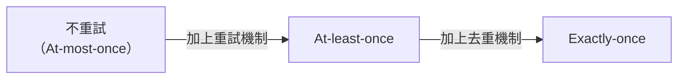
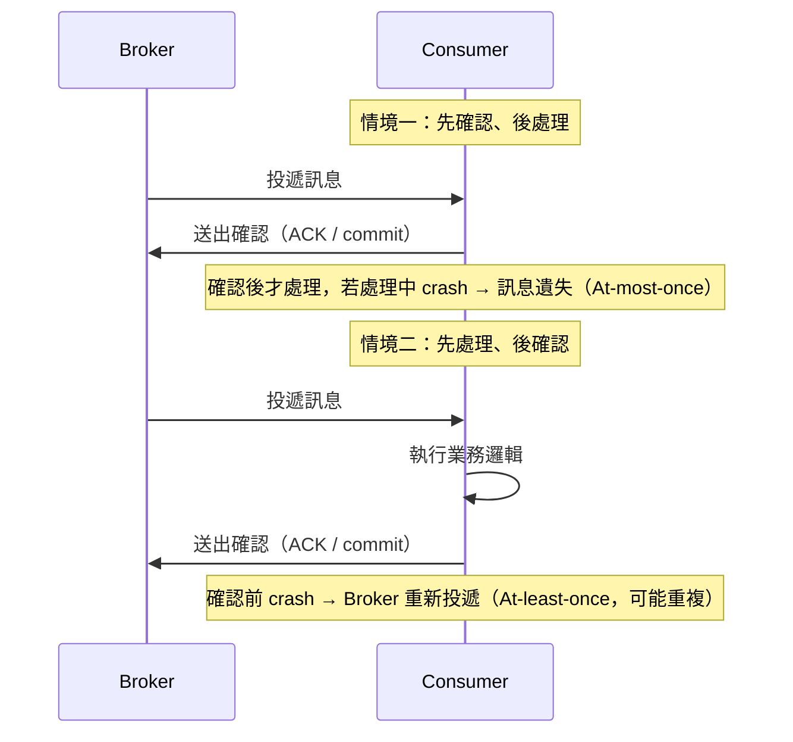
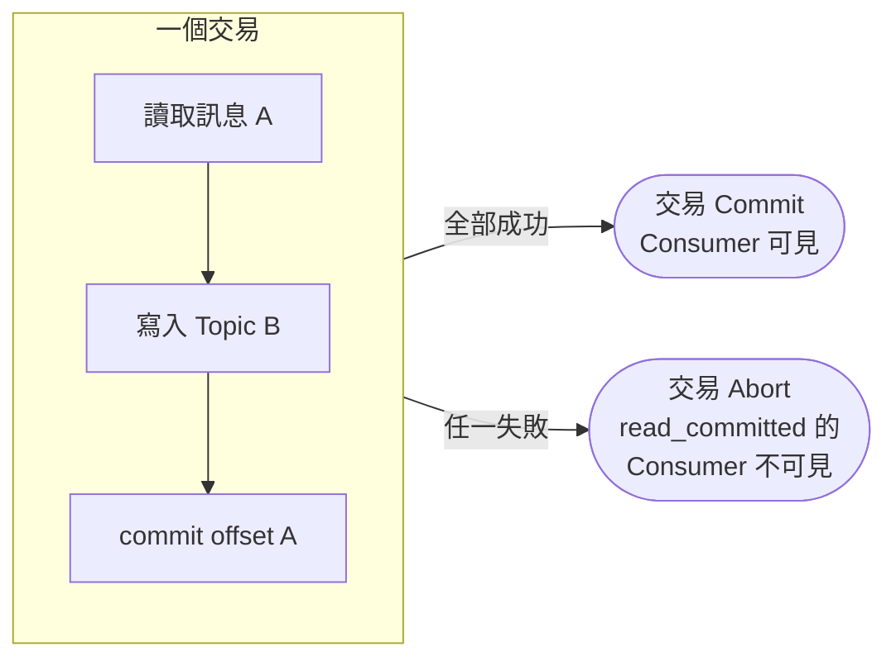

<ArticleTitle />

<ScrollToTopBtn />

在這個 Message Queue 系列中，我們陸續談過 [Offset Commit 與手動 ACK](./2026-06-27-mq-horizontal-scaling-idempotency.md)、[Kafka 的 acks 設定](./2026-07-03-kafka-message-durability.md)，這些機制其實都在回答同一個更根本的問題：**這則訊息，Broker 保證會被投遞幾次？** 這個保證的等級，就是 MQ 的「傳遞語義（Delivery Semantics）」。面試中常被問到「解釋 At-least-once 跟 Exactly-once 的差異」，這篇把系列文章中散落的機制收斂成一個框架來回答。

---

## 三種傳遞語義

傳遞語義描述的是「Broker 保證訊息被消費的次數」，可以用兩個問題來判斷：**訊息會不會遺失？訊息會不會重複？**

| 語義 | 會遺失嗎 | 會重複嗎 | 特性 |
|------|---------|---------|------|
| At-most-once（至多一次） | 可能 | 不會 | 訊息送出後不重試，出錯就算了 |
| At-least-once（至少一次） | 不會 | 可能 | 沒收到確認就重送，寧可重複也不遺失 |
| Exactly-once（恰好一次） | 不會 | 不會 | 不遺失也不重複，實作複雜、有效能代價 |

三種語義本質上是**「遺失」與「重複」之間的取捨**：

At-most-once 是最寬鬆的保證：發送方送出後不等確認、不重試，任何環節出錯訊息就直接消失。這聽起來很糟，但在某些場景反而是合理選擇——例如即時監控的 Metrics 上報，晚一筆、少一筆的代價遠低於為了保證送達而拖慢系統。

At-least-once 是大多數 MQ 系統的預設語義（包含 Kafka 與 RabbitMQ），做法是「沒收到確認就重送」。這解決了遺失問題，但重送的前提是發送方無法區分「對方沒收到」還是「對方收到了但確認遺失」，於是保守地選擇重送，代價就是可能重複。

Exactly-once 則是同時要求不遺失又不重複，必須在 At-least-once 的重試機制之上，再疊加一層去重（Deduplication）機制，才能達成。

---

## 語義差異的根本原因：ack 時機

三種語義的分野，其實來自發送端「什麼時候可以放心刪除/推進訊息」與接收端「什麼時候送出確認」的時序關係。以 Consumer 端為例，關鍵在於**業務邏輯執行**與**確認送出**這兩個動作的先後順序：

- **先確認、後處理**：Consumer 一收到訊息就立刻確認，之後才執行業務邏輯。如果處理過程中崩潰，Broker 已經認為訊息投遞成功，不會重送，訊息實質上遺失了——這是 At-most-once 的典型成因。
- **先處理、後確認**：Consumer 執行完業務邏輯才確認。如果確認送出前崩潰，Broker 沒收到確認會重新投遞，造成重複——這是 At-least-once 的典型成因，也是 Kafka、RabbitMQ 的預設行為。

Producer 端也有類似的時序問題：Producer 送出訊息後，如果在收到 Broker 回應前逾時，會不知道訊息究竟有沒有寫入成功，重試就可能造成重複寫入。這正是 [#39 Kafka 如何保證訊息不遺失](./2026-07-03-kafka-message-durability.md) 中 `acks` 設定要處理的問題：`acks=0` 完全不等待、沒有重試依據，趨近 At-most-once；`acks=all` 搭配 `retries` 則是 At-least-once 的基礎。

---

## Kafka：從 At-least-once 到逼近 Exactly-once

### 預設語義：At-least-once

Kafka 的預設組合——Producer 端 `acks=all` + `retries`，Consumer 端 manual commit——已經在 [#39](./2026-07-03-kafka-message-durability.md) 與 [#33](./2026-06-27-mq-horizontal-scaling-idempotency.md) 完整說明過，結論是 **At-least-once**：不遺失，但 Consumer 在業務邏輯完成、commit offset 之前崩潰，重啟後會重新消費同一批訊息。

### Idempotent Producer：解決 Producer 端的重複

`enable.idempotence=true`（Kafka 3.0 起預設開啟）讓 Broker 用 `(Producer ID, Sequence Number)` 為每則訊息去重，Producer 因網路逾時重試送出的重複訊息會被 Broker 直接丟棄。這解決了**單一 Producer、單一 Partition** 內的重複寫入問題，但還不是端到端的 Exactly-once——它保證的是「訊息不會因為 Producer 重試而寫入兩次」，不涉及 Consumer 端的重複消費。

### Transactional API：跨 Partition 的原子寫入

當一個操作需要**同時寫入多個 Partition**（例如：讀取一筆訊息、處理後寫入另一個 Topic，同時要 commit offset），單靠 Idempotent Producer 無法保證這些寫入操作要嘛全部成功、要嘛全部失敗。Kafka 的 Transactional API 透過設定 `transactional.id`，讓 Producer 可以把多個寫入（包含 offset commit）包進一個交易：

- 交易 commit 成功 → 所有寫入對外可見
- 交易 abort → 所有寫入都被標記為未提交，consumer 端不會看到

Consumer 端要參與這個保證，必須設定 **`isolation.level=read_committed`**：Consumer 只會讀到已提交（committed）交易中的訊息，尚在進行中或已中止（aborted）的寫入會被過濾掉，不會被消費到。

**Idempotent Producer + Transactional API + `read_committed`** 三者合起來，就是 Kafka 官方所稱的 Exactly-once Semantics（EOS）：Producer 不因重試而重複寫入、跨 Partition 的多個寫入具備原子性、Consumer 只看得到已提交的結果。需要注意的是，這個保證的範圍是「**Kafka 內部的讀取-處理-寫入鏈路**」（常見於 Kafka Streams 這類串流處理場景），如果鏈路末端涉及外部系統（例如寫入資料庫、呼叫外部 API），仍然需要應用層的冪等性設計來補足，這點我們在下一段說明。

Exactly-once 並非沒有代價：官方估算開啟後大約增加 2-5ms 延遲、10-20% 的吞吐量下降，因此是否啟用，取決於業務對「重複」的容忍度是否低於這個效能成本。

---

## RabbitMQ：Publisher Confirm 與其限制

RabbitMQ 的可靠性機制分成兩段，在 [#33](./2026-06-27-mq-horizontal-scaling-idempotency.md) 已介紹過 Consumer 端的手動 ACK，這裡補充 Producer 端的 **Publisher Confirm**：

- Producer 發布訊息後，等待 Broker 回傳確認（confirm）
- 對於路由到 durable Queue 的持久化訊息，Broker 會在訊息**落盤持久化後**才送出確認
- Producer 收到確認才視為發布成功；逾時未收到確認則重新發布

Publisher Confirm 保證的是「Broker 端」的至少一次：訊息不會在 Broker 尚未持久化前就被視為送達。但 RabbitMQ 官方文件明確指出一個限制——**Broker 送出的確認本身可能因為網路問題遺失**，導致 Producer 誤判失敗而重複發布；同時 Consumer 端的手動 ACK 也是同樣的邏輯（處理完才 ACK，ACK 前崩潰會被重新投遞）。因此，**Publisher Confirm + Consumer Manual ACK 的組合，整體提供的是 At-least-once，而非 Exactly-once**。

RabbitMQ 並沒有像 Kafka Transactional API 那樣原生的跨佇列原子交易與 `read_committed` 語義（雖然 RabbitMQ 也有 Transaction 機制，但主要用於發布端的批次確認，效能較差，社群普遍建議改用 Publisher Confirm）。這也是 [#36 RabbitMQ vs Kafka](./2026-06-30-rabbitmq-vs-kafka.md) 中提到的設計哲學差異的延伸：Kafka 因為以 Log 為核心、Offset 可重複讀取，天然適合建構交易語義；RabbitMQ 以佇列即時派送為核心，原生沒有對應的機制。

因此，**RabbitMQ 要做到 Exactly-once，必須依賴應用層的冪等性設計**，而非期待平台本身提供。

---

## 應用層冪等性：所有 MQ 都適用的兜底方案

無論是 Kafka 未啟用交易的預設場景、還是 RabbitMQ，只要鏈路末端涉及外部系統（資料庫寫入、呼叫第三方 API、發送通知），最終能落地的 Exactly-once，幾乎都不是靠 MQ 平台本身，而是靠應用層的 **冪等性（Idempotency）** 設計把 At-least-once「升級」成效果上的 Exactly-once。

這正是 [#33 MQ 水平擴展機制與避免重複消費的設計](./2026-06-27-mq-horizontal-scaling-idempotency.md) 中介紹過的去重表（資料庫唯一索引）與 Redis `SET NX` 方案：Broker 層面允許重複投遞（At-least-once），但應用層用業務 ID 去重，讓重複投遞的訊息在處理層被攔截，對外觀察到的結果等同於 Exactly-once。

這也是為什麼多數系統設計文件會說「Exactly-once 語義幾乎總是 At-least-once + 冪等性的組合」，而非單純依賴 MQ 平台的原生機制。

---

## 總結

- 傳遞語義的判斷標準是「會不會遺失」與「會不會重複」：At-most-once 不重複但可能遺失，At-least-once 不遺失但可能重複，Exactly-once 兩者都不允許。
- 語義差異的根源在於發送端與接收端「處理」與「確認」的先後順序：先確認後處理趨向 At-most-once；先處理後確認趨向 At-least-once。
- Kafka 透過 **Idempotent Producer**（防止 Producer 重試造成重複寫入）與 **Transactional API + `read_committed`**（跨 Partition 原子寫入，且 Consumer 只看得到已提交結果），在其內部讀取-處理-寫入鏈路中提供 Exactly-once Semantics，但有額外的延遲與吞吐量代價。
- RabbitMQ 的 Publisher Confirm 與 Consumer Manual ACK 組合起來只能提供 At-least-once，原生沒有對應 Kafka 交易語義的機制。
- 當鏈路末端涉及外部系統時，Exactly-once 幾乎都要靠應用層的冪等性設計（唯一索引、Redis SET NX）在 At-least-once 的基礎上補強，而非單純依賴 MQ 平台本身。

---

## 參考

- [Message Delivery Guarantees for Apache Kafka - Confluent Documentation](https://docs.confluent.io/kafka/design/delivery-semantics.html)
- [Kafka Transactional Support: How It Enables Exactly-Once Semantics - Confluent Developer](https://developer.confluent.io/courses/architecture/transactions/)
- [Exactly-once Semantics is Possible: Here's How Apache Kafka Does It - Confluent Blog](https://www.confluent.io/blog/exactly-once-semantics-are-possible-heres-how-apache-kafka-does-it/)
- [Kafka Exactly-Once: Producers + Transactions - Conduktor](https://www.conduktor.io/glossary/exactly-once-semantics-in-kafka)
- [Consumer Acknowledgements and Publisher Confirms - RabbitMQ Official Docs](https://www.rabbitmq.com/docs/confirms)
- [Reliability Guide - RabbitMQ Official Docs](https://www.rabbitmq.com/docs/reliability)
