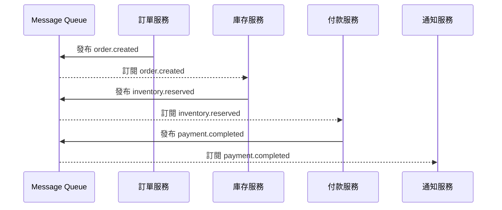
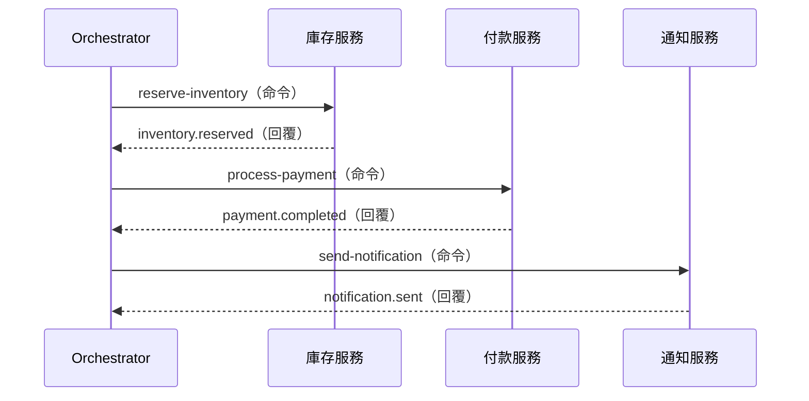
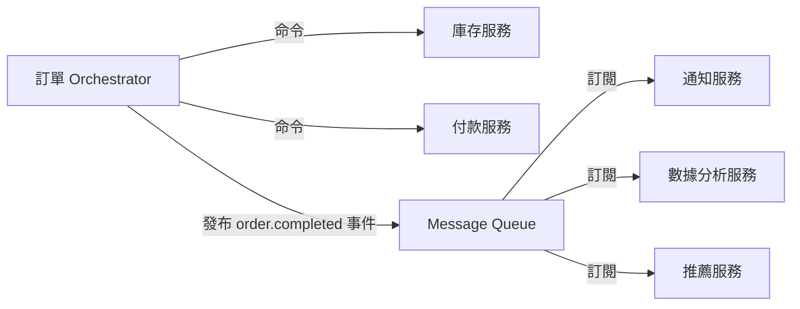

<script setup>
  import ArticleTitle from '@theme/components/ArticleTitle.vue'
  import ScrollToTopBtn from '@theme/components/ScrollToTopBtn.vue'
</script>

<ArticleTitle />

<ScrollToTopBtn />

在 [#27 微服務資料一致性](./2026-06-21-microservices-data-consistency.md) 中，我們從 Saga Pattern 的角度初步介紹了 Choreography 與 Orchestration 這兩種協作方式。本篇要從 **Message Queue 的架構設計**切入，探討兩者在 Topic 設計、服務耦合、可觀察性上的根本差異，以及在實務中該如何選型。

---

## 問題的起點

當一個業務流程橫跨多個微服務時，你面臨的第一個設計決策是：**誰來協調這個流程？**

以電商下單為例，完成一筆訂單需要：

```
建立訂單 → 扣減庫存 → 執行付款 → 發送通知
```

這四個步驟分別由四個不同的服務負責。你有兩條路：讓各服務自己「聽到消息就動作」，或者安排一個「指揮官」統一調度。這兩種思路，就是 Choreography 與 Orchestration。

---

## Choreography：事件驅動，去中心化

Choreography（編舞）的核心概念是：**每個服務只負責發布「發生了什麼」，其他服務自行決定要不要反應。**

服務之間沒有直接依賴，而是透過 Message Queue 上的事件（Domain Event）鬆散地串連起來。



### Topic 設計：以「發生了什麼」為命名原則

Choreography 的事件使用**過去式動詞**命名，反映的是「已經發生的事實」，而不是「要求別人做什麼」：

- `order.created`
- `inventory.reserved`
- `payment.completed`
- `notification.sent`

每個服務只擁有自己的事件 Topic，負責發布該 Topic 的訊息。訂閱者可以有多個，發布者不需要知道有誰在訂閱。

**這是 Choreography 最核心的特性：發布者與訂閱者彼此不知道對方的存在。**

### 優點

- **鬆耦合**：新增一個服務訂閱 `payment.completed` 事件，完全不需要修改付款服務
- **高擴展性**：各服務獨立部署、獨立擴展
- **開發自主性**：不同團隊各自負責一個服務，互不干擾

---

## Orchestration：中央協調，命令驅動

Orchestration（協調）的核心概念是：**由一個 Orchestrator（協調者）服務掌握整個業務流程，依序發出指令，並等待各服務回報結果。**



### Topic 設計：命令頻道 + 回覆頻道

Orchestration 的訊息使用**命令式動詞**命名，反映的是「要求對方執行什麼」：

- `inventory.commands`（Orchestrator 發布，庫存服務訂閱）
- `inventory.replies`（庫存服務發布，Orchestrator 訂閱）
- `payment.commands`
- `payment.replies`

Orchestrator 持有整個流程的狀態，知道目前走到哪一步、哪些步驟成功、哪些需要補償。

實務上，Orchestrator 可以直接以同步 API 呼叫各服務（不透過 MQ），也可以將命令放入 MQ 進行非同步協調，取決於延遲容忍度與可靠性需求。

### 優點

- **流程可見性高**：Orchestrator 是整個流程的唯一真相來源，可以一眼看出訂單走到哪一步
- **失敗處理集中**：重試邏輯、逾時設定、補償交易全都在 Orchestrator 中管理
- **容易除錯**：出問題時只需查看 Orchestrator 的狀態日誌

---

## 兩者的根本差異比較

| 面向 | Choreography | Orchestration |
|------|--------------|---------------|
| **控制結構** | 去中心化 | 中心化 |
| **訊息類型** | 領域事件（已發生的事） | 命令（要求做什麼）+ 回覆 |
| **事件命名** | 過去式：`order.created` | 命令式：`reserve-inventory` |
| **Topic 數量** | 較多（每種事件一個） | 較少（命令 + 回覆各一組） |
| **服務耦合** | 低（服務互不知曉） | 中（服務需知道 Orchestrator） |
| **流程可見性** | 低（分散各服務） | 高（集中於 Orchestrator） |
| **新增服務** | 直接訂閱事件，零改動 | 需在 Orchestrator 中新增步驟 |

---

## Choreography 的關鍵挑戰：事件鏈的可觀察性

Choreography 最大的痛點是：**當一筆訂單出問題，你很難知道它卡在哪個服務。**

事件鏈分散在四個服務、四個 Topic、四份日誌。問「訂單 #A1234 的付款為什麼沒有觸發？」，你必須：

1. 到訂單服務確認 `order.created` 是否成功發布
2. 到庫存服務確認有沒有消費到那筆事件
3. 到付款服務確認有沒有收到庫存事件...

**解法：Correlation ID**

在每筆事件的 Header 中加入一個 `correlation_id`（或稱 `trace_id`），從第一個事件一路傳遞到最後一個服務。這樣就可以用同一個 ID 在各服務的日誌中查詢，串出完整的事件鏈。

```json
{
  "event_type": "order.created",
  "correlation_id": "ord-2026-a1234",
  "payload": { "order_id": "A1234", "amount": 500 }
}
```

搭配 OpenTelemetry、Jaeger 等分散式追蹤工具，可以將這條事件鏈視覺化成一棵追蹤樹，大幅降低除錯難度。

---

## Orchestration 的關鍵挑戰：協調者本身的可靠性

Orchestrator 是整個系統的核心，**一旦它崩潰，所有進行中的業務流程都會停住。**

此外，Orchestrator 需要持久化流程狀態。如果只是將流程邏輯寫在記憶體中，崩潰後就無法從上次的步驟恢復。

**解法：Workflow Engine（工作流引擎）**

現代架構通常不會自己手寫 Orchestrator，而是使用專門設計的工作流引擎：

- **Temporal**：以程式碼定義工作流，內建持久化、重試、逾時處理，即使服務崩潰重啟也能從斷點繼續執行
- **Camunda**：BPMN 視覺化工作流設計，適合需要業務人員理解流程的場景
- **AWS Step Functions**：雲端託管的工作流服務，適合 AWS 生態系

這些工具的共同特點是：**工作流的狀態持久化不再是 Orchestrator 開發者需要自行處理的問題。**

---

## 如何選型？

沒有放諸四海皆準的答案，選型取決於以下幾個維度：

**選 Choreography 的情境：**
- 流程步驟少（三步以內），邏輯直線不分叉
- 各服務由獨立團隊維護，希望保持最低耦合
- 以「廣播通知」為主的場景（例如：訂單完成後通知多個下游服務）
- 系統需要高度水平擴展

**選 Orchestration 的情境：**
- 流程複雜，有條件分支（付款失敗走退款流程，庫存不足走排隊流程）
- 需要清楚的流程狀態追蹤（例如：金融合規要求每個步驟留下稽核記錄）
- 失敗補償邏輯複雜，需要集中管理
- 步驟之間有嚴格的順序依賴或逾時要求

---

## 務實的選擇：混用兩種模式

在真實系統中，兩種模式往往並存，**核心業務流程用 Orchestration，邊緣廣播用 Choreography**。

以電商平台為例：



訂單、庫存、付款這條關鍵流程由 Orchestrator 嚴格控管；但訂單完成後，Orchestrator 發布一個 `order.completed` 事件，通知服務、數據分析服務、推薦服務各自訂閱，不需要 Orchestrator 一一呼叫它們。

這樣的設計，既保留了核心流程的可見性與可靠性，又維持了周邊服務的鬆耦合與擴展彈性。

---

## 總結

Choreography 與 Orchestration 不是非此即彼的選擇，而是兩種互補的協作哲學：

- **Choreography** 讓服務透過事件鬆散地協作，擴展性強，但流程可見性差；核心對策是 Correlation ID 與分散式追蹤。
- **Orchestration** 讓 Orchestrator 掌控全局，可見性高、失敗處理集中，但需要處理 Orchestrator 本身的可靠性；核心對策是使用 Workflow Engine。

面試中回答這個問題的關鍵，不是說哪個更好，而是能清楚說出**為什麼選這個、它的代價是什麼、你如何應對這個代價**。

---

## 參考

- [Choreography Pattern - Azure Architecture Center](https://learn.microsoft.com/en-us/azure/architecture/patterns/choreography)
- [Saga choreography pattern - AWS Prescriptive Guidance](https://docs.aws.amazon.com/prescriptive-guidance/latest/cloud-design-patterns/saga-choreography.html)
- [Orchestration vs Choreography - Camunda Blog](https://camunda.com/blog/2023/02/orchestration-vs-choreography/)
- [Schema and Topic Design in Event-Driven Systems - Flipp Engineering](https://medium.com/flippengineering/schema-and-topic-design-in-event-driven-systems-featuring-kafka-a555ddfdb8d8)
- [Temporal: Revolutionizing Workflow Orchestration in Microservices](https://medium.com/@surajsub_68985/temporal-revolutionizing-workflow-orchestration-in-microservices-architectures-f8265afa4dc0)
