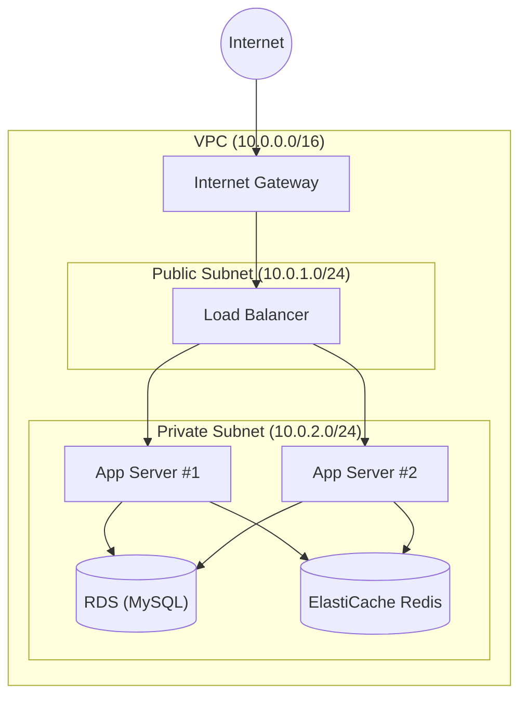
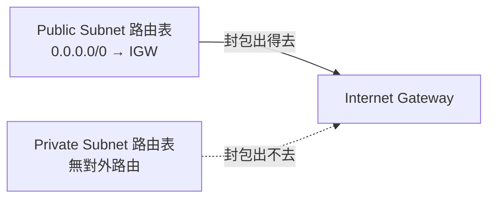
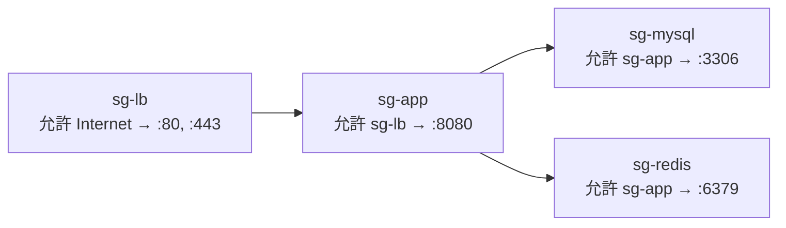

<ArticleTitle />

<ScrollToTopBtn />

在雲端上部署一個後端服務，不論是 Laravel、Rails 還是 Node.js，幾乎都會遇到同一組名詞：VPC、Subnet、Security Group、Load Balancer、RDS、Redis。這些組件不是獨立存在的，它們各自解決一個具體問題，組合在一起才構成一個安全、可水平擴展的三層架構。

## 整體架構

只有 Load Balancer 放在 public subnet 對外暴露；App Server、RDS、Redis 全部在 private subnet，外部網路無法直接連入。每個組件扮演的角色，接下來逐一說明。

## VPC（Virtual Private Cloud）

雲端供應商（如 AWS）上有數百萬台虛擬機器。你在上面開了幾台，預設它們和所有人的機器共用同一個公開網路。VPC 讓你在雲端的大網路裡**劃出一塊屬於自己的私有 IP 空間**，用 CIDR 定義邊界（例如 `10.0.0.0/16` 代表 65,536 個 IP 位址）。圈進 VPC 的資源一定有私有 IP，公有 IP 是可選的。

VPC 的隔離方式比多數人想像的更根本：沒有公有 IP 的資源（如 private subnet 裡的 RDS）根本無法被外部網路路由到——不是因為有什麼東西擋住了連線，而是它沒有對外可路由的地址。這和家用路由器建立的 LAN 是同樣的道理：家裡設備用 `192.168.x.x`，外面連不進來，因為這段 IP 不在公開網際網路上路由。

> **核心**：VPC 是雲端上的私有局域網，隔離靠的是「沒有公開地址」，而不是防火牆擋掉連線。

## Subnet（子網路）

同一個 VPC 裡，不同機器對外暴露的程度不同——Load Balancer 需要接收外部請求，MySQL 和 Redis 絕對不能對外。Subnet 把 VPC 的 IP 段再切小，讓你對每個區塊套不同的路由規則。

**Public Subnet**：路由表有一條 `0.0.0.0/0 → Internet Gateway`，流量可以進出網際網路。

**Private Subnet**：路由表沒有這條規則，封包送不出去，外部也無法主動連入。

Subnet 的 public/private 差異完全由**路由表**決定，不是名稱、標籤或任何開關設定。Internet Gateway 一直在那裡——差別只在路由表有沒有寫「往外的封包送去那裡」。

> **核心**：Subnet 讓你對不同區域的機器套不同路由規則；公私之分看路由表，不看名稱。

## Security Group

Subnet 做的是區域隔離，但同一 VPC 內還需要更細的管控：哪台機器可以連我、連哪個 port？Security Group 是掛在每台機器上的**虛擬防火牆**，只寫允許規則，未列到的流量一律擋掉（預設拒絕所有入流量）。

### 以 Security Group 當來源，而非 IP

雲端機器的 IP 會隨重開、替換、水平擴展而改變。如果 MySQL 的規則寫死 IP，App Server 擴展到十台就要手動更新十條規則。

改以 Security Group 當來源：「允許來自 `sg-app` 的 `:3306` 流量」。新機器只要掛上 `sg-app`，MySQL 的規則自動套用。**規則跟角色走，不跟 IP 走**，這讓規則與機器數量完全解耦。

### 入出流量的預設行為

| 方向 | 預設行為 |
|------|----------|
| 入流量（Inbound） | 全部拒絕，只允許明列的規則 |
| 出流量（Outbound） | 全部允許（`0.0.0.0/0` outbound allow） |

Security Group 是 **stateful** 的：允許進入的流量，回應封包會自動放行，不需要另外設定 outbound 規則。

> **核心**：Security Group 是 instance 層級的 stateful 防火牆；以 SG 當來源讓規則與機器數量解耦；入流量預設全擋，出流量預設全放行。

## Load Balancer

單台 App Server 撐不住流量時，水平擴展成多台。但多台機器對外要怎麼暴露？Load Balancer 對外只提供一個入口（一個 IP 或域名），對內把流量分配給多台機器。

### 分流策略

| 策略 | 說明 | 適用場景 |
|------|------|----------|
| **Round Robin** | 依序輪流，不考慮機器負載 | 機器規格相同、請求處理時間均勻 |
| **Weighted Round Robin** | 按比例輪流，規格強的機器設較高權重 | 機器規格不同 |
| **Least Connections** | 優先送給目前連線數最少的機器 | 請求處理時間差異大 |
| **IP Hash** | 把使用者 IP 做 hash，固定對應同一台機器 | 不使用外部 session store 的舊系統 |

### 水平擴展帶來的 Session 問題

多台機器服務同一批使用者時，session 可能存在機器 A，下一個請求被 LB 分到機器 B——找不到 session，使用者被登出。

**解法：把 session 外移到 Redis。** 所有機器都去 Redis 讀寫 session，LB 分到哪台都沒差。這也是為什麼 Load Balancer 和 Redis 幾乎總是一起出現：**水平擴展強制要求 App 是 stateless 的，而 Redis 正是承接「需要共享的狀態」的地方**。以 Laravel 為例，把 session driver 從 `file` 改成 `redis` 就能解決這個問題。

> **核心**：Load Balancer 讓應用層可以水平擴展，但前提是每台機器可以互換——任何機器都能處理任何請求，不依賴本地狀態。

## RDS 與 ElastiCache Redis

這兩者扮演互補的角色：

| 維度 | RDS（如 MySQL） | ElastiCache Redis |
|------|-----------------|-------------------|
| **類型** | 關聯式資料庫 | 記憶體內 key-value store |
| **持久性** | 持久化，資料不丟 | 預設非持久（可開啟 RDB/AOF） |
| **速度** | 較慢（磁碟 I/O） | 極快（記憶體） |
| **存什麼** | 使用者、訂單、文章等結構化資料 | 快取、session、queue |
| **雲端優勢** | 自動備份、Multi-AZ failover，免維護 | 託管，免自己安裝管理 Redis |

RDS 是資料的「永久倉庫」，Redis 是加速存取的「工作臺」。需要查詢關聯、需要持久化的資料放 RDS；需要快速讀取、允許遺失的暫存資料放 Redis。

## 總結

| 組件 | 解決的問題 |
|------|-----------|
| **VPC** | 在雲端建立私有網路，資源預設不對外暴露 |
| **Subnet** | 細分網路區域，透過路由表控制哪些資源可以對外 |
| **Security Group** | instance 層級防火牆，以角色（SG）而非 IP 管理連線規則 |
| **Load Balancer** | 單一入口分流，讓 App 可以水平擴展 |
| **RDS** | 持久化結構化資料的託管關聯式資料庫 |
| **ElastiCache Redis** | 快取、session、queue 的高速記憶體存儲 |

這六個組件環環相扣：VPC 定義邊界，Subnet 切分公私，Security Group 管控連線，Load Balancer 帶來水平擴展，而水平擴展又倒逼 App 必須是 stateless 的，Redis 正是承接這些共享狀態的地方。

## 參考

- [What is Amazon VPC? | AWS Documentation](https://docs.aws.amazon.com/vpc/latest/userguide/what-is-amazon-vpc.html)
- [Subnets for your VPC | AWS Documentation](https://docs.aws.amazon.com/vpc/latest/userguide/configure-subnets.html)
- [Control traffic to your AWS resources using security groups | AWS Documentation](https://docs.aws.amazon.com/vpc/latest/userguide/vpc-security-groups.html)
- [What is an Application Load Balancer? | AWS Documentation](https://docs.aws.amazon.com/elasticloadbalancing/latest/application/introduction.html)
- [What is Amazon RDS? | AWS Documentation](https://docs.aws.amazon.com/AmazonRDS/latest/UserGuide/Welcome.html)
- [What is Amazon ElastiCache? | AWS Documentation](https://docs.aws.amazon.com/AmazonElastiCache/latest/dg/WhatIs.html)
