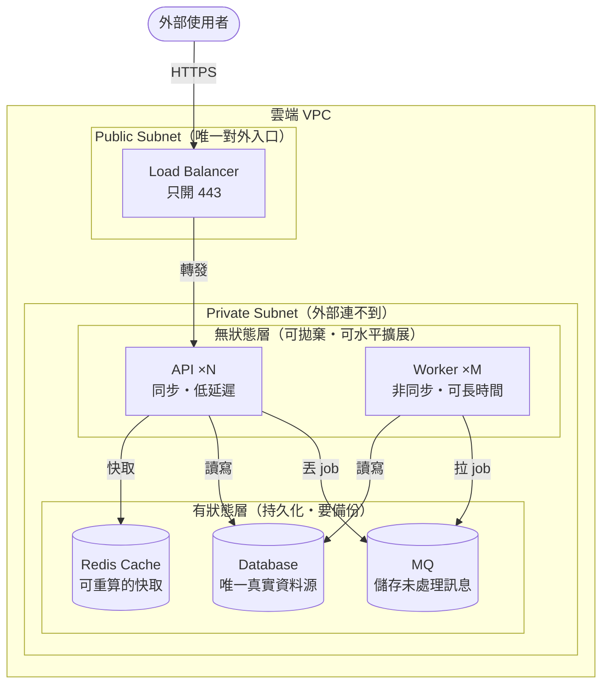
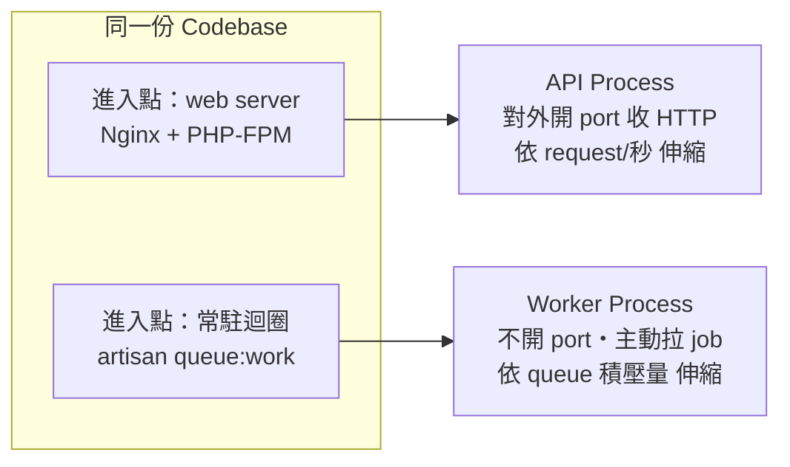
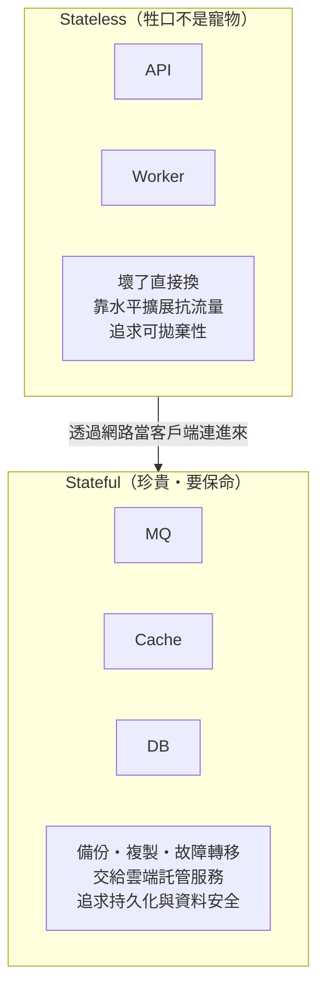
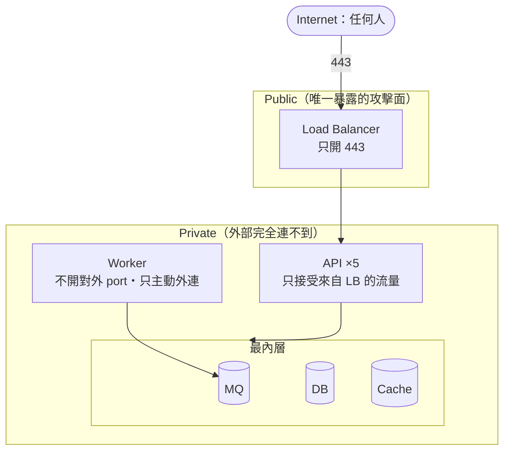

<ArticleTitle />

<ScrollToTopBtn />

前一篇 [雲端部署基礎架構](./2026-07-08-cloud-deployment-basics.md) 談的是「VPC、Subnet、Security Group、Load Balancer 各自是什麼」。這一篇要換一個角度：拿到 API、Worker、MQ、Cache、DB 這幾個組件，你該**沿著哪些線把它們切開部署**？

如果把部署當成一張要背下來的架構圖，一旦組件換成別的、或規模變了，就不知道該怎麼擺。真正能遷移的是**切分的判斷準則**——三條邊界，每條背後都有一個可以複用的提問。

## 整體架構：三條分界線

這張圖有三條分界線，就是本篇的全部重點：

1. **API / Worker 的橫切線**：同步與非同步的時間特性不同。
2. **Stateless / Stateful 的縱切線**：有沒有保管資料，決定能不能被隨意砍換。
3. **Public / Private 的網路線**：誰真的需要被外部主動連入。

以下逐條拆開。

## 邊界一：API vs Worker —— 時間特性不同就該分開

### 為什麼不能塞在同一個 process？

直覺上「同一份程式碼跑在一起最省事」，但這忽略了兩種工作的**時間特性**根本不同：

| 工作 | 同步/非同步 | 延遲要求 | 使用者在等嗎？ |
|------|-----------|---------|--------------|
| HTTP 請求（送出訂單） | 同步 | 幾百 ms 內回應 | 在螢幕前等 |
| Queue job（寄確認信） | 非同步 | 幾秒也沒關係 | 根本不在等 |

如果塞在同一個 process，一個慢吞吞的寄信 job 就會**占住本來該去服務 HTTP 請求的資源**——這就是「web process 被 queue 卡住」。

The Twelve-Factor App 把這件事講得很直接：把不同類型的工作交給不同的 process type，HTTP 請求由 web process 處理、長時間的背景任務由 worker process 處理。

### 分開部署帶來的營運價值：獨立伸縮

兩個角色的負載曲線不一樣，就該各自獨立伸縮：

- 平常 API 請求穩定，但整點湧入大量批次 job（例如結算 10 萬筆）。
- 如果 API 和 worker 是**分開部署的兩組機器**，這時可以**只 scale worker，完全不動 API**。

API 和 worker 通常**共用同一份 codebase**，但用**不同的進入點、部署成不同的 process**。API 由 web server 驅動、對外開 port 收 HTTP；worker 是常駐迴圈（例如 Laravel 的 `php artisan queue:work`），不對外開 port，只主動往 queue 拉 job。因為負載特性不同，兩者的伸縮依據也不同——API 看 request/秒，worker 看 queue 積壓量。

> **小心過度概化**：上圖把 worker 標為「主動拉 job（pull）」，是以 Laravel Queue、SQS、Redis list 的 pull 模型為例。push 還是 pull 依 broker 而異——RabbitMQ 是 broker 主動 push 給 consumer，Kafka 則是 consumer 主動 pull。不要把「worker 一律主動拉」當成所有 MQ 的通則。

> **核心**：API 與 worker 常共用 codebase，但因為同步／非同步的時間特性不同，要用不同進入點部署成不同 process，才能各自獨立伸縮——混在一起時，慢 job 會卡住本該服務請求的資源。

## 邊界二：Stateless vs Stateful —— 部署的第一刀

### 分水嶺不是「省不省事」，而是「有沒有保管資料」

判斷一個組件該怎麼部署，真正該問的是這一句：

> **把這台機器直接砍掉、換一台新的頂上，使用者會不會感覺到資料不見了？**

- **不會 → Stateless（無狀態）**：API、Worker。它們不保管長期資料，處理完請求／job 就結束，狀態寫回別處。正因為無狀態，才能被**自由地砍、換、加**——這是「scale API／scale worker」能成立的前提。
- **會 → Stateful（有狀態）**：MQ、Cache、DB。它們**保管資料**，砍掉就掉資料，必須是獨立、被妥善管理、會持久化的組件。

這正是基礎建設圈那句「牲口不是寵物（cattle, not pets）」的意思：無狀態機器是可替換、可拋棄的牲口，壞了就換一台一樣的頂上；有狀態資料則是需要細心照顧的寵物。

### Cache 與 MQ 都是 stateful，但存的資料性質不同

三個有狀態組件雖然都不能亂砍，但「掉了會怎樣」差很多：

| 組件 | 存什麼 | 掉了會怎樣 |
|------|--------|-----------|
| Redis Cache | 掉了也能從 DB 重算回來的資料 | 效能下降，資料不會真的少 |
| MQ | 還沒被處理的 job／訊息 | 真的少做事（訊息遺失） |
| DB | 唯一真實資料源（source of truth） | 資料永久遺失 |

在小型 Laravel 系統裡，常用同一個 Redis 同時兼任 cache 和 queue——這很常見，但它們是**兩種不同責任**，規模大了會拆開（例如 cache 用 ElastiCache、queue 改用 SQS 或專用 MQ）。

> **核心**：雲端部署的第一刀，沿著 stateless／stateful 切開。無狀態層（API、worker）追求可拋棄性、靠水平擴展抗流量；有狀態層（DB、MQ、Cache）追求持久化與資料安全，要有備份、複製、故障轉移，通常交給雲端**託管服務**（RDS、ElastiCache、SQS／managed Kafka）來扛，而不是裝在 app 機器上。API 和 worker 都只是這些託管服務的**客戶端**。

## 邊界三：Public vs Private —— 誰需要被外部主動連入

### 分法：只有「流量入口」需要 public

四個角色沿著「誰需要被外部主動連入」來分：

- **API**：需要接收外部請求 → 靠近 public。
- **Worker / MQ / DB**：都是被 API 或 worker 從內部去連的，沒有任何理由對全世界開放 → private。

### 但連 API 機器本身都可以退進 private

如果有 5 台 API 機器，外部請求要怎麼知道連哪一台？中間需要一個 **Load Balancer** 分流。而這個 LB 一出現，它就變成真正頂在 public 最前線的東西——**API 機器反而可以全部退進 private**。

這樣一來，暴露在網路上的攻擊面只剩「一個 LB + 它開的 443 port」，後面所有東西全躲在 private，外面完全連不到。層層往內收，**愈珍貴、愈有狀態的東西藏得愈深**。

> **核心**：網路邊界不是沿著「誰要對外服務」切，而是沿著「誰真正需要被外部主動連入」切。真正需要 public 的只是**流量入口（Load Balancer，通常只開 443）**，不是運算節點本身。API／worker／MQ／DB 全退進 private，只透過內部網路互連，再用 Security Group 限制「誰能連我」。

## 責任邊界總表

把三條邊界合起來看，每個角色的定位就一目了然：

| 角色 | 狀態 | 網路層 | 對外開 port？ | 伸縮依據 |
|------|------|--------|--------------|----------|
| Load Balancer | 無狀態 | public | 是（443） | 通常託管、自動 |
| API | 無狀態 | private | 否（只收 LB） | request/秒 |
| Worker | 無狀態 | private | 否（主動外連） | queue 積壓量 |
| MQ | 有狀態 | private（內層） | 否（只收內部） | 託管／水平分區（partition） |
| Cache | 有狀態 | private（內層） | 否（只收內部） | 一般垂直／託管擴展 |
| DB | 有狀態 | private（最內層） | 否（只收內部） | 讀寫分離；寫入靠 sharding |

## 總結

三條邊界，三個提問，三句話就能記住：

1. **時間特性不同就分開**：API 同步、worker 非同步，塞一起慢 job 會卡住請求，分開才能獨立伸縮（API 看 request/秒，worker 看 queue 積壓量）。
2. **有沒有保管資料決定能不能砍**：問「砍掉換一台，使用者會不會覺得資料不見」——不會的（API/worker）可拋棄、水平擴展；會的（MQ/Cache/DB）要持久化、交給託管服務。
3. **只有流量入口需要 public**：LB 當唯一對外門面（只開 443），其餘全退進 private，愈珍貴藏愈深。

面對一個新系統時，別急著畫圖——先照這三條線切，圖自然就會浮現。

## 參考

- [The Twelve-Factor App — VI. Processes](https://12factor.net/processes)
- [The Twelve-Factor App — VIII. Concurrency](https://12factor.net/concurrency)
- [Laravel Documentation — Queues](https://laravel.com/docs/queues)
- [The History of Pets vs Cattle | Cloudscaling](http://cloudscaling.com/blog/cloud-computing/the-history-of-pets-vs-cattle/)
- [The difference between RabbitMQ and Kafka | AWS](https://aws.amazon.com/compare/the-difference-between-rabbitmq-and-kafka/)
- [Subnets for your VPC | AWS Documentation](https://docs.aws.amazon.com/vpc/latest/userguide/configure-subnets.html)
- [What is an Application Load Balancer? | AWS Documentation](https://docs.aws.amazon.com/elasticloadbalancing/latest/application/introduction.html)
