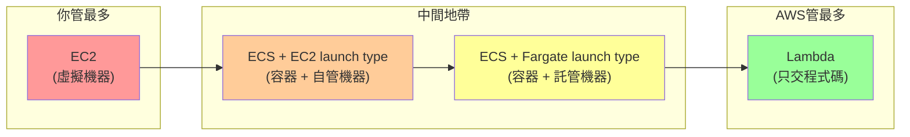
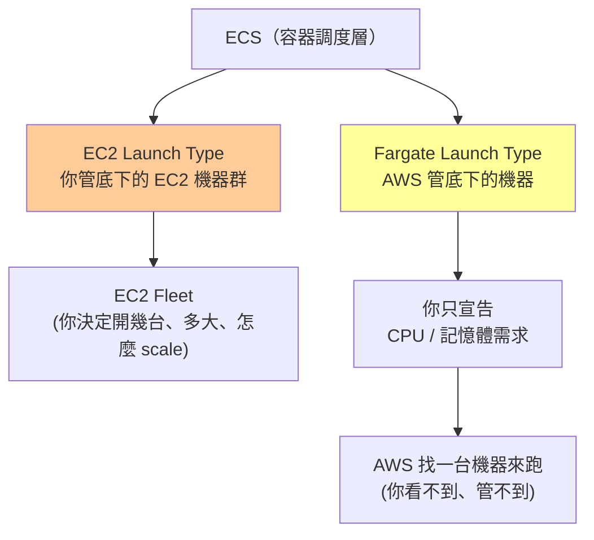
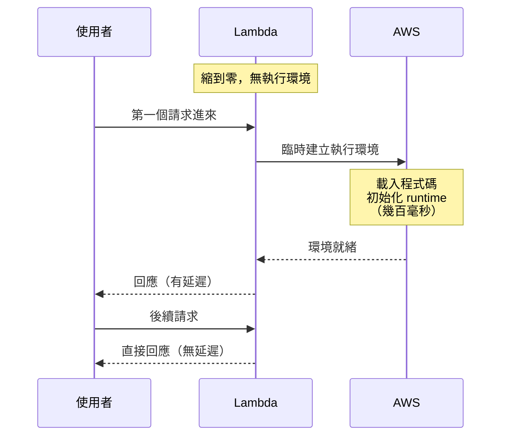
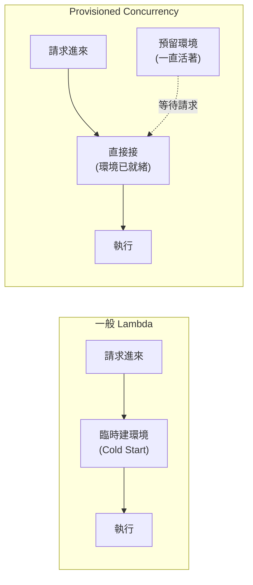

<ArticleTitle />

<ScrollToTopBtn />

前兩篇分別談了 [VPC / Subnet / Security Group / Load Balancer 各自的邊界](./2026-07-08-cloud-deployment-basics.md)，以及 [API / Worker / MQ / DB 沿著哪三條線切分](./2026-07-09-deployment-boundaries.md)。知道組件要分開部署之後，下一個問題自然是：這些組件「跑在什麼上面」？

AWS 提供 EC2、ECS（含兩種 launch type）、Lambda 三種層次的運算選項。它們的核心差異不在功能清單，而在**你需要自己管到哪一層**。

## 管理責任光譜

從你管最多到 AWS 管最多，排成一條光譜：

每往右一步，你就交出一層管理責任，換來更少的 infra 負擔——但同時也換來更少的控制權和更多的使用限制。

## EC2：虛擬機器，你管一切

AWS 交給你的是一台**虛擬機器（Virtual Machine）**——底下的實體硬體與虛擬化層是 AWS 的事，從 OS 往上全部是你的責任。

**你負責的事：**
- 作業系統安裝、更新、安全性修補
- Runtime 環境（Node.js、PHP、Java…）
- 程式部署與開機自動啟動
- Scaling（流量大了要不要再開一台？）
- 磁碟、記憶體監控

**收費方式**：機器開著就收錢，不管有沒有流量。

**適合情境**：需要完整控制環境、有特殊系統需求（特定 OS 版本、GPU、特殊網路設定）。

## ECS：容器調度層，兩種發動機

ECS（Elastic Container Service）本身只做一件事：**把你的容器調度到機器上跑**。但「底下那台機器誰管」有兩種選擇，稱為 launch type。

### EC2 Launch Type

你自己維護一群 EC2 作為 worker pool，ECS 把容器分配到這群機器上。

**你管：** 底下的 EC2 數量、規格、Auto Scaling Group、OS 維護

**ECS 管：** 把哪個容器排程到哪台 EC2 上

**收費方式**：底下的 EC2 機器開著就收錢。

**適合情境**：需要 GPU、特殊網路設定，或已有現成 EC2 fleet 要充分利用。

### Fargate Launch Type

你只宣告「這個容器需要 0.5 vCPU、1 GB RAM」，AWS 臨時找一台符合的機器來跑，跑完還給 AWS。你完全看不到底層機器。

**你管：** 容器本身和資源需求宣告

**AWS 管：** 底下所有機器的事

**收費方式**：容器跑著就收錢（按 CPU × 記憶體 × 時間）。

**適合情境**：長時間運行的服務（API server、Queue Worker），且不想管 infra。

> **容易混淆的邊界**：Fargate 下你沒有在「管理機器規格」，你只是在**宣告容器需求**——這台機器你看不到也管不到。用「宣告需求」而非「管理規格」才能準確描述這個邊界。

## Lambda：只交程式碼，其他全託管

Lambda 是光譜的另一端：你只提交**一段 function**，AWS 決定要跑在哪台機器上、要同時跑幾份。

### Scale to Zero（縮到零）

Lambda 最獨特的特性：**沒有請求時，不保留任何執行環境**。

- 好處：沒請求 = 不收錢（按請求次數 + 執行時間計費）
- 壞處：第一個請求進來時需要臨時建立執行環境，產生延遲

### Cold Start（冷啟動）

這個「縮到零後第一個請求要等」的現象有精確術語——**Cold Start（冷啟動）**。

Cold Start 的延遲高度依賴 runtime 與套件大小——Node.js、Python 通常在 100 ms 以內；Java、.NET（JVM/CLR）可達數秒；套件越大、初始化邏輯越重，延遲越長。對延遲敏感的 API 有感。

### Lambda 的限制

- **原生不支援持有長連線**：函式執行完即結束，無法維持 WebSocket 連線。可搭配 API Gateway WebSocket API 實現雙向通訊，但連線由 API Gateway 持有，每次訊息觸發一次獨立的 Lambda 呼叫；若需要原生持有 TCP/WebSocket 的場景（高頻訊息、自訂協定），Lambda 不適合。
- **無狀態**：in-memory 狀態不跨請求保留，下一個請求可能跑在不同的執行個體上。
- **執行時間上限**：單次 function 最長執行 15 分鐘。

## Provisioned Concurrency：用錢消除 Cold Start

Provisioned Concurrency 讓你**預先保留 N 份已初始化的執行環境**，讓它們一直活著等待請求，直接消除 Cold Start。

**代價**：預留的環境一直活著就一直收錢（類似 EC2 的「開著就跑錶」邏輯）。

**何時值得開？** 同時滿足兩個條件：
1. 服務對延遲敏感（使用者直接在等的 API）
2. 流量夠穩定夠大（能攤平固定費用）

> **Provisioned Concurrency 跟 ECS launch type 無關**：兩者都跟「預先備好資源」有關，容易混淆。實際上，ECS launch type（EC2 / Fargate）是 ECS 底層機器的選擇；Provisioned Concurrency 是 Lambda 自己的特性，用來預先保留執行環境消除 Cold Start。分屬不同服務、解決不同問題。

搭配 Application Auto Scaling，還可以根據流量動態調整預留份數——尖峰前自動拉高，離峰後縮回來，兼顧低延遲與成本控制。

## 選型比較

| 維度 | EC2 | ECS + EC2 | ECS + Fargate | Lambda |
|------|-----|-----------|---------------|--------|
| **你管什麼** | OS + runtime + 機器 | 容器 + EC2 機器群 | 只宣告容器資源需求 | 只管程式碼 |
| **收費方式** | 機器開著就收錢 | 機器開著就收錢 | 容器跑著就收錢 | 按請求次數 + 執行時間 |
| **沒有流量時** | 繼續收錢 | 繼續收錢 | 通常持續收錢 | 不收錢（縮到零） |
| **Cold Start** | 無 | 無 | 通常無 | 有（Node.js/Python < 100 ms，Java 可達數秒） |
| **長連線支援** | 支援 | 支援 | 支援 | 原生不支援（可搭配 API Gateway WebSocket） |
| **適合工作負載** | 需完整控制環境 | 有現成 EC2 fleet | 長時間服務、不想管 infra | 事件觸發、短暫、無狀態 |
| **不適合情境** | 不想管 OS | 不想管機器 | 極短暫任務 | 長連線、有狀態、延遲敏感（未開 Provisioned Concurrency） |

## 總結

三個服務，一條光譜，兩個核心提問：

1. **你願意管幾層？** EC2 給你最多控制、最多責任；Lambda 讓你只交程式碼、責任最少。Fargate 在中間——但記得你沒有在「管機器規格」，你只是在「宣告容器需求」，底層機器你看不到也管不到。

2. **你的流量形態是什麼？** 流量穩定、長時間運行 → ECS Fargate 或 EC2；事件觸發、間歇性、無狀態 → Lambda，但要評估 Cold Start 是否能接受。延遲敏感且流量夠大 → Provisioned Concurrency，以固定費用換低延遲。

看到「低延遲需求」就要自動聯想 Cold Start 是否是瓶頸、是否需要 Provisioned Concurrency——這個連結建起來，選型討論時才不會漏掉。

## 參考

- [Amazon EC2 Documentation | AWS](https://docs.aws.amazon.com/ec2/)
- [Amazon ECS launch types and capacity providers | AWS Documentation](https://docs.aws.amazon.com/AmazonECS/latest/developerguide/capacity-launch-type-comparison.html)
- [AWS Fargate for Amazon ECS | AWS Documentation](https://docs.aws.amazon.com/AmazonECS/latest/developerguide/AWS_Fargate.html)
- [AWS Fargate or AWS Lambda? — AWS Decision Guide](https://docs.aws.amazon.com/decision-guides/latest/fargate-or-lambda/fargate-or-lambda.html)
- [Understanding the Lambda execution environment lifecycle | AWS Documentation](https://docs.aws.amazon.com/lambda/latest/dg/lambda-runtime-environment.html)
- [Configuring provisioned concurrency for a function | AWS Documentation](https://docs.aws.amazon.com/lambda/latest/dg/provisioned-concurrency.html)
- [Understanding Lambda function scaling | AWS Documentation](https://docs.aws.amazon.com/lambda/latest/dg/lambda-concurrency.html)
